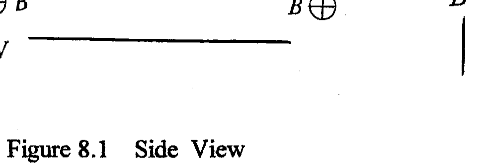
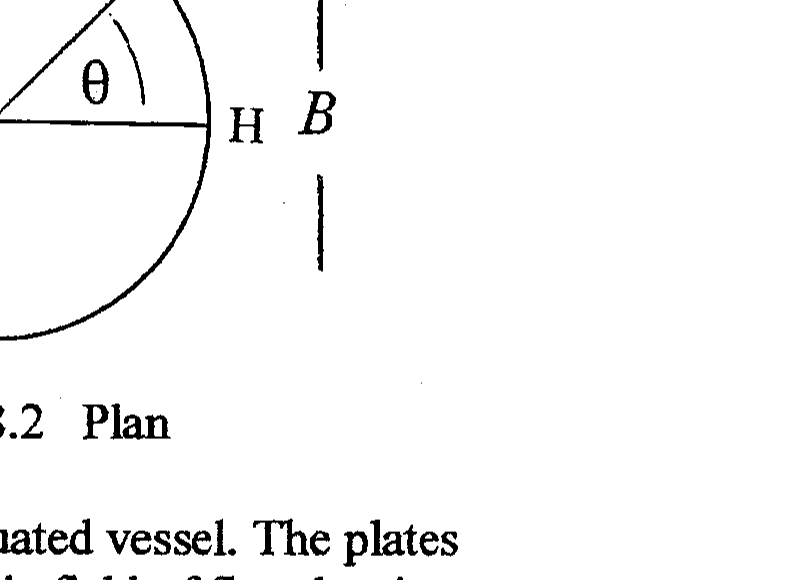

Q8

Figure 8.1 Side View

Figure 8.2 Plan

Two parallel circular conducting plates, 1.00 mm apart, are in an evacuated vessel. The plates are at a potential difference of 100 V and situated in a constant magnetic field of flux density $\mathrm{B}=0.010 \mathrm{~T}$ parallel to the surface of the plates, Figures 8.1 and 8.2.

A radioactive source of beta particles, with maximum energy of 15.0 keV , is located, symmetrically, at the centre, O , of the gap between the plates.
(a) Determine using classical physics:
(i) the electric force on a beta particle
(ii) the order of magnitude of the ratio of the gravitational to the electric force on a beta particle
(iii) the maximum speed of the beta particle at O
(iv) the condition for beta particles, travelling in the horizontal plane through O , to emerge from the plates
(v) the range of speeds of the emerging beta particles from the plates
(vi) the angular range of $\theta$, Figure 8.2, of the beta particles in (v)
(b) (i) The calculations in (a) assume that the beta particles are not travelling with relativistic speeds. Is this assumption justified ? Give a quantitative answer.

The relativistic mass $m$ of the electrons is given by

$$
m=m_{0}\left(1-v^{2} / c^{2}\right)^{-1 / 2},
$$

where $m_{0}=m_{e}$, the rest mass of the electron, and $v$ is the speed of the electron.
(ii) How does the kinetic energy of a relativistic electron differ from that of a nonrelativistic particle ?
