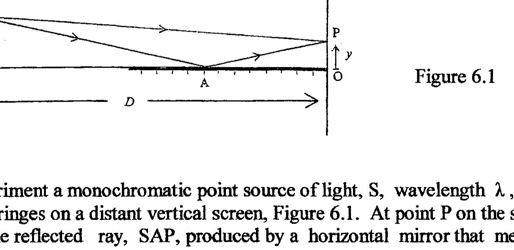

## Q6

Figure 6.1

In an interference experiment a monochromatic point source of light, $S$, wavelength $\lambda$, produces interference fringes on a distant vertical screen, Figure 6.1. At point $P$ on the screen.. the direct ray SP and the reflected ray, SAP, produced by a horizontal mirror that meets the screen at O , interfere. The distance $\mathrm{OP}=y$ and the source of light is a distance $D$ from the screen . $S$ is a vertical distance $a$ from the horizontal line of the mirror. $D$ is much larger than $a$.
(a)
(i) Explain why the reflected ray can be considered to come from the reflected image of $S$ in the mirror.
(ii) Why is the interference pattern similar to that produced in a Young's double slit experiment?
(iii) Explain the nature of the zero order fringe.
(b)
(i) Using Pythagoras's theorem, determine the length of the two rays reaching P in terms of $y, a$ and $D$. Deduce their path difference, $p$.
(ii) Using the approximation below, obtain a simplified expression for $p$.
(iii) Write down the conditions for constructive and destructive interference at $\mathbf{P}$ using the result obtained in (ii).
(iv) If one replaces the monochromatic source with a white light source, what is observed ?

$$
\left[D^{2}+x^{2}\right]^{1 / 2}=D\left[1+(x / D)^{2} / 2+\ldots\right] \text { if } x \text { is much smaller than } D .
$$
