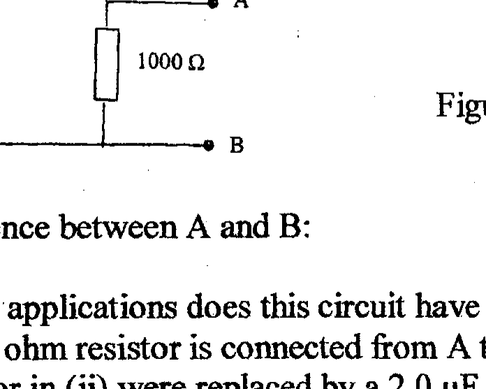
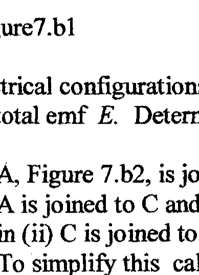
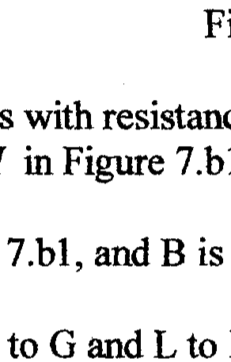
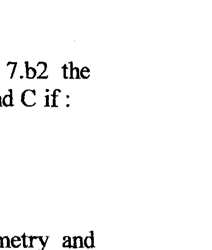

Q7
(a)

Figure 6.a

What is the final potential difference between A and B :
(i) in Figure 6.a ? What applications does this circuit have ?
(ii) if, in addition, a 500 ohm resistor is connected from $A$ to $B$ ?
(iii) if the 500 ohm resistor in (ii) were replaced by a $2.0 \mu \mathrm{~F}$ capacitor ?
(b)

Figure7.b1

Figure 7.b2

Figure 7.b3

The above electrical configurations all have resistors with resistance $R$. In Figure 7.b2 the batteries have total emf $E$. Determine the current $I$ in Figure 7.b1 between G and C if :
(i) A, Figure 7.b2, is joined to C , Figure 7.b1, and B is joined to D
(ii) $\quad \mathrm{A}$ is joined to C and B to K
(iii) in (ii) C is joined to J , Figure 7.b3, H to G and L to K To simplify this calculation it may be helpful to consider the symmetry and compare the potentials at P and S .
