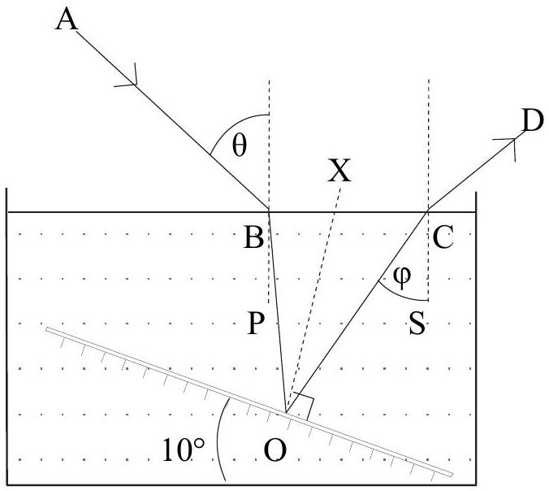
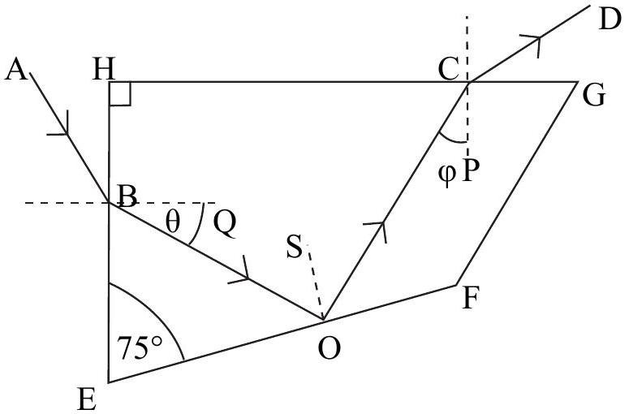

Q2
(a) A glass block measures 5.0 cm × 5.0 cm × 8.0 cm . When the block stands on one of its smaller faces, and viewed directly from above, it appears to be a cube. Determine the refractive index of the block.
[2]

Figure 2.b

Figure 2.c
(b) A plane, inclined, mirror lies at the bottom of a long flat bottomed tank containing water. The mirror makes an angle of $10^{\circ}$ with the horizontal, Figure 2.b. A narrow beam of monochromatic light falls on the surface of the water at an angle of incidence $\theta$. If the refractive index of water is $4 / 3$, determine the maximum value of $\theta$ for which light, after reflection from the mirror, would emerge from the upper surface of the water. The angle SCO is indicated by $\varphi$. OX is normal to the mirror.
(c) Figure 2.c shows the cross-section of a glass prism, refractive index $n$, with the angles indicated showing a light ray passing through it. OS is perpendicular to EF.
    (i) Express angle BOC in terms of $\theta$.
    (ii) Determine the angle $\varphi$ in terms of $\theta$.
    (iii) For what value of $\theta$ is $\theta=\varphi$ ? What condition does this impose on $n$ if total internal reflection occurs at O?
    (iv) What is the angle between the incident and emergent rays when $\theta=\varphi$ ?
(d) Why, at night, are the images of lights reflected from a river elongated?
