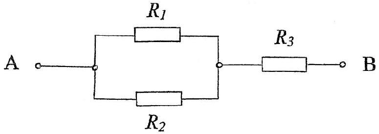
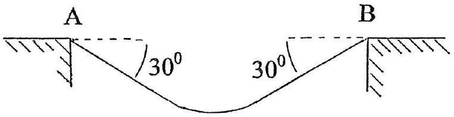
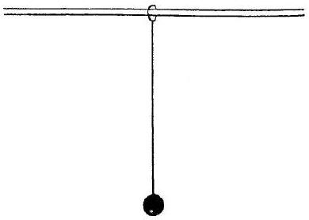
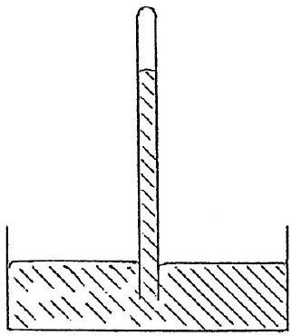

Q1
a) Gas is contained in a tank at a pressure of 10 atm and a temperature of 15°C. If one half of the gas is withdrawn and the temperature is raised to $65^{\circ} \mathrm{C}$, what is the new pressure in the tank?
[3]
b) In Figure 1.b, what is the value of the resistor $R_{3}$, in terms of the resistances $R_{1}$ and $R_{2}$, expressed in its simplest form, if the total resistance across AB is equal to $R_{1}$ ?
[2]

Figure 1.b

c) What is an electric field line? Sketch the field lines due to two charges 3Q and (-Q). [5]

d) A uniform cable has a mass of 100 kg and is suspended between two fixed points A and B, at the same horizontal level, (Figure 1.d). At the support points the cable makes angles of 30°.

Figure 1.d

What is :

(i) The force exerted on each support?
(ii) The tension in the cable at its lowest point?

e) When the Sun is directly overhead a narrow shaft of light enters an ancient temple through a small hole in the ceiling and produces a light spot, 10 m below, on the floor.
    (i) At what speed does the spot move across the floor?
    (ii) If a mirror is placed on the floor to reflect the beam, at what speed will the reflected spot move across the ceiling?

f) The potassium isotope ${ }^{42} \mathrm{~K}_{19}$ disintegrates into ${ }^{42} \mathrm{Ca}_{20}$.

(i) What are the likely source/s of radiation produced?
(ii) How many protons, neutrons and electrons are present in an atom of the daughter nucleus ${ }^{42} \mathrm{Ca}_{20}$ ?
[3]
g) A thin film of glass, refractive index 1.52, and thickness $0.42 \mu \mathrm{~m}$ is viewed by reflection with white light at normal incidence. What visible wavelength is most strongly reflected?
[6]
h)A 50 kg ball is attached to one end of a 1.2 m chord that has a mass of 0.13 kg and initially hangs vertically in equilibrium. The other end of the chord is attached to a ring that can slide on a smooth horizontal rod, (Figure 1.h). A horizontal blow is delivered to the chord which excites its fundamental mode. Assume the ball remains stationary as the chord vibrates.

Figure 1.h

    (i) What is the frequency, $f$, and period, $T$, of the fundamental mode?
    (ii) What is the amplitude, $A$, of the ring if its maximum velocity is $15 \mathrm{~ms}^{-1}$ ?
    (iii) If, initially, the ball is not stationary, determine its natural period, $T_{0}$.
    (iv) Determine the ratio ( $T / T_{0}$ ). Is the original assumption justified?

i) A sphere, mass $M$ and speed $u$, collides elastically head-on with an identical sphere of mass $m$ which is initially at rest. After the collision the masses $M$ and $m$ have respectively speeds, in the direction of $u$, of $v$ and $w$.
    (i) Prove or verify that $u+v=w$.
    (ii) If $R=(u-v) / u$, prove $R=m w /(M u)$.
    (iii) Express $R$ in terms of $M$ and $m$ only.
j) Two identical plastic balls of mass 5.00 g are charged to $+1.00 \mu \mathrm{C}$ and suspended from a fixed point by massless non-conducting threads, each of length 1.00 m. Verify that the angle between the threads is $41.0^{0}$.
k) The height of mercury, density $1.35 \times 10^{4} \mathrm{~kg} \mathrm{~m}^{-3}$, in a barometer, (Figure 1.k), is 75.9 cm, at 15 °C. The height of the evacuated space in the barometer is 8.0 cm. The internal diameter of the barometer is 6.5 mm. A small amount of nitrogen is introduced into the this space and the mercury level drops to 62.2 cm . Determine the mass, $m$, of nitrogen present.

Figure 1.k

1) A battery consisting of two cells, in series, each of emf $E$, is used to charge a capacitor, capacitance C.
    (i) What is the energy of the charged capacitor?
    (ii) How much energy has been lost?
    (iii) If the capacitor is charged in two stages, first with one cell and then with two cells, determine the energy lost. Comment on the result.
m) Two masses of 0.90 kg and 1.10 kg are hung vertically from identical springs on a common support each with force constant $39.48 \mathrm{Nm}^{-1}$. Both are released simultaneously from a position of maximum extension to describe simple harmonic motion. Calculate:
    (i) The frequencies of the two masses.
    (ii) The beat period and frequency.
n) The tangential frictional force produced by a band break on a rotating metal drum of circumference 0.25 m is 20 N. The mass of the drum is 0.40 kg and its specific heat capacity is $0.35 \mathrm{~kJ} \mathrm{~kg}^{-1} \mathrm{~K}^{-1}$. Calculate the number of complete revolutions required to increase its temperature by 5.0 K.
o) If the atmosphere is assumed to be composed of a layer of air of uniform density, 1.23 $\mathrm{kg} \mathrm{m}^{-3}$, calculate its height if it produces a pressure of $1.01 \times 10^{5} \mathrm{~Pa}$ at the Earth's surface.
