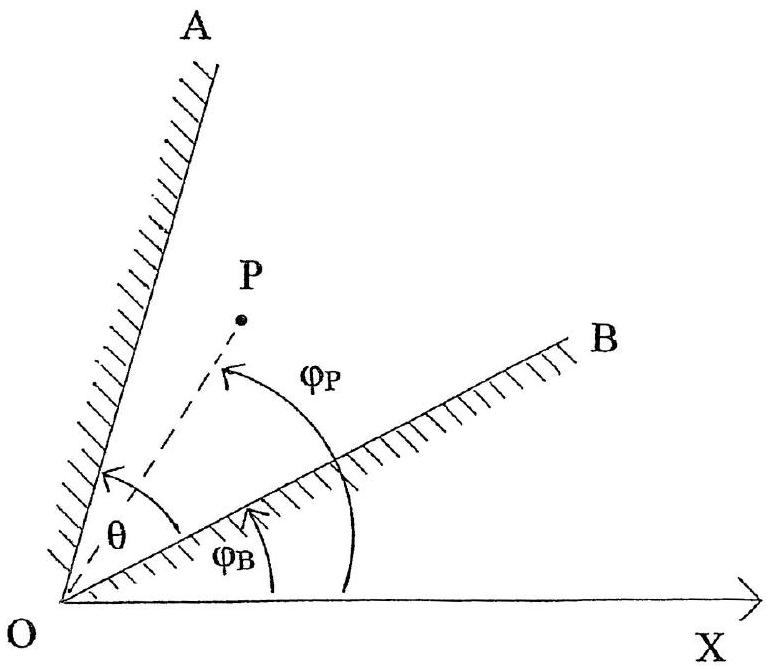

Q6

Figure 6.1

Two mirrors, OA and OB, (Figure 6.1), are rigidly set at a constant fixed angle $\theta$, but can rotate about O. A fixed point P is situated between the mirrors. OP makes an angle $\varphi_{\mathrm{P}}$ with the fixed axis OX.

a) Draw , using graph paper , an accurate diagram showing two light rays from P that are first reflected from mirror OA and then reflected from mirror OB, indicating any real or virtual images, $\mathrm{I}_{\mathrm{AP}}$ in mirror OA , and $\mathrm{I}_{\mathrm{BP}}$ in mirror OB .
b) OB makes an angle $\varphi_{\mathrm{B}}$ with the fixed axis OX . If the mirrors are rotated, by changing $\varphi_{\mathrm{B}}$, show:
    (i) That P and the images of P remain at a fixed distance from O.
    (ii) How the angle IAPOX varies with $\varphi$ B.
    (iii) How the angle $\mathrm{I}_{\mathrm{BP}} \mathrm{OX}$ varies with $\varphi_{\mathrm{B}}$, providing P remains within AOB.
c) Explain qualitatively how a rainbow is produced by spherical water droplets.
