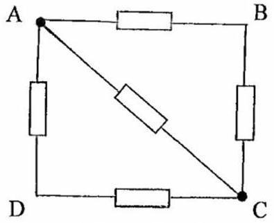
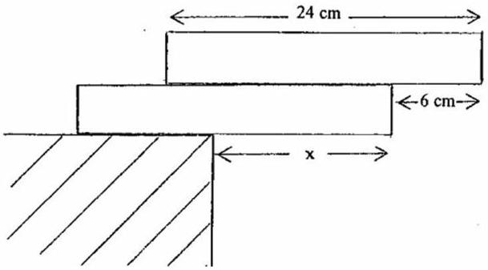
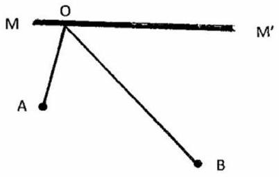
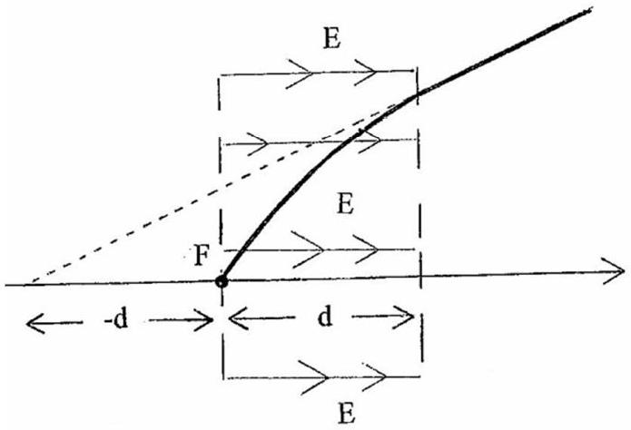

Q1
In a circuit the following resistor combination is found.

Figure 1.a

All the resistors in Figure 1.a have resistance $R$ ohms.
What is the total resistance across (i) AC and (ii) AB?
(b) The energy levels, $E_{n}$, of the hydrogen atom are given by
$$
E_{n}=\frac{-2.16 \times 10^{-18}}{n^{2}} \mathrm{~J} \text {, where } n \text { is a positive integer. }
$$
    (i) What is the ionization energy of the atom?
    (ii) What is the wavelength of the $\mathrm{H}_{\alpha}$ line, which is due to transitions from the $n=3$ to $n=2$ level?
(c) You are challenged to construct a bridge using two identical uniform rectangular blocks, length 24 cm , which overhang a table as indicated in Figure 1.c. The lower block overhangs the table by $x \mathrm{~cm}$ and the upper block overhangs the lower block by 6.0 cm . Under what condition will one or both blocks collapse?

Figure 1.c

(d) A proton travelling with a velocity of $3.00 \times 10^{7} \mathrm{~m} \mathrm{~s}^{-1}$ collides with an oxygen nucleus, of mass $2.56 \times 10^{-26} \mathrm{~kg}$ that is at rest, and is scattered through an angle of $90^{\circ}$. Calculate the velocity and direction of the oxygen nucleus using Newtonian mechanics.
(e) A submerged wreck, mass $10^{4} \mathrm{~kg}$ and mean density $8 \times 10^{3} \mathrm{~kg} \mathrm{~m}^{-3}$, is lifted out of the water by a crane with a steel cable 10 m long, cross-sectional area $5 \mathrm{~cm}^{2}$ and Young's modulus $5 \times 10^{10} \mathrm{~N} \mathrm{~m}^{-2}$. Determine the change in the extension of the cable as the wreck is lifted clear of the water.

(f) MM', Figure 1.f, is a plane mirror. A and B are points in front of the mirror and O is a variable point on the mirror. B' is the image of B in the mirror. Prove geometrically that:
    (i) the paths AOB and $\mathrm{AOB}^{\prime}$ are equal.
    (ii) the path length of the ray reflected in the mirror has the minimum possible value of AOB.

(g) An exoplanet is discovered by the Kepler mission. It has a mass $M$ with angular velocity $\omega$. A small moon of mass $m$ and radius $a$ orbits the planet at a centre to centre distance of $r$. What is the condition for this circular orbit?
If $R$ is the reaction force on a loose rock on the moon's surface, write down the equation for the 'equilibrium' of the rock on the moon's surface. Assume that the moon orbits the planet always keeping the same face towards the planet. Deduce the condition, independent of $\omega$, to be satisfied by $M / m$, for the rock to be lifted off the moon by the planet's gravitational attraction. $\square$
(h) A beaker is fitted with a heating coil and stirrer and contains $40.0 \mathrm{~cm}^{3}$ of liquid A. When the power dissipated in the heating coil is 4.80 W, the temperature of the contents rises from $15.0^{\circ} \mathrm{C}$ to $35.0^{\circ} \mathrm{C}$ in 400 s. The experiment is repeated using 20.0 $\mathrm{cm}^{3}$ of liquid A mixed with $20.0 \mathrm{~cm}^{3}$ of liquid B. It is found that, with a heater power of 4.90 W, the temperature again rises from 15.0°C to 35.0°C in 400 s.
Determine
    (i) the specific heat capacity, $s$, of B and
    (ii) the heat lost, $H$, in both experiments.
Density of A is $1.60 \times 10^{3} \mathrm{~kg} \mathrm{~m}^{-3}$, Specific heat capacity of A is $8.60 \times 10^{2} \mathrm{~J} \mathrm{~kg}^{-1} \mathrm{~K}^{-}$ Density of B is $2.00 \times 10^{3} \mathrm{~kg} \mathrm{~m}^{-3}$ $\square$
(i) The electron gun of a cathode ray tube consists of a small hot filament F which is located at $x=0$, Figure 1.i, and which produces electrons in the x-y plane of the page with a very small range of velocities. A typical electron has velocity components $v_{x}$ and $v_{y}$. Between $x=0$ and $x=d$ there is a horizontal uniform electric field, $E$, which accelerates the electrons produced at the filament to velocities which are much greater than $v_{x}$ and $v_{y}$. The electrons emerge from the field, beyond $x=d$, travelling in straight lines. Show that the paths of the emerging electrons, when projected back, appear to have come from a point along the axis at approximately $x=-d$. $\square$

Figure 1.f

Figure 1.i

(j) Determine the binding energy per nucleon, in MeV, of an alpha particle.
$$
\begin{aligned}
\text { Mass of proton } & =1.0080 \mathrm{u} \\
\text { Mass of neutron } & =1.0087 \mathrm{u} \\
\text { Mass of alpha particle } & =4.0026 \mathrm{u} \\
1 \mathrm{u} & =930 \mathrm{MeV} / \mathrm{c}^{2}
\end{aligned}
$$
(k) An organ pipe has one end closed and at the other end is a vibrating diaphragm, which is a displacement antinode. When the frequency of the diaphragm is 2,000 Hz a stationary or standing wave pattern is set up in the tube. The distance between adjacent nodes is 8.0 cm. As the frequency is slowly reduced the stationary wave pattern disappears, but another stationary wave pattern reappears at frequency 1,600 Hz.
Calculate:
    (i) the speed of sound in air
    (ii) the distance between adjacent nodes at 1,600 Hz
    (iii) the length of the tube
    (iv) the next frequency below 1,600 Hz at which a stationary pattern occurs

(l) A rescue helicopter of mass 810 kg, supports itself in a stationary position by imparting a downward velocity, $v$, to the air in a circle of radius 4.0 m . The density of the air is $1.20 \mathrm{~kg} \mathrm{~m}^{-3}$.
Calculate:
    (i) the value of $v$
    (ii) the power, $P$, required to support the helicopter

(m) A radioactive substance, with a half-life of $T$, contains a particular nucleus that has NOT decayed over an observational period of $5 T$. What is the probability that it will decay over a further period of (i) $T$ and (ii) $3 T$ ?

(n) A rectangular block has a mass of 1.5 kg with an uncertainty of magnitude 0.03 kg, and a volume of 80 mm × 50 mm × 30 mm, with uncertainties of magnitude 1 mm in each dimension. Determine the magnitude of the fractional uncertainty in the density of the block.

End of Section 1
