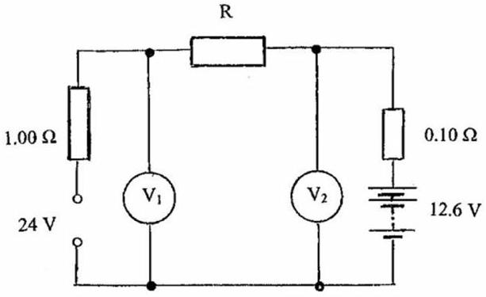
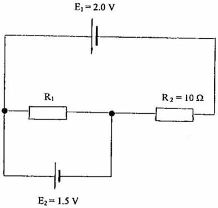
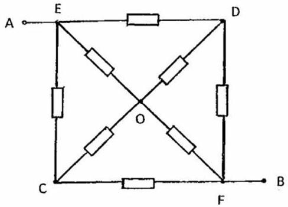

Q2
    (a) In Figure 2.a a battery of emf 12.6 V and internal resistance 0.10 ohms is being charged from a solar panel of emf 24.0 V and internal resistance $1.00 \mathrm{ohms} . \mathrm{V}_{1}$ and $\mathrm{V}_{2}$ are voltmeters, that give the value and sign of the voltage, and $R$ is a fixed resistor.
        (i) If the charging current is 5.00 A, determine the value of $R$.
        (ii) If $R$ is changed to 0.90 ohms, what would be the readings on the voltmeters?
        [5]

(b) In the circuit in Figure 2.b, determine the resistance $R_{1}$ if there is no current flowing
    Figure 2.a
through $E_{2}$.

    (c) In Figure 2.c all resistors have resistance $R$. If a pd $V$ is applied across AB:
        (i) Explain why the potentials at C and D are equal.
        (ii) What is the outcome of joining C and D by a conducting wire?
        (iii) Keeping C and D connected, draw a simplified circuit by combining those resistors which are in parallel.
        (iv) What is the pd across CO?
        (v) Determine the resistance across $\mathrm{AB}, R_{A B}$.

[7]

Figure 2.c

(d) Determine the resistance across $\mathrm{AO}, R_{A O}$, in Figure 2.c.
