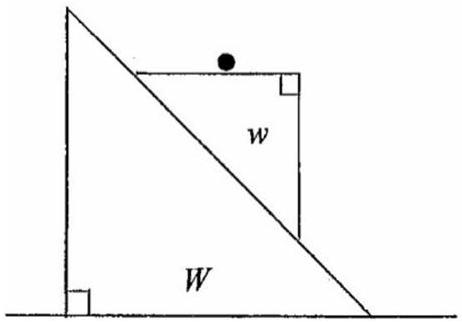

Q6
    (a) A block of wood, mass $M$, rests on a smooth horizontal table. A gun is fired horizontally at the block and the bullet, mass $m$, passes through it, emerging with half its initial speed. Determine the fraction of the initial kinetic energy that is lost in the collusion.
    [5]
    (b) A particle, mass $m$, is placed at the top of a smooth sphere of radius $a$. The particle is disturbed and slides down the side gaining speed $v$ at a vertical height $z$ above the centre of the sphere. At what value of $z$ will it leave the surface of the sphere?
    [6]
    (c) Figure 6.c shows two 45° wedges, the smaller wedge $w$ has a horizontal top face. It can slide down the larger wedge $W$, which is on a horizontal table. All the surfaces are smooth. A mass $m$ sits on the top face of the upper wedge. Describe qualitatively the motion of the system once it is released from rest.
    [4]

Figure 6.c
    (d) Two trains are travelling away from a common station at speeds of $u$ and $2 u$, in directions that are at an angle 60° to each other. What is the velocity of the train with speed $2 u$ relative to an observer in the other train?
