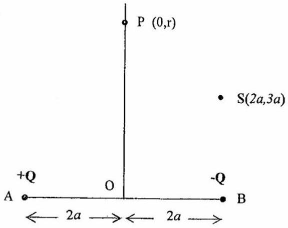

Q9
The charge distribution along a complex molecule can be simplified to the following arrangement of charges.

Figure 9.a

Two charges of magnitude, +Q and -Q , are separated by a distance $4 a$, and located at A and B respectively. O is the mid-point of AB, Figure 9.a.

    (a) Determine the potential $\mathrm{V}_{1}$ and field strength $\mathbf{E}_{1}$ along the perpendicular bisector of AB through O , at a point P a distance $r$ from O . [5]
    (b) Determine the potential, $\mathrm{V}_{2}$, and the field strength, $\mathbf{E}_{2}$, at the point S with coordinates $(2 a, 3 a)$. [10]
    (c) A circular wire, radius $3 a$, centre C, has a charge +Q uniformly distributed around it. An insulating rod of length $4 a$ and mass $m$ is initially at rest and situated along the axis of the circle. It has a point charge of +Q at one end and -Q at the other end, -Q being $4 a$ from C and +Q being $8 a$ from C . Determine the velocity of the of the charges when -Q reaches C. [5]
End of Paper
