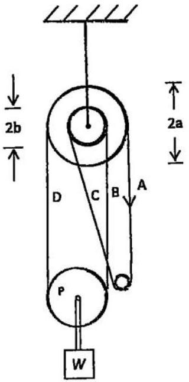
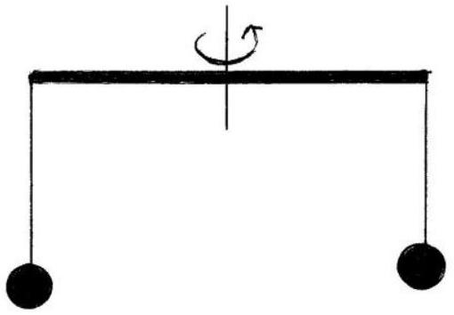

Q1.
    (a) In an experiment to measure the Planck constant, $h$, the following results were obtained, in units of $10^{-34} \mathrm{Js}: 6.65,6.67,6.57,6.61,6.72,6.60,3.66,6.71,6.66,6.64$, 6.67. What would you give as:
        (i) The best estimate of $h$ ?
            (ii) The uncertainly of $h$ from your reading?

[3]

(b) The pulley system in Figure 1.b consists of two pulleys of radii a and b rigidly fixed together, but free to rotate about a common horizontal axis. The weight W hangs from the axle of a freely suspended pulley P , which can rotate about its axle. If section $A$ of a rough rope is pulled down with velocity $V$ :
    (i) Explain which way W will move.
    (ii) With what speed will it move?

[5]

Figure 1.b

(c) Estimate the mean density of the Earth, in $\mathrm{g} \mathrm{cm}^{-3}$, assuming that the radius of the Earth $R_{E}=6.38 \times 10^{3} \mathrm{~km}$ and the value of $\mathrm{g}=9.81 \mathrm{~ms}^{-2}$. State any assumptions made.

[5]

(d) Determine the half-life, $T$, of a substance with activity that decreases by 1.00 \% in $10^{8} \mathrm{~s}$ (approximately 3 years).

[5]

(e) A horizontal bar, 8.0 m in length, has a 2.0 m rope attached at each end, with a small metal sphere at each end of each rope hanging under gravity, Figure 1.e. When the bar rotates about a vertical axis through its centre, the ropes are inclined at 30° to the vertical. Determine the period, $T$, of rotation of the system.
[5]

Figure 1.e
(f) A lithium surface, with work function energy $\mathrm{W}=3.7 \times 10^{-19} \mathrm{~J}$, is irradiated with photons of frequency $f=6.3 \times 10^{14} \mathrm{~Hz}$. The loss of photoelectrons from the surface causes the metal to acquire a positive potential, $V$. What will this potential be when the metal prevents the loss of further electrons?
[4]
(g) To determine the specific heat capacity, $s$, of a liquid flowing at a constant rate of $0.060 \mathrm{~kg} \mathrm{~min}^{-1}$ down a pipe, heat from an electrical supply is maintained at the rate of 12 W . It produces a temperature rise of 2.0 C along the flow. Calculate s.
[2]
(h) A thundercloud has a horizontal lower surface, area $25.0 \mathrm{~km}^{2}, 750 \mathrm{~m}$ above the surface of the Earth. Using a capacitor as a model, calculate the electrical energy, $E_{1}$, stored when its potential is $1.00 \times 10^{5} \mathrm{~V}$ above the earth potential.
If the cloud rises to 1250 m:
    (i) explain why the energy, $E_{2}$, has increased or decreased
    (ii) What is the change in electrical energy, $\Delta E$ ?
[10]
(i) A square metal plate of uniform density has dimensions $3 R \times 3 R$. Its centre is the centre of a Cartesian coordinate system, with axes parallel to the edges of the plate. A complete circular region, radius $R$, is removed from the plate. Determine the position of the centre of gravity of the remaining square plate when the centre of the circular hole is at (i) (x,0) and (ii) (x,y).

(j) A battery of emf $E$ and internal resistance $r$ drives 3.0 A round a circuit consisting of two 2.0 ohm resistors in parallel. When these resistors are connected in series the current is 1.2 A. Calculate $E, r$ and the power dissipated, $W$, in each resistor.
[5]
(k) Sketch, on the same diagram, the paths of three alpha particles, of the same energy, which are directed towards a fixed nucleus so they are deflected through (i) $10^{\circ}$, (ii) 90°, and (iii) 180°. If the nucleus in (iii) is not fixed, what is the relative velocity of the two particles at the distance of closest possible approach?
[5]
(l) A tank contains water to a depth of 1.0 m . Water emerges from a small hole in the vertical side of the tank at 20 cm below the surface. Determine:
    (i) the speed at which the water emerges from the hole
    (ii) the distance from the base of the tank at which the water strikes the floor on which the tank is standing.
[5]
(m) A smooth flat horizontal turntable 4.0 m in diameter is rotating at 0.050 revs per second. A student at the centre of the turntable, and rotating with it, releases a smooth flat puck on the turntable 0.50 m from the edge. Describe the motion of the puck as seen by a stationary observer who is standing at the side of the turntable.
    (i) How long does the puck remain on the turntable?
    (ii) At what relative velocity would the student, at the centre of the turntable, see the puck leave the turntable?
[10]
(n) A closed wire loop in the form of a square of side 4.0 cm is placed with its plane perpendicular to a uniform magnetic field, which is increasing at the rate of $0.030 \mathrm{Ts}^{-1}$. The loop has a resistance of $2.0 \times 10^{-3}$ ohms. Calculate the current induced in the loop, and explain, with the aid of a diagram, the relation between the direction of the induced current and the direction of the magnetic field.
[4]
(o) The value of a device for storing energy can be assessed by the height to which it would rise if all the stored energy were used to propel it upwards under gravity. Calculate the height of the following:
    (i) a 12 V car battery of capacity 60 Ah and mass 20 kg
    (ii) a quantity of petrol of calorific value $4 \times 10^{7} \mathrm{~J} / \mathrm{kg}$
[5]

(p) A soap bubble, diameter 3.0 cm, containing helium floats in the air. Determine the thickness of the bubble, as a multiple of the wavelength, 650 nm , of red light, assuming soap solution has a density of $1.00 \times 10^{3} \mathrm{~kg} \mathrm{~m}^{-3}$. The density of the air and helium are, respectively, $1.28 \mathrm{~kg} \mathrm{~m}^{-3}$ and $0.18 \mathrm{~kg} \mathrm{~m}^{-3}$.

End of Questions
