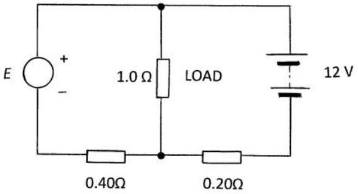
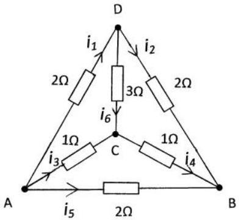

Q2.
    (a)The circuit in Figure 2.a consists of a DC voltage $E$, a 1.0 ohm load , a 12 V battery with a 0.40 ohm and a 0.20 ohm resistor.

Figure 2.a

        (i) At what value of $E$ does the battery begin to charge?
        (ii) What fraction of the power is delivered to the load by the voltage supply E when the charging current is zero?
        (iii) What is the current through the battery when $E=20 \mathrm{~V}$ ?
    (b) In the circuit in Figure 2.b, with the specified resistors and currents, $i_{1} \ldots i_{6}$, and with a pd of $V$ across AB:
        (i) Determine relations between the currents by reversing V and using symmetry considerations, or otherwise.
        (ii) Deduce the total resistance across AB.
        (iii) Determine the magnitudes of the currents in terms of V.

Figure 2.b

(iv) If the voltage is now applied across CD determine, by redrawing the circuit in a similar form to Figure 2.b, with CD as the base, the resistance across CD.
(v) Redraw the circuit with AC as the base. Explain why the resistance across AC cannot be calculated in terms of resistances in series and/or parallel.
