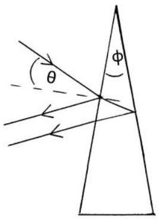
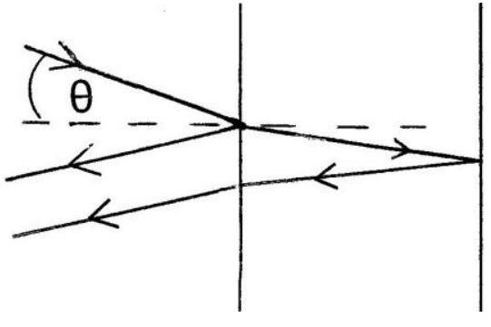
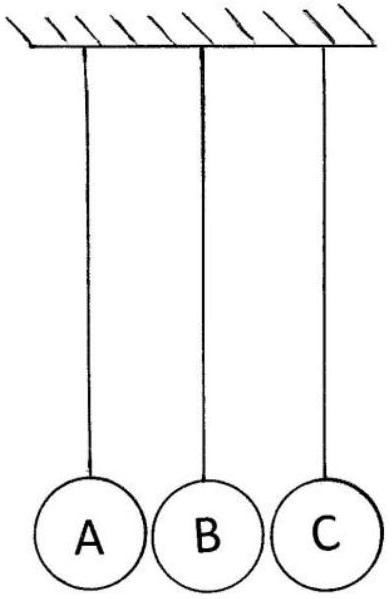

Q5.

Figure 5.1

Figure 5.2

A soap film, with constant refractive index $\mu=1.45$, is contained within a vertical rectangular wire frame and has a wedge shaped profile, small wedge angle $\phi$, Figure 5.1. The film drains under gravity, being thicker at the bottom than at the top, where the thickness can be considered to be zero. The film is viewed, by reflection, with red and violet light at near normal incidence; the angle of incidence being exceedingly small. Interference results from light reflected from the outer surface and that emerging after reflection at the inner surface of the film. The optical path difference between the two rays can be determined, to a good approximation, by assuming the film is of constant thickness, $t$, in the region of these two reflections, Figure 5.2; $t$ will increase with position down the film. The first violet, wavelength 420 nm, constructive interference band is observed at a distance $x_{V}=3.0 \mathrm{~cm}$ from the top edge of the film. The wavelength of the red light is 680 nm.

Determine:

(i) the thickness of the film at the lowest order constructive violet interference band, $t_{V}$.
    [4]
    (ii) the film wedge angle $\phi$ in degrees.
    [3]
(iii) for the red light, the lowest order constructive interference film thickness, $t_{R}$, and distance, $x_{R}$ from the top of the film.
    [3]
(iv) The soap film drains so that the rate of change of decreases in angle by 8.3 x $10^{-5}$ degrees in one minute. Determine the initial speed, ( $\Delta x_{V} / \Delta t$ ), in cm per minute, of the observed violet interference fringe by considering a small time interval, $\Delta t$, in which $\phi$ changes by $\Delta \phi$ and $x_{V}$ changes by $\Delta x_{V}$, by first showing
$$
x_{V} \Delta \phi+\phi \Delta x_{V}=0, \text { or otherwise. }
$$

Q6.Three small identical steel balls A, B, and C are suspended by vertical threads of equal length from a horizontal support, with their centres in a horizontal line and separated by a small gap. A is raised by a height $h$, with the thread taut, and released. All subsequent collisions are elastic.

Figure 6.1

    (i) When all the balls have mass M , determine the subsequent motion of the system and the height to which the centre of C is raised following its first collision.
    (ii) When A has mass A, B has mass 2M and C has mass 3M, determine the height to which the centre of C is raised after its first collision.
