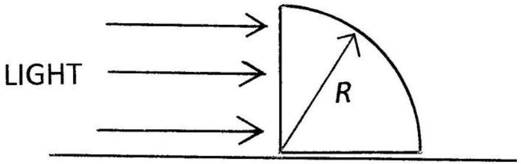
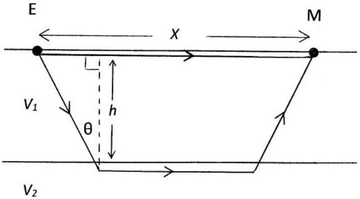

Q8.
    (a) A glass prism in the shape of a quarter- cylinder, Figure 8.a, radius $R=5.00 \mathrm{~cm}$ and refractive index $\mu=1.50$, lies on a horizontal table. A uniform horizontal beam of light is incident, from the left, on its vertical plane face.
        (i) Where, beyond the cylinder, will the table be illuminated?
        (ii) If the horizontal beam is incident from the right, verify that for angles of incidence, on the circular surface, greater than $83.27^{\circ}$, no light will emerge directly from the vertical face of the prism.

Figure 8.a

(b) Geophysical exploration is being carried out below a horizontal land area, Figure 8.b. The rock directly below ground has depth $h$ and sound travels through it with velocity $V_{1}$. Below this layer of rock is another layer of rock in which the velocity of sound is $V_{2}$, with $V_{2}$ being greater than $V_{1}$. Sound is reflected and refracted in a similar manner to light.
An explosion on the surface at E is detected by a microphone M on the surface, which is a distance $x$ from $E$. Sound waves from $E$ can travel directly along the surface rock to M , and also down into the upper region of the lower rock layer as indicated in Figure 8.b, before final refraction and subsequent detection by M. Determine $x$, in terms of $h, V_{1}$ and $V_{2}$, if these two waves are to arrive at M simultaneously.

Figure 8.b
