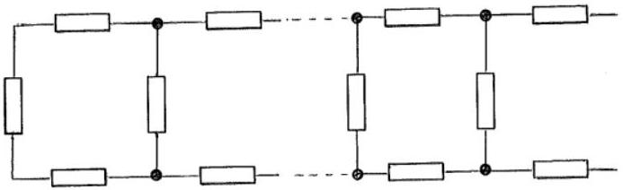
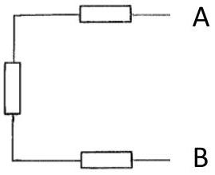
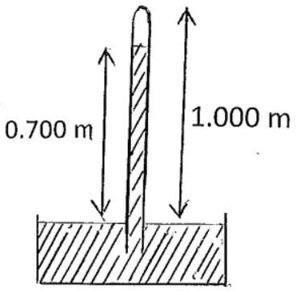
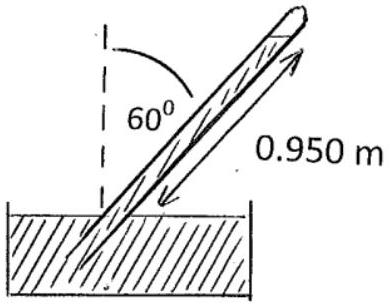
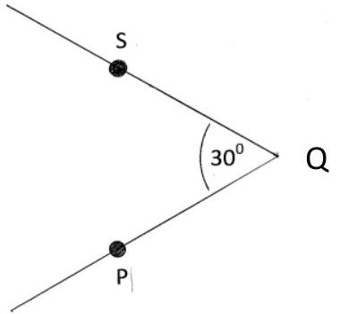
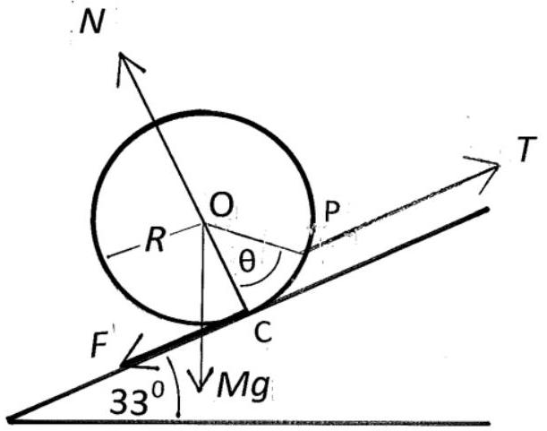

## BPhO  —  British Physics Olympiad

## BRITISH PHYSICS OLYMPIAD 2013-14

## BPhO Round 1

## Section 1

## $\mathbf{1 5}^{\text {th }}$ November 2013

## Instructions

Time: 1 hour 20 minutes on Section 1.

Questions: Students may attempt any parts of Section 1 but are not expected to complete all parts.

Marks: A maximum of 40 marks can be awarded for Section 1, out of the total of 78 marks allocated to the problems in Section 1.

Solutions: Answers and calculations are to be written on loose paper or in examination booklets. Graph paper and formula sheets should also be made available. Students should ensure their name and school is clearly written on each page of their answer sheets.

Setting the paper: There are two options for setting BPhO Round 1:

- Section 1 and Section 2 may be sat in one session of 2 hours 40 minutes.
- Section 1 and Section 2 may be sat in two sessions on separate occasions; with 1 hour 20 minutes allocated for each section. If the paper is taken in two sessions on separate occasions, Section 1 must be collected in after the first session and Section 2 handed out at the beginning of the second session.

Important Constants
| Speed of light | $c$ | $3.00 \times 10^{8}$ | $\mathrm{m} \mathrm{s}^{-1}$ |
| :--- | :--- | :--- | :--- |
| Planck constant | $h$ | $6.63 \times 10^{-34}$ | J s |
| Electronic charge | $e$ | $1.60 \times 10^{-19}$ | C |
| Mass of electron | $m_{e}$ | $9.11 \times 10^{-31}$ | kg |
| Gravitational constant | $G$ | $6.67 \times 10^{-11}$ | $\mathrm{N} \mathrm{m}^{2} \mathrm{~kg}^{-2}$ |
| Acceleration of free fall | $g$ | 9.81 | $\mathrm{m} \mathrm{s}^{-2}$ |
| Permittivity of a vacuum | $\varepsilon_{0}$ | $8.85 \times 10^{-12}$ | $\mathrm{F} \mathrm{m}^{-1}$ |
| Avogadro constant | $N_{A}$ | $6.02 \times 10^{23}$ | $\mathrm{mol}^{-1}$ |

Section 1

(a)A chain of resistors, Figure 1.a.i, is composed of $n$ units, each consisting of three resistors, each resistor of resistance $R$, Figure 1.a.ii. A unit is attached to the left hand end of the chain in order to increase the number of units from $n$ to $(n+1)$.

Figure 1.a.i

Figure 1.a.ii

    (i) Calculate the resistance (between A and B) across a chain with two units, $R_{2}$, and the resistance $R_{3}$, across a chain with three units.
    (ii) A unit is attached to a long chain. The resistance of the chain, $R_{T}$, is not altered by this addition. Determine the resistance of the chain.
[6]
(b)
    (i) A satellite is in orbit just above a spherical planet of radius $R$ and uniform density $\rho$. If the periodic time for each orbit is $T$, find an expression for $\rho T^{2}$. Comment on the result.
    (ii) A man with a mass of 75 kg stands at the end of a diving board, depressing it by 0.30 m. What would be the period of his motion if he was to jump lightly in rhythm with the harmonic motion of the diving board?

[6]

(c)
    (i) A uniform vertical tube, open at the lower end and sealed at the upper end, is lowered into sea water, trapping air in the tube. When the tube is submerged to a depth of 10.0 m, sea water has exactly filled the lower half of the tube. To what depth must the tube be lowered so that sea water fills 90\% of the tube?
    (ii) A mercury barometer has some air above the mercury, Figure 1.c.i. The top of the barometer is 1.000 m above the level of the mercury in the reservoir. When the tube is vertical the height of the mercury column is 0.700 m. When the tube is inclined at $60^{\circ}$ to the vertical, Figure 1.c.ii, the reading of the mercury level is 0.950 m . What is the atmospheric pressure in mm of mercury?

Figure 1.c.i

Figure 1.c.ii

(d) A car travels along a horizontal road starting at time $t=0$, and finishing at $t=\pi / 10$. At time $t$ it has travelled a distance $x$, has a speed $v$ and an acceleration $f$ given by $x=A \sin (5 t), \quad v=5 A \cos (5 t)$ and $\quad f=-25 A \sin (5 t), \quad$ where $A$ is a constant. Determine the average speed, $v_{A V}$, and average acceleration, $f_{A V}$.
(e) One gram of hydrogen atoms is separated into electrons and protons. The electrons are deposited on the Moon, the protons remaining on the Earth. What, numerically, is the force that results? The Earth - Moon distance is $R_{E M}=3.84 \times 10^{8} \mathrm{~m}$.
(f) Determine the half life of uranium given that $3.23 \times 10^{-7} \mathrm{~g}$ of radium is found per gram of uranium in ancient minerals. The half life of radium is 1,600 years. The atomic weights of uranium and radium are 238 and 226 respectively. All the radium arises from the uranium.
(g) A mixed beam of deuterons (an isotope of hydrogen, ${ }^{2} \mathrm{H}^{+}$) and protons, which have been accelerated through $1.00 \times 10^{4} \mathrm{~V}$, enter a uniform magnetic field of 0.500 T in a direction at right angles to the field. Calculate the separation of the proton beam from the deuteron beam when each has described a semicircle in the field.

(h) A sound source, frequency $f$ and velocity $u$, is moving along a straight line towards an observer who is approaching the sound source with velocity $v$. Determine the frequency $f_{0}$ heard by the observer if the speed of sound is $c$.
A moving sound source, S , has velocity of $15.0 \mathrm{~m} \mathrm{~s}^{-1}$ and frequency 200 Hz . An observer P , speed $18.0 \mathrm{~ms}^{-1}$, and S are approaching a point Q along paths inclined at 30° to each other, Figure 1.h. What frequency is heard by the observer when S and P are equidistant from Q ? The speed of sound is $331 \mathrm{~ms}^{-1}$.

    [8]

Figure 1.h

(i) A beaker, containing some water, has a total mass of 0.300 kg . The beaker rests on a weighing scale. A 250 g copper sphere, density $8.93 \times 10^{3} \mathrm{~kg} \mathrm{~m}^{-3}$, is suspended so that it is completely immersed in the water, but does not touch the bottom of the beaker. What is the reading on the weighing scale in newtons? The density of water is $1.00 \times 10^{3} \mathrm{~kg} \mathrm{~m}^{-3}$.
[3]
(j) A capacitor, capacitance $C_{1}$, with a charge $\mathrm{Q}_{0}$, is connected in a closed (loop) series circuit with an uncharged capacitor, capacitance $C_{2}$ and a switch, which is initially open. Compare the energy stored in the capacitors before and after the switch is closed by considering the potential across each capacitor. What can one conclude?
[8]

(k)
Figure 1.k

A uniform sphere, radius $R$ and mass $M=5.00 \mathrm{~kg}$, is pulled up an inclined plane, inclination 33.0° to the horizontal, by a string of tension $T$, which is attached to a point P on its surface, making an angle $\theta$ with the line joining the centre of the sphere, O, and its contact point with the plane, C. The string is parallel to the plane. The coefficient of friction between the sphere and the plane $\mu=0.420$. The sphere is about to slide up the plane. The frictional force is $F$ and the normal reaction is $N$, Figure 1.k.
Determine, numerically:

    (i) $T$, by resolving the forces along and perpendicular to the slope
    (ii) $\theta$.
(I) Three boats start at time $t=0$ from the corners of an equilateral triangle, of side 50 km , and maintain constant speeds of $30 \mathrm{~km} \mathrm{hr}^{-1}$ during the subsequent motion. They each maintain a heading, clockwise, towards the neighbouring boat. They all eventually meet at P.
Determine:
    (i) qualitatively, the evolution of the triangle formed by the three boats
    (ii) the velocity components of the three boats in the direction of P ,as a function of time, $t$, and in the perpendicular directions
    (iii) the time, $t_{\mathrm{M}}$, at which they all meet
    (iv) the distance travelled by each boat, $D$.

(m) A bicycle tyre has a volume of $1.20 \times 10^{-3} \mathrm{~m}^{3}$ when fully inflated. The barrel of the bicycle pump has a working volume of $9.0 \times 10^{-5} \mathrm{~m}^{3}$. How many strokes of the pump are needed to completely inflate the flat tyre to a total pressure of $3.0 \times 10^{5} \mathrm{~Pa}$ ? The atmospheric pressure is $1.00 \times 10^{5} \mathrm{~Pa}$. Assume the air is pumped in slowly, so that the temperature remains constant.

End of Questions
