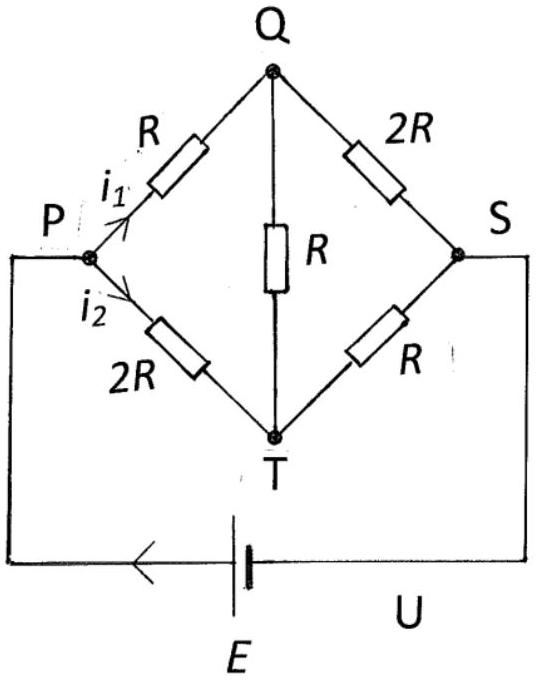

Q1.
Figure 1.1

The above circuit, Figure 1.1, has resistors with resistance $R$ and $2 R$, a cell with emf $E$, and currents $i_{1}$ and $i_{2}$ along PQ and PT respectively.

(a) By reversing the cell's polarity determine the current in $\mathrm{QS}, i_{Q}$, and in $\mathrm{TS}, i_{T}$. [2]
(b) Determine the currents, $i_{\mathrm{QT}}$ and $i_{\text {SUP }}$, in QT and SUP, respectively, using the result that the sum of the currents entering any junction is equal to the sum of the currents leaving the junction. [2]
(c) The sum of the clockwise products of current and resistance around any closed path is equal to the source of emf in the closed path. Use this result for paths PQTP and PTSUP to obtain two independent equations. [4]
(d) Hence determine the resistance, $R_{P S}$, across PS, in terms of $R$, and the currents $i_{1}$ and $i_{2}$ in terms of $E$ and $R$. If the cell has resistance $3 R$, how is $R_{P S}$ altered? [5]
(e) If the resistance across QT is replaced by a variable resistance, $X$, what is the possible range of values for $R_{P S}$ ? [7]
