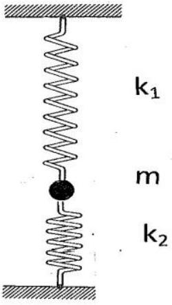

Q2.
Figure 2.1

    (a) A Hookian spring, with spring constant $k_{1}$, is cut into $n$ identical springs, each with a spring constant $k_{2}$. Determine the relation between $k_{1}$ and $k_{2}$.
    [4]
    (b) A spring, with spring constant $k_{1}$, is attached to small sphere of mass $m$. The other end is hung from a rigid support. A spring, with spring constant $k_{2}$ as in part (a), is attached to the bottom of the sphere and the lower end of the spring is attached to a rigid base and has zero tension. The two springs and the mass lie in a vertical line, Figure 2.1.
Determine the equilibrium extension of the upper spring, $x_{10}$.
    [1]
    (c) If the mass is displaced vertically downwards from equilibrium, by a distance $x$, show that it will perform simple harmonic motion and determine its frequency, $f$.
    [6]
    (d) Derive an expression for the total energy, $E$, of the system in terms of the downward displacement, $x$ of the mass, from its equilibrium position, and its velocity $v$. Show that $E$ depends only on the variables $v^{2}$ and $\mathrm{x}^{2}$.
    [6]
    (e) If the system is arranged horizontally on a smooth table, so that the sphere oscillates, in a straight line, along the direction of the springs, determine the frequency of oscillation, $f_{H}$.
    [3]
