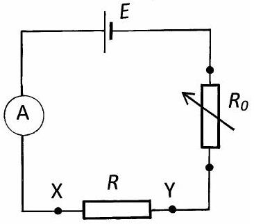
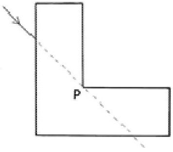
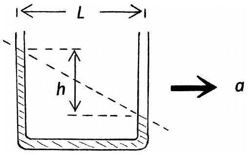
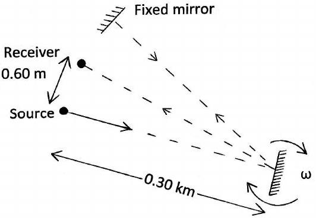
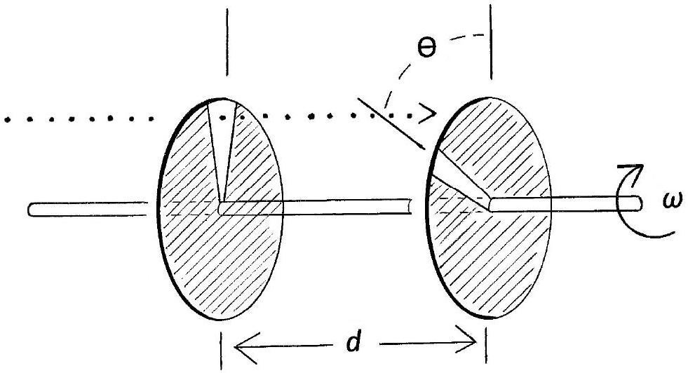

Q1.
    (a)The circuit in Figure 1.(a) contains a cell of emf $E$, a known variable resistance $R_{0}$, an unknown resistance $R$ and an ammeter. When X and Y are short circuited $E=I_{0} R_{0}$ When $R$ is inserted the current is $\alpha /_{0}$, where $\alpha$ is a constant.

Figure 1.(a)
    (i) Express $R$ in terms of $R_{0}$ and $\alpha$, giving the range of validity of $R$ and $\alpha$.
    (ii) In order to extend the range of $\alpha$, modify the circuit by putting $R$ in parallel with $R_{0}$. Determine the ranges of $R$ and $\alpha$ for the modified circuit.
    (b) A man, on an open wagon of a train travelling along a straight horizontal track at a constant speed of $10 \mathrm{~ms}^{-1}$, throws a ball into the air in line with the track, that he judges to be at $60^{\circ}$ to the horizontal. A woman standing on the ground observes the ball rise vertically.
How high does the ball rise relative to
    (i) the man and;
    (ii) the woman?

(c)A glass block of refractive index $\mu=1.5$ has an 'L' cross-section, Figure 1.(c), and is of constant width and thickness.

Figure 1.(c)

    (i) A laser beam enters the block from the left, as indicated in Figure 1.(c), at an incident angle of $\theta=45^{\circ}$. If the block was absent the beam would pass through the point P. Determine the angle at which the beam will emerge from the bottom face after refraction through the block.
    (ii) If this beam enters the block below the horizontal through P , determine its possible subsequent path(s).

(d) The largest moon of Jupiter, Ganymede, revolves around the planet in a circular orbit of radius $1.07 \times 10^{6} \mathrm{~km}$ and period 7.16 days. Determine the mass of Jupiter, $M_{J}$, in terms of the mass of the Earth, $M_{E}$.
The radius of the Earth $R_{E}=6.38 \times 10^{6} \mathrm{~m}$ [5]
(e) Two 1.00 m lengths of wire, one copper and one tungsten, are joined vertically end to end. The copper wire has a diameter of 0.500 mm . When a 100 kg block is suspended from one end, the combined length of wire stretches by 6.00 cm. What is the diameter, $d$, of the tungsten wire if the Young's modulus for copper is $12.4 \times 10^{10}$ Pa , and that for tungsten is $35.5 \times 10^{10} \mathrm{~Pa}$ ? [6]
(f) Wood from the coffin of an Egyptian mummy showed a specific activity of $1.2 \times 10^{2}$ $\mathrm{s}^{-1} \mathrm{~kg}^{-1}$. Comparable living wood has a value of $2.0 \times 10^{2} \mathrm{~s}^{-1} \mathrm{~kg}^{-1}$. The half life of carbon- 14 is $5.70 \times 10^{3}$ years. What is the time interval, $T_{B}$, in years, since the burial? [5]
(g) Explain why the centre of gravity of a triangular plate lies along a median; the line joining a vertex to the midpoint of the opposite side. An equilateral triangular plate, sides of length $b$, has a triangle, formed by two corners and the centre of gravity of the original plate, removed. Determine the centre of gravity of the remaining plate. The centre of gravity of a triangular plate is at a point two thirds along the length of a median measured from the vertex. [7]

(h) A vertical U-tube, partially filled with liquid, is accelerated vertically upwards in a lift, acceleration $\alpha$. What is the effective value of ' $\boldsymbol{g}$ ', $\boldsymbol{g}_{v}$ ? If the U-tube is mounted in a vehicle accelerating in a horizontal straight line, acceleration $a$, Figure 1.(h), what is the effective ' $\boldsymbol{g}^{\prime}, \boldsymbol{g}_{h}$ ? Express $a$ in terms of the distance between the arms of the Utube, $L$, and the difference in heights, $h$, of the liquid in the arms.
    [7]

Figure 1.(h)

(i) In Figure 1.(i) a fixed mirror, a light source and a light receiver are all 0.30 km from a rotating mirror, with angular frequency $\omega$. The distance between the light source and the receiver is 0.60 m . What is the lowest value of $\omega$ required for detection of the reflected light?
[4]

Figure 1.(i)

(j) A car travelling at 90 km/hr in a straight line sounds its horn continuously, frequency 400 Hz, as it passes a stationary observer. At the closest point, A, to the observer the car is at a distance $D=100 \mathrm{~m}$ from the observer. Determine the frequency heard by the observer when the car is:
    (i) at A;
    (ii) at a distance $x$ from $A$, after passing $A$

The velocity of sound is $v_{S}=343 \mathrm{~ms}^{-1}$.

(k) A ball of mass $m$ and velocity $u$ collides elastically with a larger ball of mass $M$, initially at rest. The ball of mass $m$ rebounds along its original line of motion with speed $v_{1}$ and the ball of mass $M$ has velocity $v_{2}$ in the direction of $u$.
    (i) Write down the conservation equations for the system.
    (ii) Deduce the result that $u-v_{1}=v_{2}$.
(I) A velocity selector, Figure 1.(I) , consists of two slotted discs mounted on a common axis a distance $d$ apart. The slots are displaced relative to each other by an angle $\theta$. The axis is driven at an angular velocity $\omega$. Particles in a horizontal beam, with all possible velocities, will get through the first slit, in the first disc, for a short time interval. To subsequently get through the second slit, particles must travel a distance $d$ in the times it takes the second slot to line up with the beam. This will occur, for rotations of the second slit of $\theta, 2 \pi+\theta, 4 \pi+\theta$, ,. etc.
If $d=1.00 \mathrm{~m}, \omega=24,000 \mathrm{rpm}$ and $\theta=60^{\circ}$, what are the speeds of those particles that pass through the velocity selector?

Figure 1.(I)
