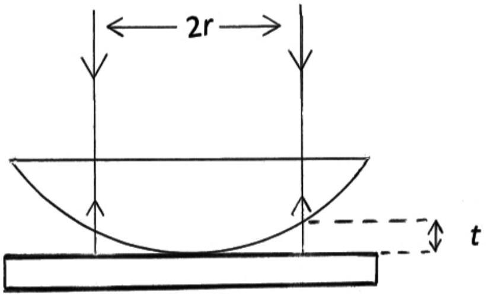

Q5.
Figure 5.(1)

A Newton's rings interference experiment uses a plano-convex lens resting on a glass plate with light of wavelength $\lambda$ incident normally on the lens, Figure 5.(1).

    (a) Derive the conditions for constructive and destructive interference resulting from a region where the air gap has thickness $t$.

(b) A constructive interference ring, resulting from light passing through the air gap of thickness $t$, has a radius $r$. Show that the radius of curvature of the lens, $a$, is given by the equation.
$$
r^{2}=2 a t-t^{2}
$$

(c) By neglecting $t^{2}$ in the above formula, derive a formula for $a$ in terms of $r$ and the order of interference, $n$, that is independent of $t$ for the case in which the $\mathrm{n}^{\text {th }}$ order destructive interference ring has radius $r$.

(d) If, using sodium light of wavelength $\lambda=598 \mathrm{~nm}$, the diameter of the $\mathrm{n}^{\text {th }}$ order constructive interference ring is 0.582 cm and that of the $(\mathrm{n}+20)^{\text {th }}$ has diameter 1.36 cm, calculate the radius of curvature of the lens.

(e) If, in 5.0 s, the air gap between the lens and the plate is filled with methyl alcohol of refractive index $\mu=1.33$, what are the average speeds at which the radii of the constructive interference rings increase in (d) in this time interval?
