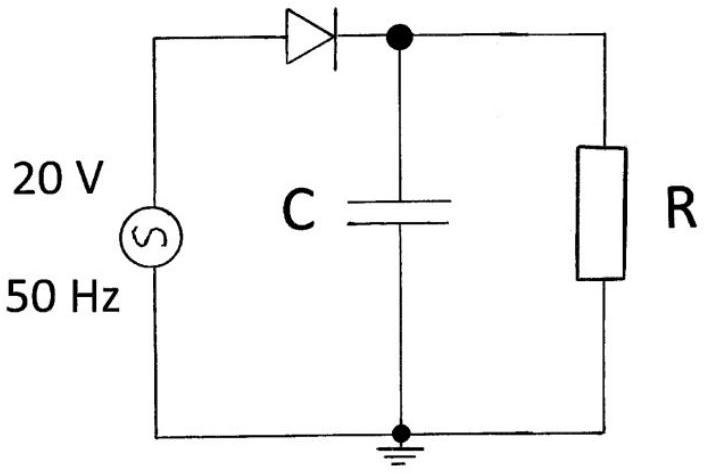

Q6

Figure 6.(1)

(a) The diode in the above circuit, Figure 6.(1), is used to rectify an ac voltage supply. The ac voltage supply at time $t$ has the form,
$$
V(t)=V_{0} \cos (2 \pi f t)
$$
It has $f=50 \mathrm{~Hz}$ and $V_{0}=20 \mathrm{~V}$. The capacitor has capacitance $C=50 \mu \mathrm{~F}$ and the resistance, $R$, can take the values $10 \mathrm{k} \Omega, 1 \mathrm{k} \Omega$ and $100 \Omega$.
Determine the time constants for the discharge of the capacitor, for all three values of the resistance.
(b) Sketch a graph of the voltage forms across the resistance for the three values of $R$, superimposing the original ac source on each sketch.

(c) For the case $R=10 \mathrm{k} \Omega$, deduce a relation for determining the time the diode conducts, $T_{D}$, in terms of $f$ and $T_{1}$, where $T_{1}$ is the time the capacitor discharges per cycle. Show that it is the solution of the equation
$$
\exp \left(-T_{1} / R C\right)=\cos \left(2 \pi f T_{1}\right),
$$
and verify that $T_{1}=0.019125 \mathrm{~s}$.
Determine the percentage of the time that the diode is conducting.

(d) Calculate the variation in voltage, from maximum to minimum, for $R=10 \mathrm{k} \Omega$.
