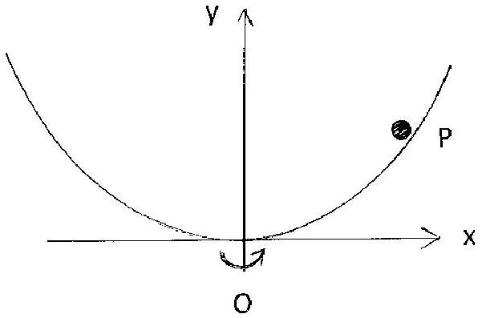
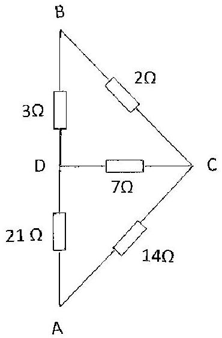

Q1.
    (a) A measurement is carried out to check the speed of a camera shutter of $1 / 15 \mathrm{~s}$. The camera is focused symmetrically on a rotating turntable which revolves at 33.3 ± 0.1 revolutions per minute and has a spot at its centre and at its circumference. A photograph shows the arc produced by the spot on the circumference subtends an angle of $12.4 \pm 0.1^{\circ}$ at the centre of rotation. What is the correct exposure time?
    [3]
    (b)The temperature coefficients of resistance, $\alpha$, of certain alloys are positive and others are negative. They have resistance per unit length of $r$. This makes it possible to produce a resistor, using the two wires in series, which does not vary with temperature. The values of $r$, at $0^{\circ} \mathrm{C}$, and $\alpha$ are given in Table 1.b for constantan and manganin. These wire have lengths $L_{\mathrm{c}}$ and $L_{\mathrm{m}}$ respectively at 0 °C. What values of $L_{\mathrm{c}}$ and $L_{\mathrm{m}}$ are required to produce a $5.0 \Omega$ resistor?

| Wire | $r / \Omega \mathrm{m}^{-1}$ | $\alpha /{ }^{\circ} \mathrm{C}^{-1}$ |
| :--- | :--- | :--- |
| Constantan | 6.3 | $-3.0 \times 10^{-5}$ |
| Manganin | 5.3 | $+1.4 \times 10^{-5}$ |

Table 1.b

[5]
    (c) A monochromatic sodium lamp, wavelength $\lambda=6.0 \times 10^{-7} \mathrm{~m}$, radiates 100 W of radiation uniformly in all directions. At what distance from the lamp will the photons have an average density of $10^{6} \mathrm{~m}^{-3}$ ?
[5]
    (d) Protons are accelerated from rest through a p.d. of $2.0 \times 10^{6} \mathrm{~V}$ and fired at a gold $\left({ }_{79}^{197} \mathrm{Au}\right)$ foil. What is the distance of closest approach of a proton to the gold nucleus?

[4]

(e)Figure 1.e is a section through a smooth parabolic metal bowl, which can be rotated about its vertical axis of symmetry, the $y$ - axis. Its equation, in Cartesian coordinates, is $y=a x^{2}$. The gradient at the point $(x, y)$ is $2 a x$.
There is one angular speed of rotation, $\omega$, of the bowl about the $y$ - axis for which a small metal sphere remains at rest relative to the rotating bowl, wherever it is placed on the inner surface. Determine $\omega$ in terms of $a$ and $g$.

Figure 1.e
(f) A ray of light is incident on a 60°glass prism of refractive index 1.500 at an angle of incidence of 48.59°. Determine:
    (i) the angle of emergence, $\theta$, from the prism; i.e. the angle between the emergent ray and the normal to the prism face.
    (ii) the angle of deviation of the ray, $\delta$.
(g) A man blowing a whistle of frequency $f$ moves away from a stationary observer at speed $u$. Derive the formula for the frequency $f_{1}$ heard by the observer. The velocity of sound is $c$.
If a man blowing a whistle of frequency 500 Hz moves away from a stationary observer towards a fixed wall, in a direction perpendicular to the wall at $2.00 \mathrm{~ms}^{-1}$, determine the beat frequency heard by the observer if $c=330 \mathrm{~m} \mathrm{~s}^{-1}$.

(h)Determine, in Figure 1.h, the total resistances, $R_{\text {TBC }}$, across BC, $R_{\text {TBD }}$ across BD and $R_{\text {TBA }}$ across AB.

Figure 1.h

[6]
(i) What mass of radium, mass number 226, half-life of 1620 years, and an $\alpha$ emitter, is required to produce an average of $10 \alpha$ particles per second?
[4]
(j) An a.c. voltmeter displays the rms value of the voltage, $V$, for a.c. signals and also for periodic signals that are not sinusoidal. What reading will it display if connected to a periodic voltage, period 4T, that changes instantaneously from +10V to -2 V to +4 V repeatedly, the voltages lasting, respectively, for $T, T$ and $2 T$ ?
Determine the following;
    (i) the mean voltage i.e. $V_{\mathrm{m}}$.
    (ii) the rms voltage i.e. $V_{\text {rms }}$.
    (iii) the rms value of deviation from the mean, $\left(V-V_{\mathrm{m}}\right)$ which is $V_{\mathrm{rmsm}}$.

(k) Assuming the Earth is a homogeneous sphere, calculate the fractional difference between the acceleration due to free fall at the Earth's equator and at the poles, indicating which is the greater. You may not use a value of $g$ given in the constants table as that is an average value, neither correct at the poles nor at the equator. Mass of the $M_{\mathrm{E}}=5.98 \times 10^{24} \mathrm{~kg} \quad$ Radius of the Earth $R_{\mathrm{E}}=6.38 \times 10^{6} \mathrm{~m}$
(l) A horizontal square wire loop of side 4.00 cm has a resistance, $R$, of $2.00 \times 10^{-3} \Omega$. The loop is situated in a vertical downward magnetic field of 0.700 T. When the field is switched off, it decreases to zero, at a uniform rate, in 0.800 s.
Determine:
    (i) the induced current, $I$, and its direction in the loop.
    (ii) the energy dissipated in the loop.
(m) Two well separated identical conducting spheres of radius 10.0 cm are charged to +200 V and +400 V. If they are joined by a long wire, how much heat is generated?
