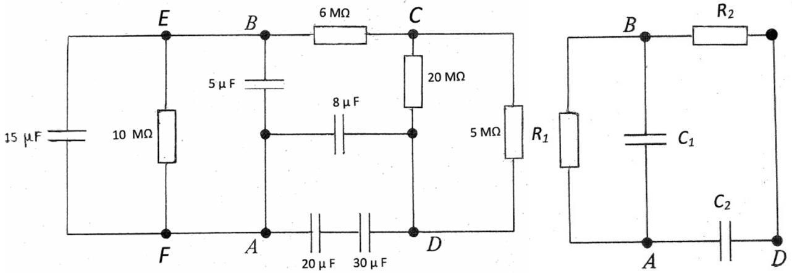

Q4.
    (a) A square wave, positive voltage pulse with peak value 5.0 V and duration 0.020 s is applied across a series combination of a $2.0 \mathrm{k} \Omega$ resistor and a $5.0 \mu \mathrm{~F}$ capacitor.
Sketch, on the same graph, the voltages across the resistor, $V_{R}$, using a full curve, and across the capacitor , $V_{C}$, using a dashed curve. Add the two voltages using a dotted curve. No numerical calculation is required.
    [6]
    (b) The current, $I$, through a rod is related to the voltage $V$ across it by
$$
I=0.20 V^{3} .
$$
The rod is connected in series with a resistor, resistance $R$, and a 6.0 V battery.
What is the value of $R$ if:
        (i) the current in the circuit is 0.40 A?
        (ii) the power dissipated in the rod is twice that dissipated in the resistor?
        [7]
    (c) In the circuit in Figure 4.c(i), show that the circuit can be reduced to that in Figure 4.c(ii). Determine the values of $R_{1}, R_{2}, C_{1}$ and $C_{2}$. Each time a simplification is made to the circuit elements, draw the modified circuit.
        [7]

Figure 4.c(i)

Figure 4.c(ii)
