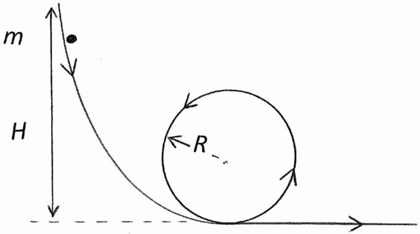

## Question 1.

(a) Sketch the electric field lines due to two point charges, of magnitudes $+Q$ and $+2 Q$, at A and B, separated by a distance $d$.
    (i) Determine the location of the neutral point, P , where the electric field is zero.
    (ii) Why does the magnitude of the electric field vary along a field line?
(b) A charge of $0.5 \times 10^{6} \mathrm{C}$ passes through a 12 V battery when the battery discharges. Assuming that the p.d. across the terminals remains constant, calculate the time for which it can supply 0.45 kW.
(c) Draw a general resistive network diagram with:
    (i) two resistors in series which are, in turn, in series with three resistors in parallel.
    (ii) five resistors that are not in series or parallel, or in a combination of series and parallel arrangements.

Calculate the resistance in (i) and (ii) if all the resistors have resistance $R$.

(d) Two spheres, of uniform density, one of mass $m_{1}$ and radius $r_{1}$ and the other of mass $m_{2}$ and radius $r_{2}$, attract each other gravitationally. What is their relative speed at the instant of collision if they are released from rest when a great distance apart?

(e) A bicycle tyre has a volume of $1.2 \times 10^{-3} \mathrm{~m}^{3}$ when fully inflated. A bicycle pump has a working volume of $9.0 \times 10^{-5} \mathrm{~m}^{3}$. How many strokes, $n$, of the pump are needed to inflate the completely flat tyre, containing no air, to a pressure of $3.0 \times 10^{5} \mathrm{~Pa}$ ? The atmospheric pressure is $1.0 \times 10^{5} \mathrm{~Pa}$. Assume the air is pumped in slowly so that there is no change in temperature.

(f) A van, travelling at constant speed of $80 \mathrm{~km} \mathrm{hr}^{-1}$ (km/hour), passes a car. The car immediately begins to accelerate at a constant rate of $1.2 \mathrm{~m} \mathrm{~s}^{-2}$ and passes the van 0.50 km further down the road. What is the speed, $v$, of the car when it passes the van?

(g) A calorimeter contains 0.800 kg of water at a temperature of 15.0 °C. The heat capacity of the calorimeter is $42.8 \mathrm{~J}^{\circ} \mathrm{C}^{-1} .0 .400 \mathrm{~kg}$ of molten lead is poured into the calorimeter. The final equilibrium temperature is 25.0 °C. What was the initial temperature of the lead?
The specific heat of molten lead is $158 \mathrm{~J} \mathrm{~kg}^{-1}{ }^{\circ} \mathrm{C}^{-1}$, the specific heat of solid lead is 137 J $\mathrm{kg}^{-1}{ }^{\circ} \mathrm{C}^{-1}$ and the specific latent heat is $2.323 \times 10^{4} \mathrm{~J} \mathrm{~kg}^{-1}$. Lead freezes at $327^{\circ} \mathrm{C}$. The specific heat of water is $4200 \mathrm{~J} \mathrm{~kg}^{-1}{ }^{\circ} \mathrm{C}^{-1}$.

(h) A small object of mass $m$ rests on a scale-pan which is supported by a spring. The period of vertical oscillations is 0.50 s. When the amplitude of the oscillations exceeds the value, $A$, the mass leaves the scale-pan. Determine $A$.

(i) Uncharged metallic spheres of radii $6 R, 3 R$ and $2 R$ are mounted on insulated stands. The spheres of radii $2 R$ and $6 R$ are charged to a potential $V$ above earth potential. All three spheres are then briefly joined by a copper wire. What, in terms of $V$, is the subsequent potential of the sphere of radius $3 R$ ?
What fraction of the original total charge is held by the sphere of radius $3 R$ ? [5]
(j) The maximum kinetic energy of photoelectrons ejected from a tungsten surface by monochromatic light of wavelength 248 nm is $8.60 \times 10^{-20} \mathrm{~J}$.
What is the value of the work function, $W$, of tungsten? [3]
(k) A ladder of length $L$ and mass $m$, with a uniform density, rests against a frictionless vertical wall at an angle of $60^{\circ}$ to the wall. The lower end rests on a flat surface with a coefficient of static friction of $\mu_{s}=0.40$. A student with a mass $M=2 m$ attempts to climb the ladder. What fraction of the distance up the ladder will the student have reached when the ladder begins to slip? [5]
(I) A smooth ball of radius 10.0 cm, mass 0.600 kg, hangs by a weightless string from a support. What is the speed of a horizontal wind necessary to keep the string inclined at 39° to the vertical? Make the assumption that the wind speed drops to zero on collision with the ball. The density of the air is $1.293 \mathrm{~kg} \mathrm{~m}^{-3}$. [4]
(m) The activity of polonium, Po, fell to one eighth of its initial value in 420 days. Calculate the half-life, $t_{h}$, of polonium.
Give the numerical values of $\mathrm{a}, \mathrm{b}, \mathrm{c}, \mathrm{d}, \mathrm{e}$, and f in the nuclear equation
$$
{ }_{\mathrm{b}}^{\mathrm{a}} \mathrm{Po} \rightarrow{ }_{\mathrm{d}}^{\mathrm{c}} \alpha+{ }_{82}^{206} \mathrm{~Pb}+{ }_{\mathrm{f}}^{\mathrm{e}} \gamma
$$

(n) Four masses of 1 kg, 4 kg, 3 kg, and 4 kg are arranged cyclically at the corners of a square of side $2 b$ and centre O . A thin circular metal ring has radius $a$, mass 8 kg , and with the same centre O lies in the same plane as the square. Determine the position of the centre of mass of the system from 0 .
(o) A trumpeter travelling in an open car sounds a note at 440 Hz . A stationary pedestrian directly in the path of the car hears a note at frequency 466 Hz . What is the speed of the car? The velocity of sound is $331 \mathrm{~ms}^{-1}$.
(p) A beam of protons is accelerated from rest through a potential difference of 2000 V and enters a uniform magnetic field which is perpendicular to the direction of the proton beam. If the flux density is 0.2000 T , calculate the radius of the path of the beam.
How is the result modified for deuterons?
(q) A particle, mass $m$, slides down the smooth track, Figure 1(q), from a height $H$ under gravity. It is to complete a circular trajectory of radius $R$ when reaching its lowest point. Determine the smallest value of $H$.

Figure 1(q).
