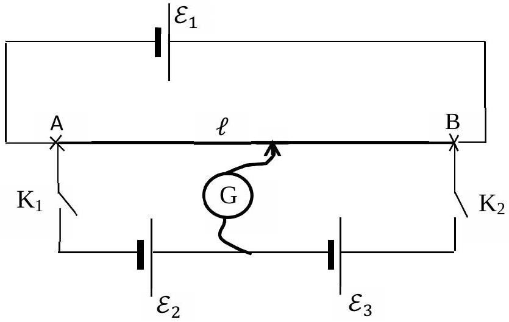
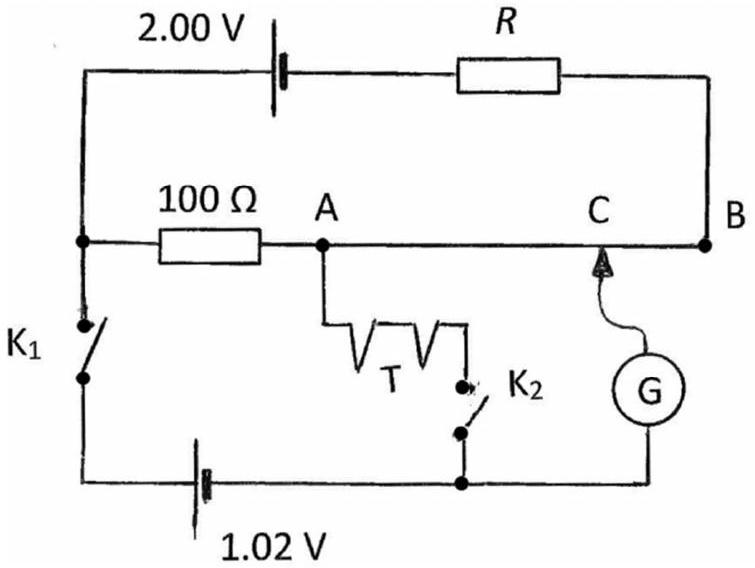
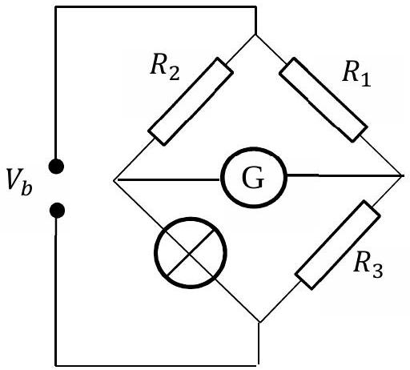
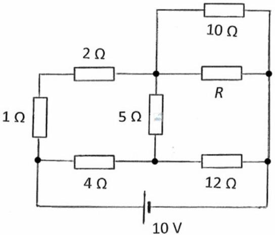

Question 2.

(a) Ideal cells of EMF $\varepsilon_{1}, \varepsilon_{2}, \varepsilon_{3}$ are connected to a wire of resistance $R$ and of length $\ell$ between ends A and B as shown in Figure 2(a).
    (i) With switches $\mathrm{K}_{1}$ and $\mathrm{K}_{2}$ initially open, write down the potential $\mathcal{E}$ at length $\ell_{1}<\ell$ from A in terms of $\varepsilon_{1}, \ell$ and $\ell_{1}$.
    (ii) The cells $\varepsilon_{2}$ and $\varepsilon_{3}$ are chosen such that $\varepsilon_{1}=\varepsilon_{2}+\varepsilon_{3}$. When $\mathrm{K}_{1}$ and $\mathrm{K}_{2}$ are closed, the galvanometer G (a very sensitive ammeter) is connected between A and B at a distance $\ell_{2}$ from A so that no current flows through it. Write down equations relating
        a. $\varepsilon_{1}, \varepsilon_{2}, \ell$ and $\ell_{2}$
        b. $\varepsilon_{1}, \varepsilon_{3}, \ell$ and $\ell_{2}$

[2]

Figure 2(a). Cells connected to a resistance wire.

(b) The circuit in Figure 2(b) enables the measurement of the EMF, $\mathcal{E}$, of a thermocouple T (a temperature dependent source of a small EMF). AB is a uniform wire of length 1.00 m and resistance $2.00 \Omega . \mathrm{K}_{1}$ and $\mathrm{K}_{2}$ are switches.
No current flows through G when:
    (i) $\quad \mathrm{K}_{1}$ is closed and $\mathrm{K}_{2}$ is open and $\mathrm{AC}=90.0 \mathrm{~cm}$.
    (ii) $\mathrm{K}_{2}$ is closed and $\mathrm{K}_{1}$ is open and $\mathrm{AC}=45.0 \mathrm{~cm}$.

Figure 2(b).

(c) The potential difference across a filament lamp, $V$, is related to the current $I$ through it by
$$
V=2 I+8 I^{2}
$$
The lamp is connected to a measurement arm of a Wheatstone bridge, the circuit shown in Figure 2(c). The other arms are each of resistance $4 \Omega$. Determine the value of the voltage across the bridge, $V_{b}(>0)$, necessary for the bridge to be balanced i.e. when no current flows through G.

Figure 2(c). Wheatstone Bridge circuit.

Figure 2(d).

(d) In the circuit, Figure 2(d), determine the value of resistance $R$ required to minimise the heat generated in the $5 \Omega$ resistor.
