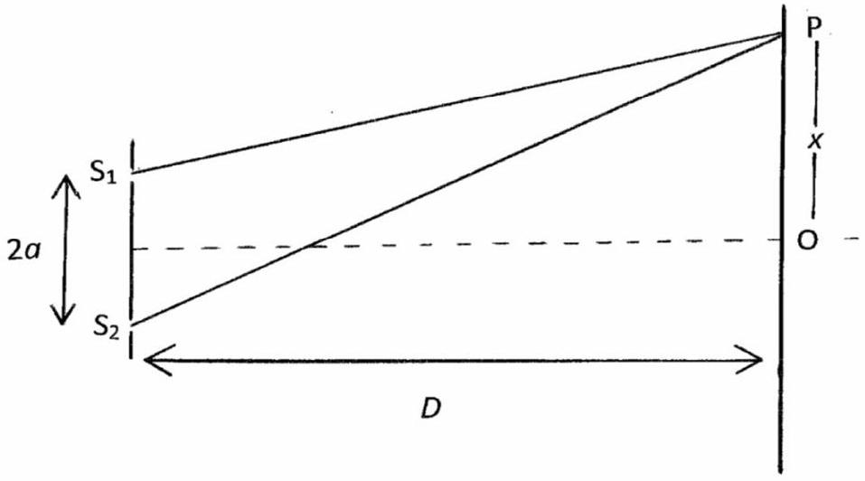
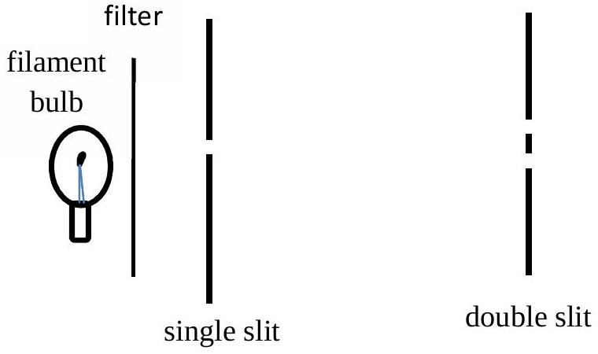

## Question 3.

Figure 3(a).

(a) In a Young's slit experiment the slits, $\mathrm{S}_{1}$ and $\mathrm{S}_{2}$, are a distance $2 a$ apart and the screen is at a distance $D$ from the line joining the slits, Figure 3(a). P is a point on the screen a distance $x$ from the line of symmetry of the system.
    (i) Derive an expression for the spacing between adjacent fringes, $\Delta x$, for light of wavelength $\lambda$, in terms of $a, x$ and $D$ in the approximation $x, a \ll D$.
    (ii) If white light was passed through the slits, sketch or describe what would be seen near the centre of the screen.
    (iii) A laser is often used to illuminate the two slits. Before the invention of the laser, a light bulb with a small filament and with a colour filter was used to illuminate a single slit in front of the double slit in Figure 3(b). Explain the purpose of the single slit. Your answer should consider the effect of coherence.

Figure 3(b). Filament bulb and single slit to illuminate the double slit.

(b) Two whistles, both of frequency $f=2.00 \mathrm{kHz}$, are situated 3.00 m apart and blown simultaneously. An observer travelling along a line parallel to the line joining the whistles, and at a distance approximately 20.0 m opposite the whistles, detects minima in sound intensity at a series of points spaced 1.14 m apart. Calculate the speed of sound in air. [6]
$$
\text { (For small } \varepsilon,(1+\varepsilon)^{\alpha}=1+\alpha \varepsilon+\cdots \text { ) }
$$
