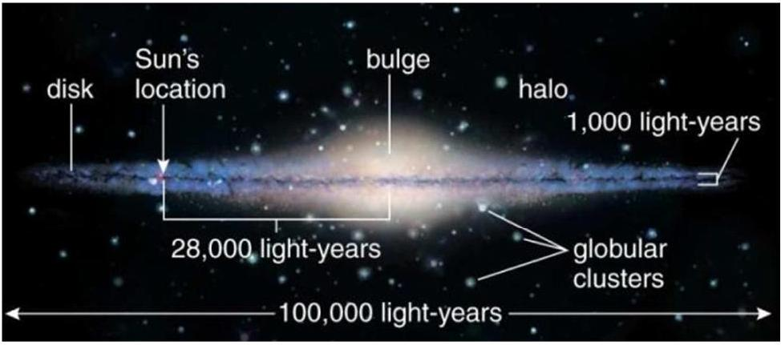

Question 5. (You may answer EITHER Qu 5 OR Qu 6 but not both)
Galaxies are a large collection of stars and gas that are held together by their own gravity. One class of galaxies, spiral galaxies, are characterised by a spherical bulge and a flattened disk in which the stars form a spiral pattern. The stars and gas in a spiral galaxy trace out circular orbits around the centre of the galaxy. A schematic of a spiral galaxy, the Milky Way, can be seen below in Figure 5.

Figure 5. Schematic of the Milky Way galaxy.

(a) Using the gravitational force acing on a star moving in a circular orbit and assuming spherical symmetry, determine the rotational velocity $\left(v_{\text {rot }}\right)$ of a star as a function of the mass enclosed within a radius $r$. Only the mass of material contained within the orbital radius of the star contributes to the gravitational force of attraction.
(b) Assuming that most of the mass of the galaxy is contained within the spherical bulge of radius $r_{0}$, with uniform density $\rho_{0}$, determine the shape of the rotation curve (the graph of $v_{\text {rot }}$ against $r$ ) inside and outside $r_{0}$. Sketch the expected rotation curve of the galaxy.

(c) Astronomers have observed the rotation curves of galaxies and found a significant discrepancy between what is measured and the theoretical prediction. They found that the rotation velocity curve was flat at $r>r_{0}$, which cannot be explained by a centrally dominating mass. Another component was suggested to make up for the missing, invisible mass, called "dark matter". Assuming a more realistic density profile for the spherically distributed dark matter:
$$
\rho(r)=\rho_{0}\left(\frac{r}{r_{0}}\right)^{-\alpha}
$$
Determine the exponent, $\alpha$, needed such that the rotation curve is flat at $r>r_{0}$, as seen from measurements.

(d) At $r=2.8 \times 10^{5}$ light years distant from the centre of the Milky Way, our Sun has a measured velocity of $v_{\text {rot }}=220 \mathrm{~km} \mathrm{~s}^{-1}$ and an expected velocity of $v_{\text {exp }}=$ $70 \mathrm{~km} \mathrm{~s}^{-1}$. Calculate the visible as well as the true mass of the Milky Way. What is the percentage of dark matter in the galaxy? Express your answer in units of solar masses, $M_{\odot}$.
$$
M_{\odot}=1.99 \times 10^{30} \mathrm{~kg} . \quad 1 \text { light year is the distance light travels in a year. }
$$
(e) Although dark matter is now the widely accepted explanation for the rotation curve problem, an alternative has been suggested: modifying the laws of gravity. Modified Newtonian Dynamics (MOND) postulates that Newton's third law can be re-written as $F=m \mu\left(\frac{a}{a_{0}}\right) a$ where $\mu$ is a function with the property that $\mu(x)=1$ for $x \gg 1$ and $\mu(x)=x$, for $x \ll 1, a$ is the acceleration and $a_{0}$ is a constant that marks the transition between Newtonian gravity and MOND. In the limits of small acceleration ( $a \ll a_{0}$ ), show that this formulation also leads to a flat rotation curve at large radii.
