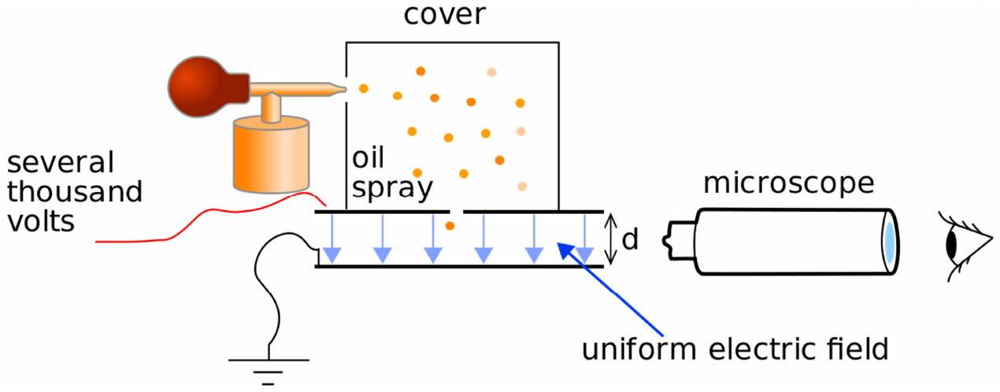

## Question 7.

Millikan's oil drop experiment, illustrated in Figure 7, was the first experiment to determine the size of the elementary charge, $e$. Charged oil droplets are sprayed into an air filled chamber and observed through a microscope inserted in the side of the chamber. The droplets fall under gravity with a terminal velocity. A uniform electric field between the top and bottom plates could be used to hold the charged oil drops in a fixed vertical position in the electric field. The potential between the plates was measured. The polarity could be changed in order to pull them back up against gravity. The drag force on them due to air resistance is known as viscous drag. The charge on an oil drop may spontaneously change due to random ionisation.

Figure 7. Millikan oil drop experiment apparatus (schematic).
Source: https://en.wikipedia.org/wiki/Oil_drop_experiment

(a) The viscous drag force on a small spherical droplet is given by $F_{v}=6 \pi \eta a u$ where $a$ is the radius of the drop, $u$ is the terminal velocity of the drop, $\eta$ is the viscosity of the air. $\quad \eta=1.82 \times 10^{-5} \mathrm{~kg} \mathrm{~m}^{-1} \mathrm{~s}^{-1}$.
In two successive measurements of an oil droplet, the rise times were 42 s and 78 s. The distance travelled upwards at constant velocity was 1.00 cm, the potential difference across the plates was 5000 V, and the plate separation was 1.50 cm. The radius of the drop was $a=2.76 \times 10^{-6} \mathrm{~m}$.
Calculate the change in the number of electrons in the drop between the two observations.
[8]
(b) Two drops of the same density, with radii $r_{1}$ and $r_{2}$, both with identical charges $Q$ and terminal velocities $u_{1}$ and $u_{2}$ respectively, coalesce. How is the final terminal velocity $v$ of the drop related to the initial velocities?
[5]
(c) A separate experiment to measure $e / m_{e}$ for an electron could be used to enable the electron mass, $m_{e}$, to be determined.
A potential difference of 3000 V is maintained between deflector plates, with separation 2.0 cm, in an evacuated tube. A magnetic field of $2.5 \times 10^{-3} \mathrm{~T}$ at right angles to the electric field gives no deflection to an electron beam entering the fields. The electron beam received an initial kinetic energy by being accelerated through a potential difference of 10000 V. Calculate the ratio $e / m_{e}$.
[7]
