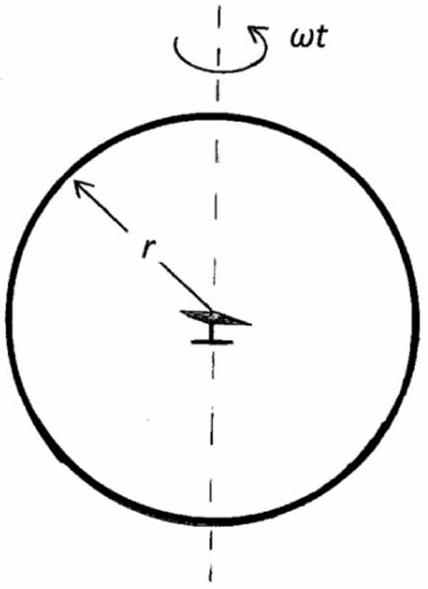

## Question 8.

Figure 8.

A circular copper ring, of radius $r=0.125 \mathrm{~m}$ and resistance $R$, rotates about a vertical diameter with constant angular velocity, $\omega$, radians per second. A small magnetic compass needle, which can rotate about a vertical axis, is situated in the middle of the ring, Figure 8. When the ring is stationary, the needle points in the direction of the horizontal component of the Earth's magnetic field, $\boldsymbol{B}$. However, when it rotates at the rate of 10 revolutions per second, the compass needle deviates by an average angle of $\alpha=2.00^{\circ}$ from this orientation. At time $t=0$ the ring is in a plane perpendicular to $\boldsymbol{B}$.

Determine, algebraically:

(a) the magnetic flux , $\Phi$, through the ring at time $t$. [2]
(b) the current, $I$, in the ring. [3]
(c) the magnetic field components of the ring, parallel and perpendicular to $\boldsymbol{B}$. [3]
(d) the average values, over time, of these components. [7]
(e) Hence determine, numerically, $R$. [5]
$$
\left(2 \sin ^{2} \theta=1-\cos 2 \theta, \quad \sin 2 \theta=2 \sin \theta \cos \theta\right)
$$
field at the centre of a circular loop $\quad B=\frac{\mu_{0} I}{2 \pi r}$

## END OF SECTION 2

Important Constants
| Speed of light | c | $3.00 \times 10^{8}$ | $\mathrm{m} \mathrm{s}^{-1}$ |
| :--- | :--- | :--- | :--- |
| Planck constant | $h$ | $6.63 \times 10^{-34}$ | J s |
| Electronic charge | $e$ | $1.60 \times 10^{-19}$ | C |
| Mass of electron | $m_{e}$ | $9.11 \times 10^{-31}$ | kg |
| Gravitational constant | $G$ | $6.67 \times 10^{-11}$ | $\mathrm{N} \mathrm{m}^{2} \mathrm{~kg}^{-2}$ |
| Acceleration of free fall | $g$ | 9.81 | $\mathrm{m} \mathrm{s}^{-2}$ |
| Permittivity of a vacuum | $\varepsilon_{0}$ | $8.85 \times 10^{-12}$ | $\mathrm{F} \mathrm{m}^{-1}$ |
| Avogadro constant | $N_{A}$ | $6.02 \times 10^{23}$ | $\mathrm{mol}^{-1}$ |

## Rolls-Royce

UNIVERSITY OF OXFORD

UNIVERSITY OF CAMBRIDGE

Worshipful Company of Scientific Instrument Makers

UNIVERSITY PRESS

Cambridge
UNIVERSITY PRESS
