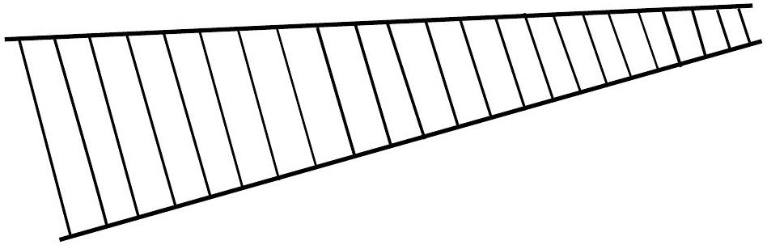
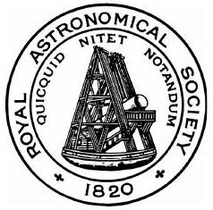

## Question 1

a) Physicists sometimes use the approximation that light travels in a vacuum at a speed of 1 foot in 1 ns. What is the percentage error in using this value?
$$
\text { ( } 1.000 \mathrm{~m}=1.094 \mathrm{yards} \text { and } 1.000 \mathrm{yard}=3.000 \text { feet } \text { ) }
$$
[3]
b) A window cleaner's ladder shown in Figure 1 is narrower at the top than the bottom. It has a weight of 350 N and a length of 5.0 m. When it lies flat on the ground, a force of 80 N is needed to lift the narrow end off the ground.
    (i) How far is the centre of mass from the narrow end?
    (ii) What force is required to lift the wide end of the ladder off the ground?

[5]
c) A particle moves in a straight line with an intial acceleration of $10 \mathrm{~m} \mathrm{~s}^{-2}$. The acceleration decreases uniformly with time until, after ten seconds, the acceleration is $5 \mathrm{~m} \mathrm{~s}^{-2}$, and from then on the acceleration remains constant. If the intial velocity is $100 \mathrm{~m} \mathrm{~s}^{-1}$,
    (i) find when the velocity has doubled;
    (ii) sketch a graph of the velocity against time.

[7]

d) A student standing at a distance $a$ from a vertical wall kicks a ball from ground level with velocity $V$ at an angle $\alpha$ to the horizontal in a plane perpendicular to that of the wall. The ball strikes the wall and rebounds. The coefficient of restitution for the collision is $e=2 / 3$. The ball first strikes the ground at a distance $2 a$ from the wall. $e$ is the ratio of the components of velocity at normal incidence to the wall, before and after collision; $e=\frac{v_{\text {after }}}{v_{\text {before }}} \leq 1$.
Find $a$ in terms of $V, \alpha$ and $g$, the gravitational field strength.

e) A helicopter of total mass 1000 kg is able to remain in a stationary position by imparting a uniform downward velocity to a cylinder of air below it of effective diameter 6 m . Assuming the density of air to be $1.2 \mathrm{~kg} \mathrm{~m}^{-3}$, calculate the downward velocity of the air.
[5]
f) In this question, distances are measured in nautical miles and speeds in nautical miles per hour. A motor boat sets out at 2 p.m. from a point with position vector $-4 \hat{\mathbf{i}}-5 \hat{\mathbf{j}}$ relative to a marker buoy (where $\hat{\mathbf{i}}$ and $\hat{\mathbf{j}}$ are two fixed perpendicular unit vectors) and travels at a steady speed of magnitude $\sqrt{41}$ in a straight line to intercept a ship $\mathbf{S}$. The ship $\mathbf{S}$ maintains a steady velocity vector $\hat{\mathbf{i}}+4 \hat{\mathbf{j}}$ and at 3 p.m. is at a position $3 \hat{\mathbf{i}}-\hat{\mathbf{j}}$ relative to the buoy. Find
    (i) the position vector of the ship at 2 p.m.,
    (ii) the velocity vector of the motor boat,
    (iii) the time of interception.
[7]
g) In a factory heating system, water enters the radiators at 60 °C and leaves at 38 °C. The system is replaced by one in which steam at $100^{\circ} \mathrm{C}$ is condensed in the radiators, the condensed steam leaving at 82 °C. What mass of steam will supply the same heat energy as 1.00 kg of hot water described in the first instance? (The latent heat of vaporisation of water is $2.260 \times 10^{6} \mathrm{~J} \mathrm{~kg}^{-1}$ at $100^{\circ} \mathrm{C}$. The specific heat capacity of water is $4200 \mathrm{~J} \mathrm{~kg}^{-1}{ }^{\circ} \mathrm{C}^{-1}$.)
[4]
h) A cell, a resistor and an ammeter of negligible resistance are connected in series and a current of 0.80 A is observed to flow when the resistor has a value of $2.00 \Omega$. When a resistor of $5.00 \Omega$ is connected in parallel with the $2.00 \Omega$ resistor, the ammeter reading is 1.00 A . Calculate the emf and the internal resistance of the cell.
[5]
i) A battery with an emf of 6 V can produce a maximum current of 3 A. A resistor is connected to the terminals whose value is such that the power dissipated in it is a maximum. Calculate the maximum energy which can be dissipated in the external resistor in one minute.
[4]

j) Calculate the number of photons emitted in a one nanosecond ( $10^{-9} \mathrm{~s}$ ) pulse of light from a 0.5 mW laser of wavelength 639 nm.
k) A lead ball is attached to the end of a light metal rod of length $l$, the other end being attached to a horizontal axle of negligble friction. The rod is given an intial impulse and swings round in a vertical circle. When it is at the top of the circle, the tension in the rod is zero. What is the tension in the rod at the lowest point of its swing?
1) Some sand is sprinkled onto a loudspeaker cone which is pointing vertically upwards. The louspeaker is driven in simple harmonic motion when attached to a signal generator and the frequency is gradually raised. At a particular frequency, when the amplitiude of oscillation is 0.20 mm, the sand begins to lose contact with the cone. At what frequency does this occur?
m) Two radio stations on the equator, diametrically opposite each other, communicate by sending and receiving radio signals that are tangential to the Earth's surface via two geostationary satellites in circular orbits at $3.59 \times 10^{4} \mathrm{~km}$ above the Earth's surface. Calculate the time delay between sending and receiving a signal.
n) A thin film of transparent material of refractive index 1.52 and thickness $0.42 \mu \mathrm{~m}$ forms a thin coating on glass of refractive index 1.60. It is viewed by reflection with white light at normal incidence. What visible wavelength in vacuo is most strongly reflected?
o) Monochromatic light of wavelength 600 nm is incident on two vertical slits hence producing two coherent sources. Before the light leaving these slits overlaps and interferes, each beam passes through a tube 5.0 cm long. One of the tubes is now gradually evacuated and it is noted that the fringe pattern shifts 25 fringes. Calculate the refractive index of air.

p) A submerged wreck is lifted from a dock basin by means of a crane to which is attached a steel cable 10 m long of cross-sectional area $5.0 \mathrm{~cm}^{2}$ and Young modulus $5.0 \times 10^{10} \mathrm{~Pa}$. The material being lifted has a mass of $1.0 \times 10^{4} \mathrm{~kg}$ and mean density $8000 \mathrm{~kg} \mathrm{~m}^{-3}$. Find the change in extension of the cable as the load is lifted clear of the water. Assume that at all times the tension in the cable is the same throughout its length. (Density of water is $1000 \mathrm{~kg} \mathrm{~m}^{-3}$.)
q) A uniform beam $\mathrm{AOB}, \mathrm{O}$ being the midpoint of AB , mass $M$, rests on three vertical springs with stiffness constants $k_{1}, k_{2}, k_{3}$ at A , O and B respectively. The bases of the springs are fixed to a horizontal platform. Determine the compression of the springs and their compressional forces in the following two instances:
    (i) $k_{1}=k_{3}=k$ and $k_{2}=2 k$
    (ii) $k_{1}=k, k_{2}=2 k$ and $k_{3}=3 k$
r) A pond is covered by a layer of ice 5 cm thick. How long will it be before the ice is 10 cm thick if the air temperature stays constant at $-10^{\circ} \mathrm{C}$ ?
Assume the density of ice $=900 \mathrm{~kg} \mathrm{~m}^{-3}$; the latent heat of fusion of ice $=330 \mathrm{~kJ} \mathrm{~kg}^{-1}$; the thermal conductivity of ice $=2.1 \mathrm{~W} \mathrm{~m}^{-1} \mathrm{~K}^{-1}$.
The power flowing perpendicular to the faces through a uniform material is given by power flow $P=\lambda A \frac{\left(T_{\mathrm{H}}-T_{\mathrm{C}}\right)}{x}$, in which $\lambda$ is the thermal conductivity of the material, $T_{\mathrm{H}}$ is the hotter temperature at one face of the material, $T_{\mathrm{C}}$ is the colder temperature on the other face, $A$ is the area of a face, and $x$ is the thickness of the material.

## END OF SECTION 1

## BLANK PAGE

## Rolls-Royce

NPL
National Physical Laboratory

Texas Instruments

Worshipful Company
of Scientific Instrument Makers

## UNIVERSITY OF CAMBRIDGE

Cambridge
UNIVERSITY PRESS

The Institution of
Engineering and Technology

PRINCETON
THE
UNIVERSITY
PRESS

RANDOM
HOUSE GROUP

Springer
