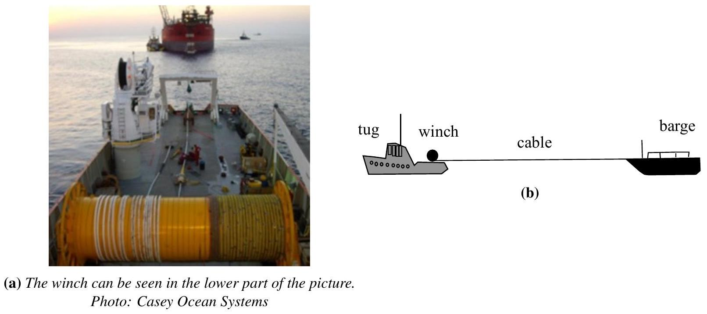
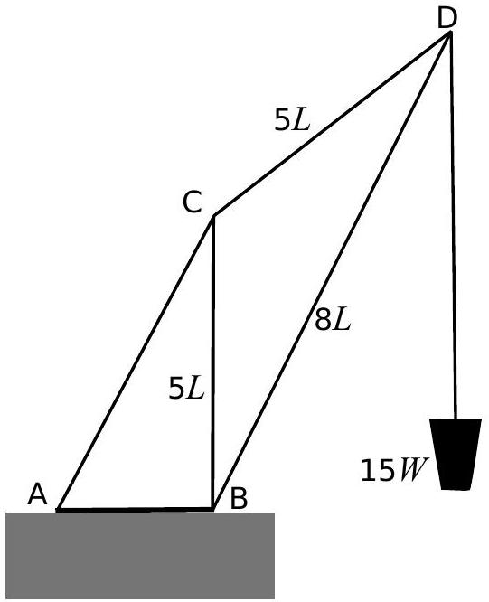
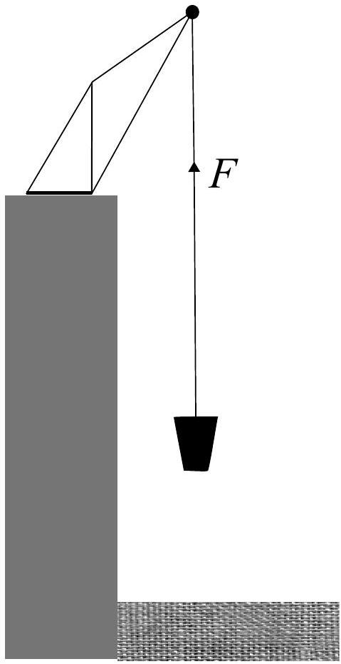

## Question 3

A tug boat winch is fitted with friction brakes that slip when the tension in the winch cable reaches 50 kN. The winch is mounted on a 450 tonne tug which is to tow a floating barge of mass 6300 tonne. The barge is initially at rest while the tug moves away from it at. The speed of the tug at the moment that the cable becomes taut is $2.5 \mathrm{~m} \mathrm{~s}^{-1}$. At that moment the winch friction brakes start slipping in order to prevent the cable from breaking. The thrust exerted on the tug by its propeller is 35 kN. The winch and arrangement might look something like Figure 1a and Figure 1b:

Figure 1

a) Calculate
    (i) The time during which the brakes are slipping,
    (ii) The common velocity of the tug and the barge when the brakes stop slipping.
    (iii) What length of cable runs out of the drum of the winch during the time the brakes are slipping?
b) In a different geometry the winch is used to haul sand up from the bottom of a dry dock using a crane constructed from a very light framework of girders. The crane geometry can be seen in the diagram of Figure 2. The crane is fixed to the horizontal dock side at points A and B. The dimensions of the sides CB, CD and BD are as shown, the girder CB is vertical, and the winch is hauling a load of weight $15 W$.
    (i) Find the magnitude of the force exerted on D by the member BD ,
    (ii) The tension in the member CD.
    (iii) If the force on the crane at A by the ground acts vertically downwards and has a magnitude $31 W$, find the distance AB in terms of $L$.

Figure 2

c) The bucket of mass $m$ is drawn up by the winch cable which exerts a steady force $F$ upwards, shown in Figure 3. The bucket starts from rest and initially contains a mass $m_{0}$ of sand. The sand leaks out at a constant rate so that the bucket is empty after time $t$, which occurs before it reaches the top of the dry dock wall.
In terms of $F, m_{0}, m, t$ and $g$ (the gravitational field strength), what is the velocity $v$ of the bucket when it is just empty? The friction brakes do not slip.

Figure 3

(8)

You may use $\int \frac{\mathrm{d} x}{(k x+a)}=\frac{1}{k} \ln (k x+a)+\mathrm{c}$
[25 marks]
