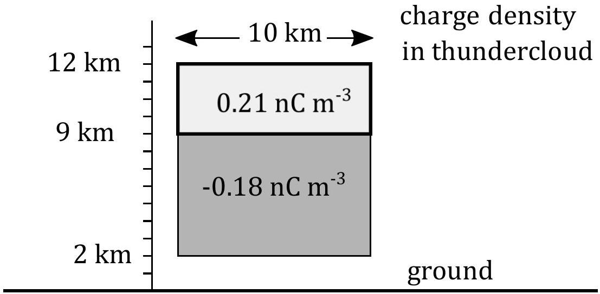

## Question 5

a) A simple pendulum of string length $l$, with a bob of mass $m$, containing charge $Q$, is in a horizontal electric field of magnitude $E$.
    (i) Determine the angle of the string with respect to the vertical when the bob is in equilibrium.
    (ii) If the electric field now points vertically downwards and there is a small negative charge on the bob, $-Q$, such that the string remains taut, what would be the period of oscillation of the bob once perturbed?
    (iii) Give the condition relating $Q, E, m$ and $g$, such that oscillations will occur when the bob is perturbed.
b) Equal and opposite charges $+Q$ and $-Q$ are a distance of $2 a$ apart. Taking the midpoint between them as the origin O , find the electric potential and the magnitude of the field strength, at a point P which is distance $r(r \gg a)$ from O, when
    (i) P is on the line passing through the charges;
    (ii) When P is on a perpendicular bisector of the line joining the charges.
c) Equal and opposite charges separated by a small distance constitute a dipole. A hydrogen chloride molecule may be treated as a dipole in which an electron is separated from a positive charge of equal magnitude by a distance of $2 \times 10^{-11} \mathrm{~m}$. Calculate the work done needed to turn the molecule, which is lying parallel to a field of $3 \times 10^{5} \mathrm{~V} \mathrm{~m}^{-1}$, through an angle of 180°.

d)In a simple model of a thundercloud, an upper cylindrical shaped region (axis vertical) contains a net positve charge and the lower cylindrical shaped region of the cloud a net negative charge, as shown in Figure 6. The upper region, from 9 km to 12 km height, with a radius of 5 km has a charge density of $0.21 \mathrm{nC} \mathrm{m}^{-3}$, whilst the lower region from 2 km to 9 km high, also with a radius of 5 km, has a charge density of $-0.18 \mathrm{nC} \mathrm{m}^{-3}$.

Figure 6: ref. Mazur V, LH Runhke: JGR, v103, D18, pp23299-23308, 1998

    (i) Calculate the magnitudes of the positive and negative charges in each region.

In order to determine the field strength at the ground due to these charges, we can aproximate these two volumes of charge as two point charges at the centres of each of the two regions (at heights 10.5 km and 5.5 km respectively). The ground is a good conducting plane surface and so charges will be induced in the surface. The effect of this induced charge can be simulated by considering a charge of equal magnitude but opposite sign at the same distance $h$ below the surface as the real charge at height $h$ above the surface. The field at the surface is then calculated from the field of the real charge at the surface added to the field due to the image charge at the surface.

(ii) For the two charges calculated, with their two image charges of opposite signs, calculate the strength of the electric field at the surface of the Earth directly below the thundercloud.
(iii) If a two metre tall person stands with his feet on the ground in this region, what is the magnitude and polarity of the potential at his head? Take the potential of the ground to be 0 V.
