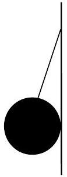
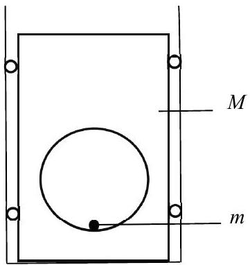
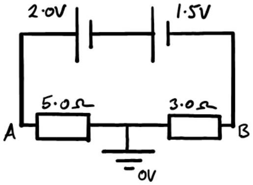
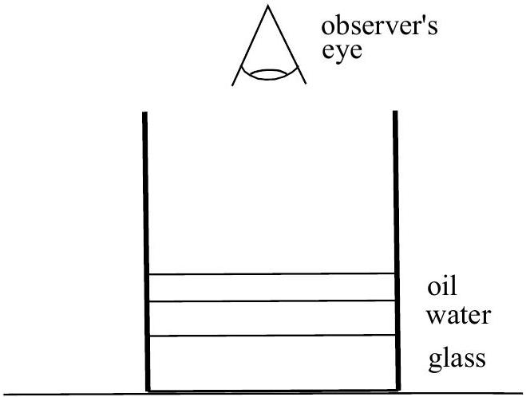
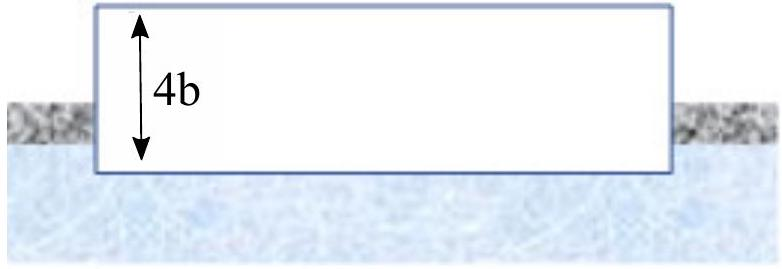
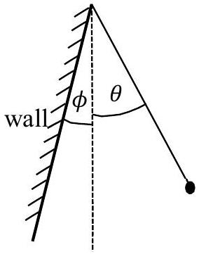
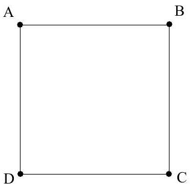
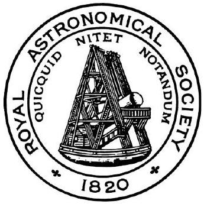

## Question 1

a) The Milky Way galaxy has a period of rotation of $240 \times 10^{6}$ years. The Sun is 26000 light years from the centre of the galaxy. How fast is the Sun moving with respect to the centre of the galaxy, given in units of $\mathrm{m} \mathrm{s}^{-1}$ ?
A light year is the distance that light travels in one year of 365.25 days.
[3]
b)A smooth sphere of radius 6.0 cm is suspended from a thread of length 9.0 cm attached to a smooth wall as shown in shown in Figure 1. If the mass of the sphere is 0.5 kg, calculate the tension, $T$, in the thread.

Figure 1

[3]

c) The displacement of an object is determined by the following function:
$$
s=2 t^{3}-9 t^{2}+12 t+4
$$
where $s$ is the displacement in metres, and $t$ the time elapsed in seconds. Determine
    (i) the times when the object comes to rest,
    (ii) the time when the acceleration is zero,
    (iii) the object's velocity when its acceleration is zero,
    (iv) the object's accelerations when its velocity is zero.

[4]

d) The distance in which a train can be stopped is given by:
$$
s=a v+b v^{2}
$$
where $s$ is the stopping distance, $v$ the initial velocity, and $a$ and $b$ are constants. When moving at $40 \mathrm{~km} \mathrm{hr}^{-1}$, the train can be stopped in 100 m , and at $80 \mathrm{~km} \mathrm{hr}^{-1}$ it can be stopped in 280 m.
Find the greatest speed such that the train can be stopped in 500 m .

e) Two planes set out at the same time from an aerodrome. The first flies north at $360 \mathrm{~km} \mathrm{~h}^{-1}$, the second south-east at $300 \mathrm{~km} \mathrm{~h}^{-1}$. After 40 minutes they both turn and fly towards each other. Calculate
    (i) the bearing, and
    (ii) the distance of the meeting point from the aerodrome.
f) A neutron moving through heavy water strikes an isolated and stationary deuteron (the nucleus of an isotope of hydrogen) head-on in an elastic collision.
    (i) Assuming the mass of the neutron is equal to half that of the deuteron, find the ratio of the final speed of the deuteron to the initial speed of the neutron.
    (ii) What percentage of the initial kinetic energy is transferred to the deuteron?
    (iii) How many such collisions would be needed to slow the neutron down from 10 MeV to 0.01 eV?
g) A uniform chain of mass per unit length, $\mu$, is suspended from one end above a table, with the lower end just touching the surface. The chain is released, falls and comes to rest on the table without bouncing.
    (i) Determine an expression, in terms of $\mu$ and the gravitational field strength $g$, for the reaction force exerted by the table on the chain as a function of time, $t$. Hint: you might consider $F$ in the form $F=\frac{\Delta m}{\Delta t} v$.
    (ii) In terms of the total weight $W$ of the chain, what is the maximum reaction force exerted by the table, and at what time during the fall does this occur?

h) A small particle of mass $m$ can slide without friction round the inside of a cylindrical hole of radius $r$, in a rectangular shaped object of mass $M$. The rectangular object is held between rigid walls by small wheels so that it can slide up and down without friction, as shown in Figure 2. If the small particle $m$ is initially at rest at the bottom of the cylindrical hole, and is then given an impulse to give it a speed $v$, what is the minimum speed $v$ needed to just lift the rectangular mass $M$ off the ground?

Figure 2

i) Two resistors and two cells are connected in the circuit shown in Figure 3. One cell has an e.m.f. of 2.0 V and an internal resistance of $1.0 \Omega$, the other an e.m.f. of 1.5 V and an internal resistance of $0.5 \Omega$. The resistors are connected in series and the point between them is at earth, i.e. zero potential. Calculate
    (i) the current through the cells,
    (ii) the potential difference across each cell, and
    (iii) the potential, relative to earth, at points A and B.

Figure 3

j) A thick-bottomed, cylindrical glass beaker is placed on a bench. Water and oil are poured into the beaker and form discrete layers, as shown in Figure 4. The bottom of the beaker is 1.8cm thick, the water is 1.2 cm deep, and the oil layer is 0.8 cm deep.
    (i) Draw a diagram showing the path of a ray at a small angle to the normal, travelling from the underside of the beaker and being refracted through the layers.
    (ii) Assuming the angles of deviation of the ray are small, calculate the apparent vertical displacement of the lab bench when viewed from above.
The refractive indices are 1.5, 1.3 and 1.1 for the glass, water and oil respectively.

Figure 4

k) A person might reasonably expect to jump a height of 1 m on Earth. On a planet with a density two thirds that of Earth, and radius twice that of the Earth, to what height might the person jump? Assume that they supply the same energy to make the jump

1) A pond containing water of density $\rho$ is covered to a depth $b$ by oil of density $\frac{2}{3} \rho$. A long wood block of square cross section $4 b \times 4 b$, with the same density as the oil, floats in the pond, as shown in Figure 5. What fraction of the wood block is immersed below the top of the surface oil level?

Figure 5

[4]
m) A volume of $80 \mathrm{~cm}^{3}$ of water in a copper calorimeter of mass 150 g takes 12 minutes to cool from $40^{\circ} \mathrm{C}$ to $15^{\circ} \mathrm{C}$ in a cold room. The same volume of ethanol of density $0.8 \mathrm{~g} \mathrm{~cm}^{-3}$ takes 8 minutes to cool also from 40 °C to 15 °C in the same calorimeter in the same circumstances. Calculate the specific heat capacity of ethanol.
The specific heat capacity of copper $=400 \mathrm{~J} \mathrm{~kg}^{-1}{ }^{\circ} \mathrm{C}^{-1}$ and of water $=4200 \mathrm{~J} \mathrm{~kg}^{-1}{ }^{\circ} \mathrm{C}^{-1}$. The density of water, $\rho_{\mathrm{w}}=1.0 \mathrm{~g} \mathrm{~cm}^{-3}$.
[5]
n) A steel girder is planted securely between two sides of a ravine in order to provide a bridge. The total cross-sectional area of the girder is $30 \mathrm{~cm}^{2}$, and the length of the girder is 4.0 m. Installed at a temperature of 5 °C, the temperature now rises to 20 °C. Calculate the force exerted by the girder due to the change in temperature, assuming the ends do not move.
Young modulus of steel $=2.0 \times 10^{11} \mathrm{~Pa}$
Linear expansivity of steel (fractional expansion per unit temperature rise) = $1.2 \times 10^{-7}{ }^{\circ} \mathrm{C}^{-1}$ at $5^{\circ} \mathrm{C}$.
[4]
o) A narrow beam of monochromatic light falls on a diffraction grating of 1200 lines $\mathrm{mm}^{-1}$, and two diffracted beams of successive orders are observed at 14° and 73° to the normal, both of them on the same side of the normal. The incident beam of light is not along the normal to the grating.
    (i) Sketch a diagram to show the path difference between rays passing through adjacent slits, for a ray incident on the diffraction grating at angle $\theta_{1}$, and for the corresponding ray emerging from the grating at angle $\theta_{2}$, with respect to the normal.
    (ii) Derive an equation relating the angles $\theta_{1}$ and $\theta_{2}$ to the order of diffraction, $n$, and the wavelength, $\lambda$.
Determine:
    (iii) The wavelength of the light used.
    (iv) The angle of incidence of the beam on the grating.
    (v) The angle of diffraction of a third transmitted beam.

[6]

p) Two identical spherical glass containers are joined by a narrow tube, whose volume is negligible compared to the spheres. The spheres contain air at $100^{\circ} \mathrm{C}$. One of the spheres is then heated by 50 °C whilst the other is cooled by 50°C. This produces a small change in pressure, from $P_{\text {initial }}$ to $P_{\text {final }}$, of the air in the system. What common temperature of the two spheres could produce the same final pressure $P_{\text {final }}$ ?
q)A simple pendulum consists of a small mass on the end of a light, inextensible string, as shown in Figure 6. It swings from an initial angle $\theta=14^{\circ}$, for which it would have a period $T_{0}$, but it hits a wall elastically, which is at angle $\phi=7^{\circ}$ to the vertical. What is the new period of oscillation in terms of $T_{0}$ ?
( $\theta, \phi$ are small angles such that $\sin \theta \approx \theta$ and $\sin \phi \approx \phi$ ).

Figure 6
r) Four charges are placed at the corners of a square of side 10 cm, as shown in Figure 7.
$$
\begin{aligned}
& A=+10 \times 10^{-9} \mathrm{C} \\
& B=+8 \times 10^{-9} \mathrm{C} \\
& \mathrm{C}=-12 \times 10^{-9} \mathrm{C} \\
& \mathrm{D}=-6 \times 10^{-9} \mathrm{C}
\end{aligned}
$$
    (i) Calculate the magnitude and direction of the electric field strength at the centre of the square.
    (ii) Calculate the work done taking an electron from the centre to the mid-point of side CD.

Figure 7

UNIVERSITY OF CAMBRIDGE

Maplesoft
Mathematics • Modeling • Simulation

