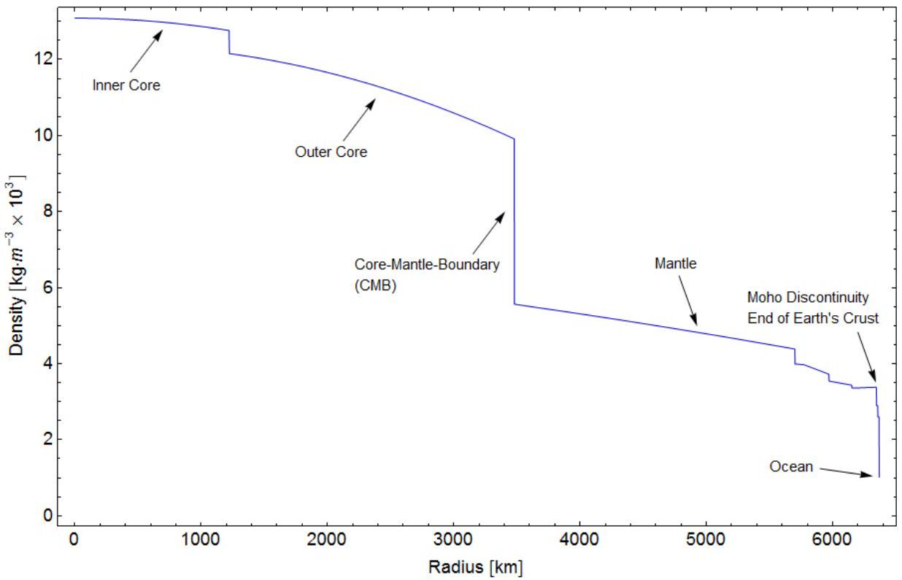

## Question 2

a) A planet has a radius $R$ and the gravitational field strength at its surface is $g$. A satellite is placed in a circular orbit of radius $r$ around the planet.
Obtain an expression for $T$, the period of orbit of the satellite, in terms of $R, g$ and $r$, explaining the relevant physics in each of your steps.
(3)
b) Both the Earth and Jupiter can be assumed to have circular orbits about the Sun. Jupiter has an orbital period, $T_{\text {Jupiter }}=11.9$ years. What is the orbital radius of Jupiter in au? Note: an au (astronomical unit) is the average distance between the Earth and the Sun.
(1)
c) The density of the Earth changes sharply between the core and the mantle. By taking just two suitable values of the density of the core and mantle of the Earth from the graph in Figure 1, estimate a value of the mass of the Earth using this data. Your values and calculation must be shown.
(3)

Figure 1: credit: AllenMcC. [CC BY 3.0 (https://creativecommons.org/licenses/by/3.0)], from Wikimedia Commons

d) A planet of mass $M_{p}$ has an orbiting moon of mass $M_{m}$. The mass of the moon is about 1/8 the mass of the planet.
    (i) Sketch a set of equipotential lines for the planet-moon system. Ignore the orbital motion of the moon. Without detailed calculation, indicate on your sketch the relative positions of the neutral point (a point of zero field strength) and the centre of mass of the planet-moon system.
A rocket of mass $m$ is launched from the planet. The rocket engine is used very briefly at take-off when it is close to the planet's surface, and it almost immediately reaches speed $v$, after which the fuel is exhausted and there is no further propulsion. It is then in free-fall and will have just enough energy to reach the moon. Assume that you can ignore relative motion of the planet and moon, and ignore air resistance. Obtain expressions and calculate values for:
    (ii) The distance, $d$, from the planet's centre, where the speed of the rocket is lowest.
    (iii) The launch speed $v$ of the rocket from the planet, in terms of the variables $M_{p}$, $M_{m}$, the radius of the planet, $R_{p}$, and the separation of the centres of the moon and planet, $D$.
For this question part, you may take $M_{p}=6.00 \times 10^{24} \mathrm{~kg}, M_{m}=7.50 \times 10^{23} \mathrm{~kg}$, $D=3.84 \times 10^{8} \mathrm{~m}$. (9)
e) The Earth can be considered to consist of concentric spheres of material, the outer sphere being the crust with a density of $2500 \mathrm{~kg} \mathrm{~m}^{-3}$. If the mass of the Earth is $M_{\mathrm{E}}=6.0 \times 10^{24} \mathrm{~kg}$, what will be the fractional change in the gravitational field strength when descending to the bottom of a gold mine, a distance $d=3000 \mathrm{~m}$ below the surface of the Earth?
Hint: the field inside a hollow spherical shell is zero. (4)
f) A planetary sized object similar to the Earth was formed from a very large spherical cloud of interstellar dust collapsing under gravity to form a spherical body of uniform density $\rho$ and radius $R$
    (i) Find an expression for the change in gravitational potential energy as the radius of the proto-planet increases from $r$ to $r+\delta r$ by the formation of a thin spherical shell of material of mass $\delta m$.
    (ii) Now derive an expression for the total transfer of gravitational potential energy in the formation of the planet. Use the following terms: the gravitational constant $G$, and the final radius and mass, $R$ and $M$ respectively.
    (iii) If all of this energy was used to heat the planet formed at a very low initial temperature, estimate the temperature that the planet would have reached.
For this planet, take $R=6400 \mathrm{~km}, M=4.0 \times 10^{26} \mathrm{~kg}$, and the average specific heat capacity of the material of the planet is $700 \mathrm{~J} \mathrm{~kg}^{-1} \mathrm{~K}^{-1}$. (5)

[25 marks]
