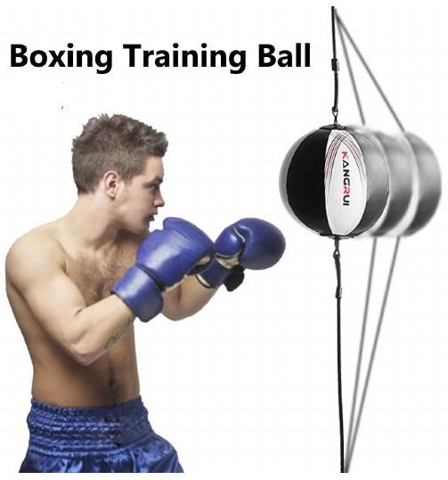

## Question 3

a) A particle is moving in a horizontal circle and is kept in its path by a string tied to a point at a height $h$ above the centre of the circle.
    (i) Find the period of rotation in terms of $h$ and the gravitational field strength $g$, explaining the physics of your derivation in words.
    (ii) If the tension in the string is three times the weight of the particle, find the length of the string $\ell$, in terms of $h$.
b) (i) A particle of mass $m$ is suspended by a thin elastic string of natural length $a$ in which a tension $m g$ would produce an extension $a$. Write down an expression for the period of oscillation of the mass in terms of $a$ and $g$.
    (ii) Two particles of equal mass $m$ on a smooth horizontal table are connected by the same thin elastic string of natural length $a$. The particles are held at rest at a distance $3 a$ apart.
        i. Describe their motions between the time they are released and when they collide.
        ii. If the particles are released simultaneously, calculate the time elapsed before they collide, given $a=0.20 \mathrm{~m}$.
c) A piece of elastic cord of length $\ell_{0}$ and cross-sectional area $A_{0}$ is stretched to twice its natural length. Assuming that the total volume remains constant, and that cross-sectional area is uniform along its length, and the Young's modulus $E$ for the material remains constant,
    (i) obtain an expression for the final tension in terms of $E$ and $A_{0}$.
    (ii) Show that the work done in stretching the elastic is given by $E \ell_{0} A_{0}(1-\ln 2)$.

d) The behaviour of the boxing training ball shown in Figure 2 can be modelled as two identical vertical springs attached to a mass, $m$. The springs each have a natural length $\ell$, and a spring constant $k$, such that an applied force of $m g$ doubles the length of spring to $2 \ell$. The top and bottom springs are attached to the ceiling and floor respectively in a room of height $4 \ell$.
Assume the radius of the ball, $r \ll \ell$.
    (i) Determine the equilibrium position of the ball below the ceiling in terms of $\ell$.
    (ii) The ball is given a small vertical displacement and released. Find an expression for the period $T_{\mathrm{v}}$ for the vertical oscillations.

Figure 2

(iii) The ball is given a small horizontal displacement. Using a suitable approximation provide an expression for the horizontal force $F_{\mathrm{h}}$ exerted on the ball by the springs.
(iv) Find an expression for the period of the horizontal oscillations $T_{\mathrm{h}}$ and evaluate the ratio $T_{\mathrm{h}} / T_{\mathrm{v}}$

(Image credit: Kangrui Sports http://kangruisport.com/sport/punchingbags )
