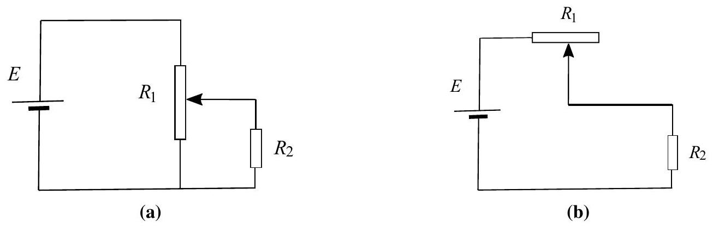
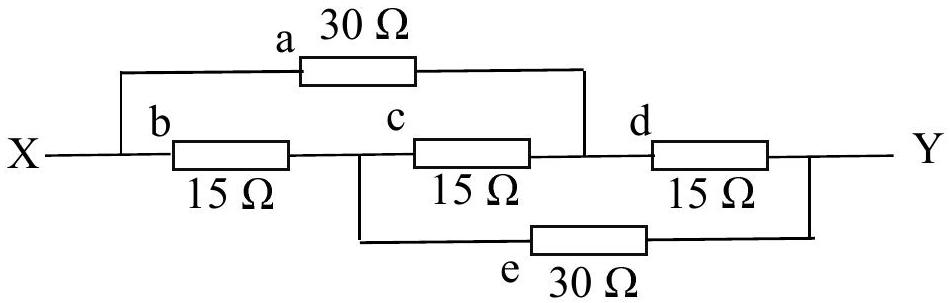
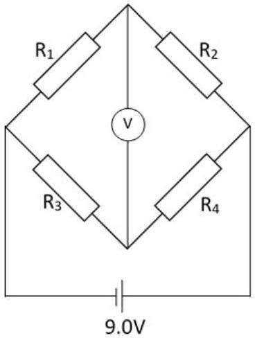
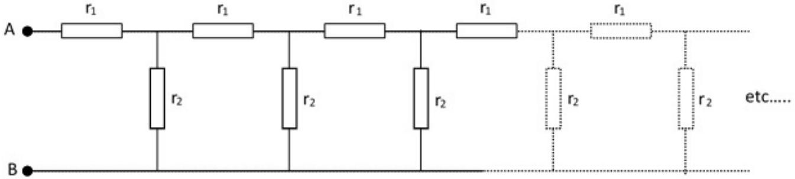
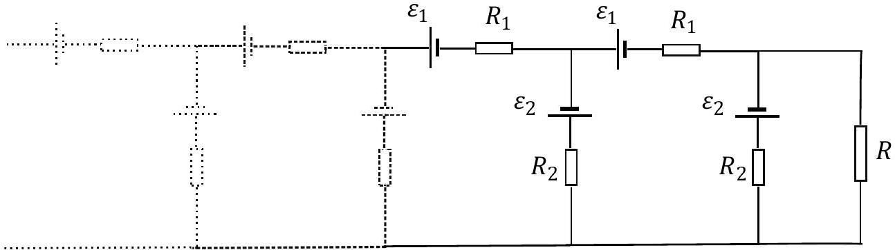

## Question 5

a) In the two circuits shown in Figures 6a and 6b below, a cell of e.m.f. $E$ and negligible internal resistance is connected across a pair of resistors, $R_{1}$ and $R_{2}$. Resistor $R_{1}$ is a length of uniform resistance wire, and $R_{2}$ is a fixed resistor.
    (i) For the circuit shown in Figure 6a, sketch two graphs on the same axes showing how the potential $V$ across $R_{2}$ varies with position of the sliding contact on $R_{1}$ for the cases
        i. when $R_{2} \gg R_{1}$
        ii. when $R_{2} \ll R_{1}$
    (ii) Repeat part (i) above for the circuit shown in Figure 6b.
    (iii) What are the relative advantages of each of these circuits when used to control the potential difference across $R_{2}$ ?

Figure 6

(5)

b)A resistance network is shown in Figure 7.

Figure 7

    (i) A total current of 10 mA flows through the circuit. Determine the current in each of the resistors, a to e.
    (ii) Hence find the total resistance between X and Y.

(4)

c) A strain gauge consists of a straight metal wire of length 0.30 m, diameter 0.028 mm and resistivity $5.0 \times 10^{-7} \Omega \mathrm{~m}$. Calculate the resistance of the gauge when
    (i) unstrained and
    (ii) stretched by 1.0 mm. You may assume that the diameter of the wire does not change.
    (iii) Calculate the resistance if the stretched wire maintained the same volume i.e. the diameter decreased in the process of stretching?

(iv)Four identical strain gauges as in c) (ii) above, labelled $\mathrm{R}_{1}$ to $\mathrm{R}_{4}$, are arranged in a bridge circuit as shown in Figure 8, with a cell of e.m.f 9.0 V and of negligible internal resistance. $\mathrm{R}_{1}$ and $\mathrm{R}_{4}$ are stretched by 1.0 mm . Assuming the internal resistance of the power supply is negligible, calculate the reading on the voltmeter (which can be considered to have an infinite resistance).

Figure 8

(6)
d)The following network shown in Figure 9 is infinite. Find an expression for the resistance between A and B in as simple a form as possible, and determine the resistance when $r_{1}=4 \Omega$ and $r_{2}=15 \Omega$. Hint: consider adding new resistors $r_{1}$ and $r_{2}$ at the left end of the circuit shown.

Figure 9

(4)

e) The network shown in Figure 10 consists of an infinite number of cells of e.m.f. $\varepsilon_{1}$ and $\varepsilon_{2}$ with corresponding internal resistances $R_{1}$ and $R_{2}$ respectively. A resistor $R$ of value $R=1.0 \Omega$, is connected to the end of the series. If the values of the e.m.f.s and resistances are $\varepsilon_{1}=1.0 \mathrm{~V}, \varepsilon_{2}=2.0 \mathrm{~V}, R_{1}=4 \Omega, R_{2}=6 \Omega$, determine the value of the current flowing through resistor $R$.

Figure 10

(6)
[25 marks]
