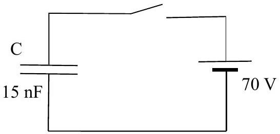
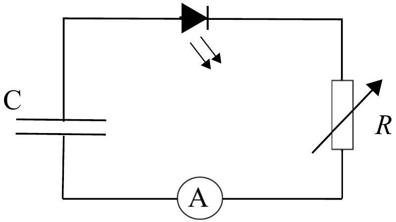

## Question 6

a) Two uncharged capacitors with values $C_{1}$ and $C_{2}$, are connected in series with a battery of e.m.f. $V$, and a switch. When the switch is closed there is a charge of $Q_{1}$ and $Q_{2}$ on the capacitors respectively.
    (i) State the relationship between $Q_{1}$ and $Q_{2}$.
    (ii) State expressions for the potential differences across each capacitor, $V_{1}$ and $V_{2}$
    (iii) Hence derive an expression for the equivalent capacitance, $C_{\mathrm{eq}}$ produced by $C_{1}$ and $C_{2}$ in series.
    (iv) Write down expressions for the total energy stored in the two capacitors, and the energy supplied by the battery, in terms of $C_{\mathrm{eq}}$ and $V$, and comment on the difference
    (6)
b) A 15 nF parallel plate capacitor is connected across a 70 V battery, as in Figure 11. How much work must be done in order to double the plate separation
    (i) with the battery disconnected,
    (ii) with the battery connected?

Figure 11

(2)

c) (i) Two capacitors, of capacitance $2.0 \mu \mathrm{~F}$ and $4.0 \mu \mathrm{~F}$, are each given a charge of $120 \mu \mathrm{C}$. The positive sides are then connected, as are the negative sides. Calculate:

    i. The new potential difference across the plates.
    ii. The change in the energy stored.
    (ii) A conducting metal sphere is insulated from the ground. It is initially charged by contact with a small metal disc which carries a charge $q$, so that the sphere gains charge $Q$. The metal disc is then again given a charge $q$, and is then touched on the sphere a second time. If this process is repeated indefinitely, what would be the final charge on the sphere, $Q_{f}$ ?
    (iii) Three capacitors with leads $A B, C D$ and $E F$ of capacitances $1 \mu \mathrm{~F}, 2 \mu \mathrm{~F}$ and $3 \mu \mathrm{~F}$ respectively are each connected separately to a battery and charged to a potential of 12 V. The positively charged plates are $A, C$ and $E$. The capacitors are joined in series so that $B$ is connected to $C, D$ is connected to $E$, and $F$ is connected to $A$.
        i. Calculate the charges on each of the capacitors, indicating the values and signs on a diagram.
        ii. Sketch a graph to show the variation of potential around the circuit from $A$ to $F$.

d) A pair of concentric conducting spheres have radii of 10 cm and 15 cm respectively. They are insulated from each other, and the potential difference between the spheres is 120 V. The spheres carry equal charges $\pm Q$, with the inner sphere being positive..
    (i) Sketch the shape of a graph of the electric field strength between $r=0 \mathrm{~cm}$ and $r=30 \mathrm{~cm}$.
    (ii) Sketch a graph of the potential between $r=0 \mathrm{~cm}$ and $r=30 \mathrm{~cm}$.
    (iii) Write down expressions for the potential on the inner charged sphere if the outer sphere were not present, and the potential for the outer charged sphere if the inner sphere were not present.
    (iv) From these results, calculate the magnitude of the charge $Q$
e) An LED is to be lit with a constant current of $800 \mu \mathrm{~A}$ supplied by a charged capacitor, $C$, in series with a variable resistor, $R$, as shown in Figure 12. The diode has a forward bias of 2.7 V, which means that when the diode is conducting a current, it has this fixed potential difference across it.
    (i) What is the variation $R(t)$ of the variable resistor against time, such that the constant current is maintained?

The initial potential difference across the capacitor is 5.0 V.

(ii) For how long would the LED remain lit if the value of the capacitor is $4000 \mu \mathrm{~F}$ ?

Figure 12

[25 marks]

## END OF SECTION 2

UNIVERSITY OF CAMBRIDGE

Maplesoft

Mathematics • Modeling • Simulation

Worshipful Company of Scientific Instrument Makers

Cambridge
UNIVERSITY PRESS

PRINCETON
THE
UNIVERSITY
PRESS

RANDOM
HOUSE GROUP
