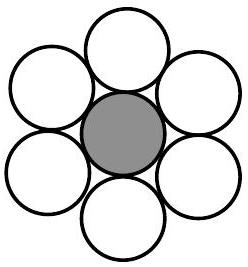
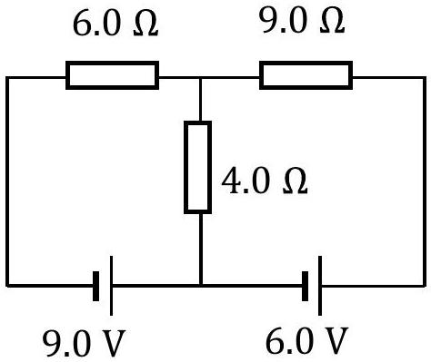
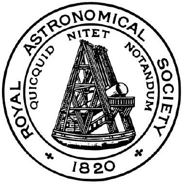

## Question 1

a) A golf ball is struck and begins to move at an initial velocity of $60 \mathrm{~m} \mathrm{~s}^{-1}$ at an angle 40° above the horizontal. Determine at time $t=3 \mathrm{~s}$ after the strike
    (i) the velocity of the ball, and
    (ii) the position of the ball relative to the origin.
b) A drone flies horizontally. The displacement of the drone is given by $s=2 t \hat{i}+6 t \hat{j}$, where $\hat{i}$ and $\hat{j}$ are unit vectors to the East and North respectively. Determine at $t=2 \mathrm{~s}$ :
    (i) the speed of the drone,
    (ii) its bearing in degrees,
    (iii) its acceleration.
Note: all bearings are measured clockwise from North.
c) Estimate the mass of a piece of paper the size of a pinhead (the blunt end of a sewing pin). Show your calculation.
d) The speed of surface waves of wavelength $\lambda$ on a liquid of density $\rho$ is given by
$$
v=\left[\frac{a \lambda}{2 \pi}+\frac{2 \pi b}{\rho \lambda}\right]^{\frac{1}{2}}
$$
where $a$ and $b$ are constants. Determine the units of $a$ and $b$.

e) Figure 1 shows the cross section of a high voltage overhead electrical transmission cable. The central strand is of steel and the six outer strands are of aluminium. The resistivity of steel is $2.0 \times 10^{-7} \Omega \mathrm{~m}$, and that of aluminium $3.2 \times 10^{-8} \Omega \mathrm{~m}$. The cross-sectional area of each strand is $5.0 \times 10^{-4} \mathrm{~m}^{2}$. The steel is present to give mechanical strength to the cable and only reduces the resistance of a length $\ell$ of cable by $1.4 \times 10^{-4} \Omega$ when it is included. Calculate the length of the cable.

Figure 1

f) Platinum (symbol Pt) and potassium (symbol K) have densities of $21.5 \mathrm{~g} \mathrm{~cm}^{-3}$ and $0.89 \mathrm{~g} \mathrm{~cm}^{-3}$ respectively. How many cubic centimetres $\left(\mathrm{cm}^{3}\right)$ of platinum could be attached to $10.0 \mathrm{~cm}^{3}$ of potassium before the combination sinks in mercury of density $13.6 \mathrm{~g} \mathrm{~cm}^{-3}$ ? Ignore any chemical reactions.

g) One kilogram of ice at 0 °C is placed in a thermally insulated bucket of volume 5 litres. Water at $15^{\circ} \mathrm{C}$ is added until the bucket is completely filled. Calculate the temperature of the water when half of the ice has melted.
$$
1 \text { litre }=1000 \mathrm{~cm}^{3}
$$
Latent heat of fusion of ice, $L_{\text {ice }}=3.34 \times 10^{5} \mathrm{~J} \mathrm{~kg}^{-1}$
Specific thermal capacity of water, $c_{\text {ice }}=4180 \mathrm{~J} \mathrm{~kg}^{-1} \mathrm{~K}^{-1}$
Densities: $\rho_{\text {ice }}=920 \mathrm{~kg} \mathrm{~m}^{-3}$ and $\rho_{\text {water }}=1000 \mathrm{~kg} \mathrm{~m}^{-3}$

h) This question concerns three vessels at sea: a ferry $(\mathbf{F})$, a container ship $(\mathbf{C})$, and a pilot boat $(\mathbf{P})$. The ferry is sailing on a bearing of $090^{\circ}$ at $5 \mathrm{~m} \mathrm{~s}^{-1}$. Relative to the ferry, the container ship is sailing on a bearing of 160°. The pilot boat is sailing on a bearing of $270^{\circ}$ at $7.5 \mathrm{~m} \mathrm{~s}^{-1}$, and the pilot boat observes the container ship moving on a bearing of 120°.
Determine the speed and direction of the container ship relative to the water.
Note: all bearings are measured clockwise from North.

i) A car accelerates from a standing start. If the mass of the car is $m$, and the car is driven at constant driving power $P$, find an expression for the velocity of the car $v$ as a function of distance travelled from a standing start, $x$. Ignore resistive effects and inefficiencies in power transmission.

j) An experiment is proposed which involves submerging a ball of mass $m$ and radius $r$ to a depth of $d \gg r$ in a swimming pool. The ball is then released, and emerges from the water and rises to a height $h \gg r$ above the surface. The quantities $d$ and $h$ are measured from the centre of the ball to the water surface. An initial model is proposed, which ignores any resistive effects and the inertia of the water. Determine the prediction this initial model makes for the ratio $h / d$ in terms of $m, r$ and the density of water, $\rho$.

k) A sand timer is a sealed glass vessel with a narrow section acting as a constraint, so that sand can flow through at a steady rate. A fifteen minute sand timer is shown in Figure 2 below. Unlike a liquid, the rate of flow of sand grains through the constrained section is independent of the height of the sand above.
Thus the rate of flow of sand through the time can be expressed as a product of powers of the remaining relevant variables:
$$
\frac{\mathrm{d} m}{\mathrm{dt}}=k \rho^{\alpha} \times A^{\beta} \times g^{\gamma}
$$
where $k$ is a dimensionless constant, $\rho$ is the density of the sand, $A$ is the cross sectional area at the narrowest point, and $g$ is the gravitational field strength, and $\alpha, \beta, \gamma$ are numbers.
    (i) By considering the units of the variables on each side of the equation, find the values of $\alpha, \beta$ and $\gamma$.
    (ii) On the Moon, the gravitational field strength is $g_{\mathrm{M}}=1.6 \mathrm{~N} \mathrm{~kg}^{-1}$. How long would the sand timer last on the Moon if it runs for 15 minutes on Earth?

Figure 2: Sand timer. (image credit: John Lewis Partnership, https://www.johnlewis.com/the-school-of-life-15-minutes-timer/p3827395)

1) An excited neon-20 isotope travels with a velocity of $3.0 \times 10^{6} \mathrm{~m} \mathrm{~s}^{-1}$ into a detector and disintegrates into an alpha particle and oxygen-16. The event produces an additional 6.25 MeV of kinetic energy. The oxygen nucleus leaves the event at right angles to the path of the original neon nucleus.
Determine the velocity of the alpha particle. Relativistic effects may be neglected. $1 \mathrm{eV}=1.6 \times 10^{-19} \mathrm{~J}$
m) An aeroplane flies due East along the equator at a constant low altitude and constant speed relative to the ground. On the aeroplane, a one kilogram mass is suspended on a spring balance and records a weight $W_{1}$. The aeroplane then flies due West along the equator, at the same altitude and speed, and measures a balance reading of $W_{2}$. If the speed of the plane relative to the ground is $250 \mathrm{~m} \mathrm{~s}^{-1}$, calculate the difference in apparent weights.
[5]
n) Two glass bulbs are connected by a thin tube. One glass bulb has a volume of $75 \mathrm{~cm}^{3}$, the other $150 \mathrm{~cm}^{3}$, and gas can move freely between them. Initially the system contains nitrogen at $-12^{\circ} \mathrm{C}$ and $0.91 \times 10^{5} \mathrm{~Pa}$. The smaller bulb is then warmed to $24^{\circ} \mathrm{C}$, whilst the larger bulb is maintained at $-12^{\circ} \mathrm{C}$. Calculate the new pressure in the system. Assume the thermal expansion of the bulbs and the volume of the connecting tube are negligible.
[5]
o)Determine the current in the $6.0 \Omega$ resistor shown in the Fig 3. The cells have no internal resistance.

Figure 3
[5]
p) An electrically isolated copper sphere of radius 2 mm is illuminated by light of wavelength 150 nm. Determine
    (i) the maximum electric potential that the copper sphere can reach
    (ii) the number of electrons lost reaching the maximum potential (Work function of copper = 4.5 eV)
[4]

q) Three conducting spheres of radii $\frac{1}{3} R, \frac{1}{2} R$ and $R$ are mounted on insulating rods, and are well separated from each other. The $\frac{1}{3} R$ and $R$ spheres are each charged to a potential $V$, whilst the $\frac{1}{2} R$ sphere is uncharged. Then a thin copper wire is used to briefly connect all three spheres. What fraction of the original charge on the two spheres is now on the $\frac{1}{2} R$ sphere?

r) The thermal power flowing by conduction through a surface is proportional to the temperature difference across the surface, $\Delta \theta$, the area of the surface, $A$ and inversely proportional to the thickness $\Delta x$. The constant of proportionality is known as the thermal conductivity.
A 60 cm composite rod, of constant cross section, is made of 20 cm lengths of steel, copper and aluminium joined together. The rod is well insulated. The tip of the steel end of the rod is maintained at 100 °C and the tip of the aluminium end, at 0 °C. What are the temperatures at each of the two junctions of dissimilar metals?
Thermal conductivities are as follows: steel $60 \mathrm{~W} \mathrm{~m}^{-1} \mathrm{~K}^{-1}$; copper $400 \mathrm{~W} \mathrm{~m}^{-1} \mathrm{~K}^{-1}$; aluminium $240 \mathrm{~W} \mathrm{~m}^{-1} \mathrm{~K}^{-1}$. $\square$
s) A bicycle pump of cross-sectional area $4.0 \mathrm{~cm}^{2}$ has one end sawn off and a cork is fitted into the end. The piston is pushed slowly inwards and the cork is fired out with a popping sound which has a frequency of 512 Hz . The initial distance between the cork and the piston is 25 cm, with atmospheric pressure equal to $1.0 \times 10^{5} \mathrm{~Pa}$ and the speed of sound in air being $330 \mathrm{~m} \mathrm{~s}^{-1}$.
Calculate the force required to eject the cork. $\square$
t) A cup of tea cools from 30.2 °C to 29.7 °C in 1 minute, in an ambient temperature of 20.0 °C. Assuming the tea cools at a rate directly proportional to the temperature difference between the tea and the surroundings, calculate how long it will take for the tea to cool from $24.0^{\circ} \mathrm{C}$ to $23.0^{\circ} \mathrm{C}$. $\square$

## END OF SECTION 1

UNIVERSITY OF OXFORD OXFORD CAMBRIDGE

Mathematics • Modeling • Simulation

Worshipful Company of Scientific
Instrument Makers

ONEWORLD
