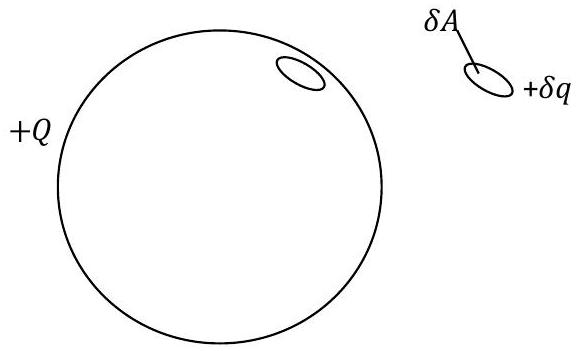
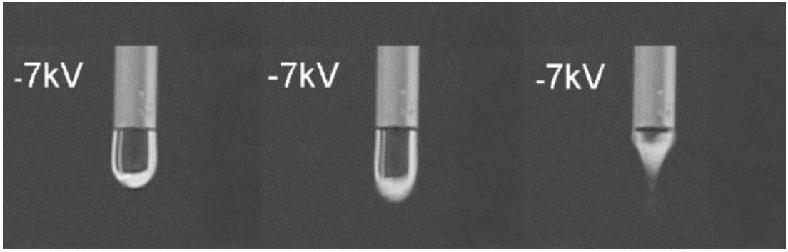
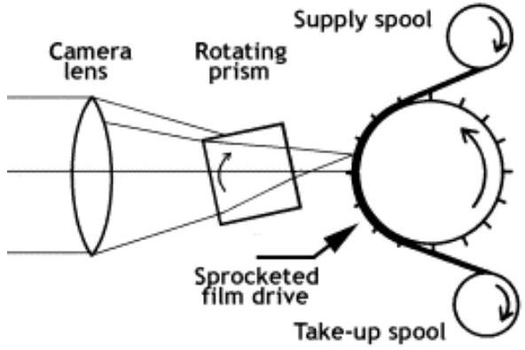
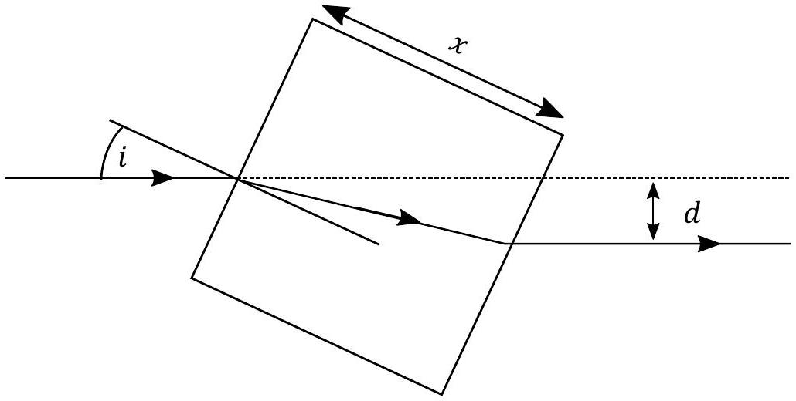

## Question 4

This question is about electric fields and their application.

a) A thin, isolated, conducting, square metal sheet of area $A$ is given a charge $+Q$.
    (i) State where the charge on the sheet is to be found.
    (ii) Sketch a set of electric field lines (with arrows) emerging from the sheet in the region near the surface and centre of the sheet (i.e. neglect edge effects).
    (iii) How are the field lines qualitatively related to the magnitude of the electric field in a given region?
    (iv) If the field strength near the sheet is $E_{\mathrm{s}}$, write down the force on a charge $+q$ at a distance $d$ from the sheet, where $d \ll \sqrt{A}$, in terms of $E_{\mathrm{s}}$ and $q$.
b) Consider a conducting spherical shell of radius $r$ given a charge $+Q$.
    (i) i. What is the charge density, $\sigma$ (the charge per unit area), and the electric field strength $E$ at the surface of the sphere?
        ii. Hence write down an expression for the electric field strength $E$ in terms of $\sigma$ and $\varepsilon_{0}$ for the conducting, charged surface. How does $E$ depend upon $r$ ?
        iii. Hence, for an isolated, thin, plane, conducting surface carrying charge density $\sigma$, what is the electric field strength very near the surface?
    (ii) A conducting, charged sphere has no field inside the surface for a charge $Q$ on the surface, but a field $E_{\text {sphere }}$ on the outside surface. The repulsion of the surface charges will cause an outward force on the surface, which can be expressed as a pressure $P$.
Imagine that this sphere described has a small area $\delta A$ removed, along with its associated charge $\delta q$, determined by the value of $\sigma$ for the sphere, as illustrated in Figure 9. The field lines remain distributed as before since we are not in practice removing the small area.
        i. What is the value of the field strength $E_{\mathrm{s}}$ on each side of the area $\delta A$, in terms of $E_{\text {sphere }}$ ?
        ii. Hence write down the field strength in the hole at the spherical surface, just inside where $\delta A$ would sit, due to the charge on the rest of the sphere, in terms of $E_{\text {sphere }}$.
        iii. Hence what is the force on the charge of the area $\delta A$ when it is in place?
        iv. Now derive an expression for the surface pressure on the sphere due to the charge it carries in terms of $E_{\text {sphere }}$ and $\varepsilon_{0}$.
c) An electric field strength of greater than $3 \times 10^{6} \mathrm{~N} \mathrm{C}^{-1}$ causes air to breakdown and conduct. Determine
    (i) the radius of the smallest water drop (treated as a conducting spherical shell so that any excess charge resides on the surface) that can be charged to an electric potential of 7000 V,
    (ii) the charge, and the surface charge density of the drop.

Figure 9

Charged drops of water are produced in a manner similar to that illustrated in Figure 10 with the capillary tube at -7.0 kV . The drop is released vertically and falls under gravity towards an earthed metal plate 10 cm below the tube where it was formed.

Calculate

(iii) the speed of the drop when it reaches the earthed metal plate below,
(iv) the average current given a flow rate through the tube of $64 \mathrm{~cm}^{3}$ per hour.

Figure 10: credit: Water with Excess Electric Charge: Leandra P. Santos, Telma R. D. Ducati, Lia B. S. Balestrin, and Fernando Galembeck; J. Phys. Chem. C 2011, 115, 11226-11232

d) The intention is to study the motion of the falling drops by means of high speed photography, and one means of doing this is to use a rotating prism camera shutter. Figure 11 shows the general arrangement for the film passing through the camera at high speed. The continually moving film would blur the image, so a rotating cube of

Figure 11: credit: (An Overview of High Speed Photographic Imaging by Andrew Davidhazy, School of Photographic Arts and Sciences, Rochester Institute of Technology)

glass is used to move the image for a short time along the film at the same speed as the film travels through the camera.

Figure 12 shows a ray of light entering the rotating cube of glass of side $x$, with a refractive index $n$.

(i) Determine an expression for the lateral displacement $d$, in terms of $x, n$, and the angle of incidence $i$, which should be assumed to be small.
(ii) The prism rotates about an axis perpendicular to the plane of the diagram, such that the image is stationary relative to the moving film. How fast should the film move if $x=5.0 \mathrm{~cm}, n=1.5$ and the cube rotates at 200 Hz? (7)

Figure 12

[25 marks]
