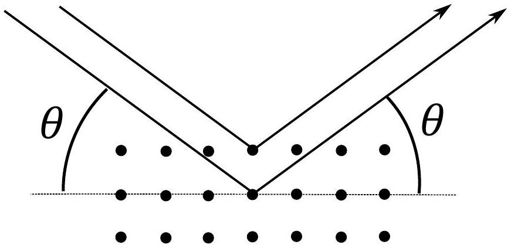
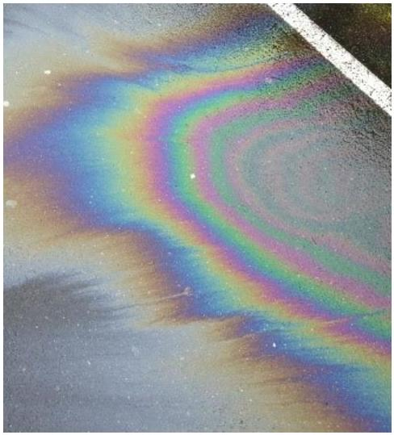
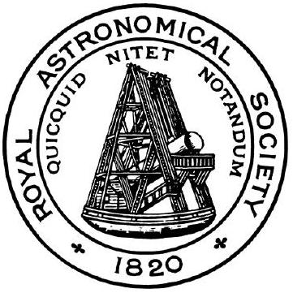

## Question 6

This question explores different applications of wave interference.

a) State the necessary conditions to be able to observe stable wave interference patterns. (2)
b) (i) Consider a ship that carries a radio receiver a height $h$ above the sea, which is anchored (stationary) a large distance $D$ away from the bottom of a cliff. Suppose on top of the cliff there is a radio transmitter at a height of $H$ above the sea and transmitting waves of wavelength $\lambda$. Assuming that the sea acts as a flat, perfectly reflecting surface, show that the signal strength received by the ship is a maximum when
$$
h=\frac{\lambda D}{4 H} .
$$
State any assumptions you make. Note that there is a phase change of $\pi\left(180^{\circ}\right)$ when waves reflect at an interface going from a less dense to a denser medium. (4)
    (ii) At high tide, the ship is 1.5 km away from the cliff and its receiver is at 20 m above the sea with the height of the transmitter above the sea at 80 m . The frequency of the radio waves is 70 MHz .
        i. By how much would the tide need to fall for the signal received by the ship to become a minimum?
        ii. The normal maximum tidal range (twice the amplitude) is 5 m. Would the signal strength change appreciably between low and high tides, and why?
        iii. What if the receiver height was just above sea level at 0.5 m?

(4)

c) A simplified model of sodium chloride (salt) consists of a cubic arrangement of alternating sodium and chloride ions separated by distance $d$. When a plane wave of X-rays is incident on the ions, each ion can be considered as a new source of spherically scattered new waves.
    (i) Show that for plane waves of wavelength $\lambda$ and incident at angle $\theta$ to be reflected from the crystal constructively they must satisfy
$$
2 d \sin \theta=n \lambda,
$$
where $n$ is a positive integer and $\theta$ is specified as the angle given in Figure 15. This is called the Bragg condition. (3)
    (ii) The density of salt is $2.17 \mathrm{~g} \mathrm{~cm}^{-3}$ with a molar mass of $58.4 \mathrm{~g} \mathrm{~mol}^{-1}$. Calculate the value of $d$ for salt. (3)

Figure 15: Bragg reflection (an interference condition) with angle $\theta$ specified. The dots denote the atomic layers.

(iii) In an X-ray diffraction experiment, waves that are incident at a minimum angle of $25^{\circ}$ are strongly reflected from a salt crystal. Calculate the wavelength of the X-rays.
d) An oil film on water produces colourful interference effects, as shown in Figure 16.
    (i) Sketch a diagram showing the path of a ray of light entering and leaving the oil film. Mark on two paths that are going to account for the interference effect observed.
    (ii) Calculate the minimum thickness of film needed to observe a strong reflection of violet light with a wavelength of 410 nm, at an angle of reflection of 50°. The refractive index of oil is 1.5 , and that of water is 1.33 .

Figure 16: Oil on water. (image credit: E. Wiebe, http://climate.uvic.ca)

UNIVERSITY OF CAMBRIDGE

