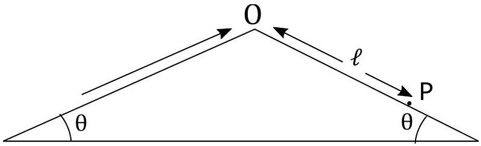
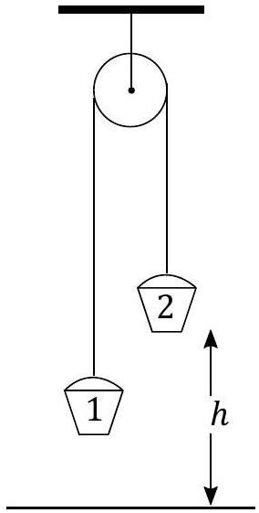
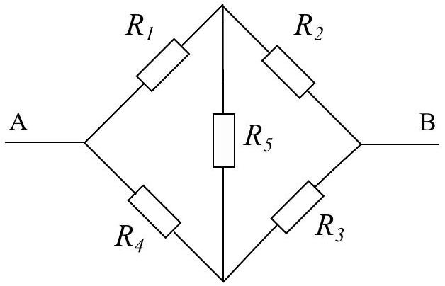
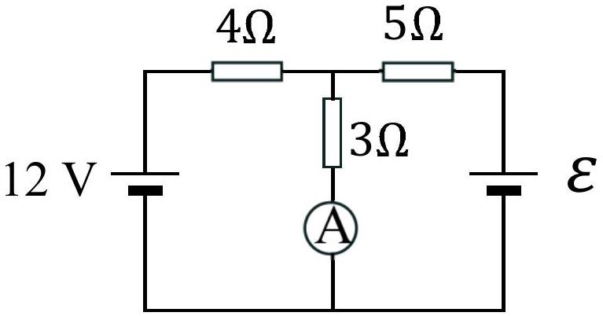
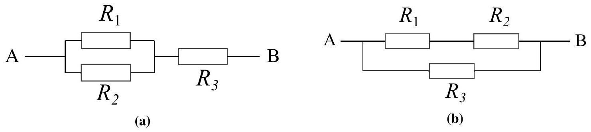
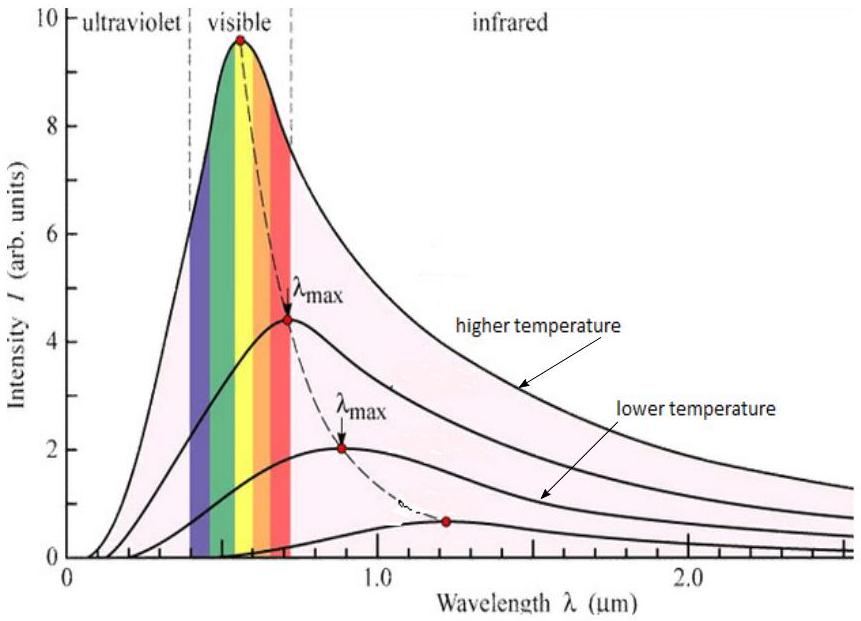

## Question 1

a) Estimate from what height, under free-fall conditions, a heavy stone would need to be dropped if it were to reach the surface of the Earth at the speed of sound of $330 \mathrm{~m} \mathrm{~s}^{-1}$.
[2]
b)A motorcycle rider is propelled up the left side of a symmetric ramp shown in Figure 1.

Figure 1

The rider reaches the apex of the ramp at speed of $u$, and falls to a point P on the descending ramp. In terms of $u, \theta$ and $g$, obtain expressions for,

    (i) The time $t_{\mathrm{a}}$ for which the rider is airborne.
    (ii) The distance $\mathrm{OP}(=\ell)$ along the descending ramp.

[4]

c) Two buckets hang from a rope over a frictionless pulley as in Figure 2. The bucket on the right has a mass $m_{2}$, which is greater than the mass of the bucket on the left $m_{1}$ $\left(m_{2}>m_{1}\right)$. Bucket 2 starts at height $h$ above the ground. If the buckets are released from rest, determine:
    (i) the speed with which bucket 2 hits the ground in terms of $m_{1}, m_{2}, h$, and the acceleration due to gravity $g$, and
    (ii) the further increase in height of bucket 1 after bucket 2 hits the ground and stops.

Ignore resistive effects and assume the rope is long compared to the height above the ground.

Figure 2

d) A rugby pitch lies in a north-south direction. In this question $\hat{\mathbf{i}}$ represents a unit vector due east, and $\hat{\mathbf{j}}$ represents a unit vector due north. Rugby player $\mathbf{Y}$ collects the ball and runs with a velocity $(3 \hat{\mathbf{i}}+4 \hat{\mathbf{j}}) \mathrm{m} \mathrm{s}^{-1}$. Player X, starting 20 m due east of player Y, immediately gives chase at a speed of $8 \mathrm{~m} \mathrm{~s}^{-1}$. She is an expert player and runs in a straight line to intercept player Y. Calculate
    (i) the velocity of player $\mathbf{Y}$,
    (ii) the time taken for the players to meet, and
    (iii) the displacement of Y from her original position at their point of contact.

[4]

e) A long wire of uniform diameter 1.40 mm has a resistance of $0.478 \Omega$. It is wrapped into a ball in order to find its weight, which is 4.60 N . When weighed in water it is 4.08 N . Calculate the resistivity of the wire.
Density of water $=1000 \mathrm{~kg} \mathrm{~m}^{-3}$
[3]
f) A train travels at a constant speed for one hour but is then delayed on the line for half an hour. When it restarts, its speed is reduced to 75\% of its previous speed. It arrives at its destination $1 \frac{1}{2}$ hours later than if it had travelled at its initial speed throughout. If the delay had occurred 45 km further on, then the train would only have been 1 hour late. Determine,
    (i) the distance travelled, and
    (ii) the initial speed of the train.

[4]

g) Emmy walks into a lift with a set of (bathroom) scales. She stands on the scales, presses the button for the $30^{\text {th }}$ floor, and starts a timer as the lift begins to move. She notices that the reading on the scales varies with time, according to the equation below:
$$
m(t)=60\left(1+\frac{t}{10}-\frac{t^{2}}{100}\right)
$$
    (i) Write down an expression for the acceleration of the lift as a function of time.
    (ii) How fast is the lift moving after 10 seconds?
    (iii) After the initial 10 seconds, the lift decelerates at a constant rate until it arrives at the $30^{\text {th }}$ floor. Given that the $30^{\text {th }}$ floor is 100 m above the ground, calculate the minimum value of the mass reading (in kg) shown on the scales during this deceleration.

[4]

h) Two transparent miscible liquids of refractive indices $n_{a}=1.15$ and $n_{b}=1.52$ can be mixed together to produce a liquid of refractive index $n$ by mixing volumes $V_{a}$ and $V_{b}$ of the liquids. The refractive index of the mixture varies linearly with the volumes of the two liquids. The refractive index of powdered glass, $n_{g}$, poured into the mixture can be found by adjusting the liquid mixture until the powdered glass cannot be observed in the liquid.
    (i) Obtain an expression for $n_{g}$ in terms of $n_{a}, V_{a}, n_{b}$ and $V_{b}$.
    (ii) If the powdered glass is poured into 100 ml of liquid A and is seen to disappear when 64 ml of liquid B is added, what is the refractive index of the glass?
i) (i) Five resistors, $R_{1} \ldots R_{5}$ are connected in a circuit between points $\mathbf{A}$ and $\mathbf{B}$, as in Figure 3. Resistors $R_{2}$ and $R_{4}$ can be changed in value to be connecting wires with $R=0$, finite values, or open circuit with $R=\infty$. Write down the values of $R_{2}$ and $R_{4}$ so that the network between A and B is equivalent to

    i. three resistors in series,
    ii. three resistors in parallel, and
    iii. two identical resistors in parallel.

Figure 3

(ii)Figure 4 shows a simple circuit with two cells and three resistors. If the current in the ammeter shown in the figure is 2.0 A determine the unknown e.m.f. $\varepsilon$, of the battery, assuming the batteries and ammeter have no internal resistance.

Figure 4

j) (i) In Figure 5a, resistors $R_{1}, R_{2}$ and $R_{3}$ are connected between A and B. Derive an expression for $R_{3}$ in terms of $R_{1}$ and $R_{2}$, if the equivalent resistance, $R_{A B}$ is equal to $R_{1}$.
    (ii) A different arrangement is shown in Figure 5b for resistors $R_{1}, R_{2}$ and $R_{3}$. Again the equivalent resistance, $R_{A B}=R_{1}$, and the ratio $\frac{R_{3}}{R_{2}}=6$. Determine the value of the ratio of $\frac{R_{1}}{R_{2}}$.

Figure 5

[4]

k) The stiffness, $S$, of a beam of rectangular cross-section, with width $w$, and thickness $t$, is directly proportional to its width and the cube of its thickness, $\left(t^{3}\right)$; that is, stiffness, $S \propto w t^{3}$. Determine the cross-sectional dimensions of the stiffest rectangular crosssection wooden beam that can be cut from a log of diameter 20 cm.
[3]
1) A narrow beam of monochromatic light is passed normally through a diffraction grating of $6 \times 10^{5}$ lines per metre. Three spots of light are observed on a screen placed 80 cm away from the grating, and the outer spots are 30 cm away from the central spot. Determine the wavelength of the light used.
[2]
m) Large craters can be produced on the Earth by meteorites. The size of a crater with diameter $d$ is dependent on the kinetic energy of the meteorite $E$, the density of the rock removed from the crater $\rho$, and the field strength $g$, since the rock must be lifted out of the crater. We can express this as
$$
d=k E^{\alpha} \rho^{\beta} g^{\gamma}
$$
where $k$ is a numeric constant and $k \approx 1$.
    (i) By considering the dimensions (or units) of the quantities above, obtain an expression relating the diameter of the crater to $E, \rho$ and $g$.
    (ii) The Barringer Crater in Arizona was made by a meteorite that landed there 30000 years ago. It has a diameter of 1200 m and is in rock of typical density $3000 \mathrm{~kg} \mathrm{~m}^{-3}$. If the impact speed was $15 \mathrm{~km} \mathrm{~s}^{-1}$, estimate the mass of the meteorite.
    (iii) If the spherical meteorite was made of iron of density $8000 \mathrm{~kg} \mathrm{~m}^{-3}$ what was its diameter?

[6]

n) The petrol engine of a car consumes 5.3 litres of petrol for every 100 km travelled at a speed of $100 \mathrm{~km} \mathrm{~h}^{-1}$ with the outside temperature being 16°C. The heat of combustion of the petrol is 30 MJ per litre, and 23 \% of this energy finds its way to the water cooling system. Calculate the mass rate of flow of cooling water such that the temperature rise of the cooling water is limited to 40 °C.
Specific thermal capacity of water $=4180 \mathrm{~J} \mathrm{~kg}^{-1}{ }^{\circ} \mathrm{C}^{-1}$.
o) Stefan's Law states that for a given perfectly radiating surface at an absolute temperature $T$, the radiated power $\Phi$ is directly proportional to $T^{4}$. The radiated energy is distributed over a range of wavelengths of electromagnetic radiation, with the peak in emission occurring at $\lambda_{\text {max }}$, as shown in Figure 6. The value of $\lambda_{\text {max }}$ is determined by Wien's Law which states $\lambda_{\text {max }}$ is inversely proportional to absolute temperature. Determine:
    (i) The ratio of the radiative powers of the surface at $500^{\circ} \mathrm{C}$ and $1000^{\circ} \mathrm{C}$, i.e. evaluate $\Phi_{1000} / \Phi_{500}$,
    (ii) the wavelength of maximum emission at 1000 °C if the wavelength of maximum emission at 500 °C is 3750 nm.

Figure 6

p) Electron beam lithography is used for etching microscopic patterns on surfaces. Typically, a 5 nm layer of aluminium deposited on an insulating substrate will remove the incident charge. If the beam current is 1.0 nA, and the electron beam of width 15 nm is incident centrally on a circular aluminium covered surface of diameter 5.0 cm, calculate the electrical resistance and potential difference between the edge of the spot and the edge of the surface.
Resistivity of aluminium $=2.8 \times 10^{-8} \Omega \mathrm{~m}$.

q) A leaky capacitor is one which does not have a perfectly insulating dielectric layer between the plates upon which the charge is stored. Such a capacitor contains a dielectric material filling the space between the plates, and with an effective resistivity of $1.5 \times 10^{12} \Omega \mathrm{~m}$. The area of the plates is $A=0.603 \mathrm{~m}^{2}$, and the dielectric film thickness $d=0.82 \mu \mathrm{~m}$. The capacitor is charged from a 24 V supply connected in series with a $4.7 \mathrm{M} \Omega$ resistor.
    (i) Calculate the maximum charge that can be accumulated on one of the capacitor plates. [For a parallel plate capacitor, $C=\frac{\epsilon_{0} A}{d}$ ]
    (ii) If the capacitor is disconnected from the circuit, calculate the time taken for the capacitor to lose half its maximum charge.
r) A fixed mass of gas expands isothermally and the relationship between the pressure $p$, and the volume of the gas $V$, is $p V=380 \mathrm{Pam}^{3}$. The volume increases at a rate of $0.005 \mathrm{~m}^{3} \mathrm{~s}^{-1}$ when the volume is $0.17 \mathrm{~m}^{3}$. At what rate does the pressure decrease at this point?
s) A hot air balloon uses a gas flame to heat the air it contains to a temperature required to enable it to hover at a small distance above ground level. The mass of the balloon, ropes, basket and riders is 240 kg and the volume of the balloon is $1100 \mathrm{~m}^{3}$. The temperature of the surrounding air is 15 °C and its density is $1.23 \mathrm{~kg} \mathrm{~m}^{-3}$.
To what temperature does the air in the balloon need to be heated? [5]

## END OF SECTION 1
