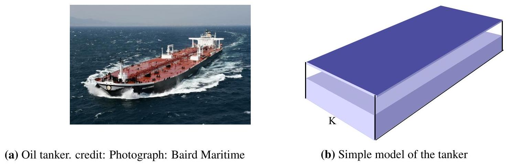
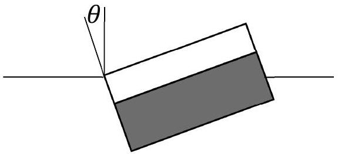
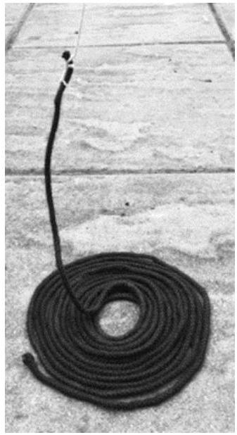
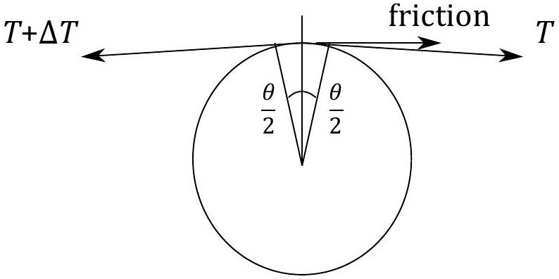

## Question 3

This question is about dynamics in nautical examples.

a) An oil tanker as illustrated in Figure 2a will typically have a length of 272 m , a breadth of 48 m and a height from the bottom of the ship to the deck surface of 24 m. The mass of the ship alone is 22000 tonnes. A typical full load would be 158000 tonnes of crude oil with a density of $900 \mathrm{~kg} \mathrm{~m}^{-3}$.
We model the tanker as a closed cuboid tank carrying oil at the bottom, of uniform crosssection, as shown in Figure 2b.

Figure 2

(i) Calculate the distance from the water line to the deck when the tanker is loaded with a full tank that occupies the lower part of the ship as shown in Figure 2b. Take the density of sea water to be $1025 \mathrm{~kg} \mathrm{~m}^{-3}$.
(ii) Calculate the height of the centre of mass of the loaded ship above the base centre point, K, shown in Figure 2b.
(iii) The ship lists to one side to the point where water just reaches the deck, as illustrated in Figure 3. Calculate the angle to the vertical $\theta$, where $\theta$ is a small angle. [The buoyancy force acts at the centre of mass of the displaced water.]

Figure 3: When the ships tilts, we assume the oil remains stationary inside due to internal baffles and walls

(iv) Determine the resultant turning moment acting on the ship.
b) A capstan (a rotating cylinder) on the ship pulls up a uniform heavy chain from the dockside by means of a much lighter thin rope of negligible mass, as in the photograph in Figure 4.

(i) The chain is pulled up from the ground at a constant speed $v$. It has a mass per unit length of $\lambda$. If the length of heavy chain lifted from the ground and suspended from the rope is taken to be $x$, find expressions for the force, $F$, and the power, $P$, supplied by the ship's capstan in terms of $x, \lambda, v$ and $g$.
(ii) Find an expression for the upward contact force $R$ from the dockside, acting on the chain whilst it is being pulled up, taking the total length of chain to be $L$.

Figure 4

c) The heavy chain, with an effective cross-sectional area of $A$, stretches under its own weight. Find an expression for the extension of the chain $e$, as a function of its suspended length $x$. The heavy chain has a mass per unit length $\mu$, a Young's modulus of $E$, and the gravitational field strength is $g$. The cross-sectional area of the chain is assumed to remain constant.
d) A strong rope can be used to pull on a large ship by wrapping the rope around a capstan (a cylinder) and holding the loose end of the rope with a small force. The friction of the rope on the capstan acts as a force multiplier. If a rope is in contact with a cylinder with friction acting, as shown in Figure 5, in which the angle $\theta$ is small.
    (i) Sketch a fully labelled diagram to show the normal component of the tension acting on the capstan from the rope.
    (ii) Obtain an expression relating the tension in the rope $T, \Delta T, \theta$ and the coefficient of friction $\mu$.
The coefficient of friction is given by; frictional force $=\mu \times$ normal reaction force of the capstan.
    (iii) By integrating your result relating $\Delta T$ and $T$, obtain the relation between the tensions on the ends of the rope for large angles $\theta$.
    (iv) Approximately how many turns of a rope on a capstan for which the coefficient of friction $\mu=0.3$ would be required if you were to balance a person's weight of $\approx 600 \mathrm{~N}$ with a weight equivalent to the "weight of the Earth" ( $6 \times 10^{25} \mathrm{~N}$ )?

Figure 5
