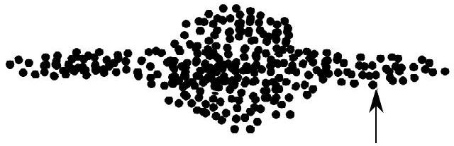

## Question 5

This question is about circular motion and gravity.

a) A hump-back bridge has a circular cross section. It crosses a river of width 18 m and the height of the centre of the bridge above the surrounding ground is 4.0 m. What is the maximum speed at which a car can drive over the bridge whilst still remaining in contact with it?
Hint: if two chords of a circle, AB and CD meet at a point S then AS $\mathrm{SB}=\mathrm{CS} \cdot \mathrm{SD}$
(3)
b) The Sun orbits the centre of the Milky Way galaxy at a radius of 30000 light years, and a period of orbit about the galaxy of 200 million years. Assuming that the mass distribution of matter in the galaxy is concentrated mainly in a central uniform sphere and the Earth lies in one of the arms, as illustrated schematically in Figure 10,
    (i) obtain an expression for the period of orbit $T$ of the Sun in terms of its radius of orbit, $r, G$ and $M_{\mathrm{g}}$, the mass of the galaxy.
    (ii) Determine a value of the mass of the galaxy.
    (iii) If the Sun represents the mass of an average star, estimate the number of stars in the Milky Way.
        (3)

Figure 10: Schematic of the Milky Way galaxy, viewed in the plane, with the Sun along one 'arm', marked by the arrow.

c) A satellite orbits the spherical Earth of radius $R_{\mathrm{E}}$ in a circular orbit of radius $r$.
    (i) Write down an expression for the speed $v$ of the satellite in terms of $r, G$ and $M_{\mathrm{E}}$, the mass of the Earth, explaining the physics needed to obtain your expression.
    (ii) Evaluate the speed of a satellite in a low orbit, if it was just grazing the Earth.
    (iii) Calculate the period of the satellite orbit.
    (iv) The satellite instead orbits at a height $h \ll R_{\mathrm{E}}$ above the surface of the Earth. Obtain an expression for the fractional change $\frac{\Delta T}{T}$ of the orbital period $T$ in terms of $h$ and $R_{\mathrm{E}}$. Hence what is the period of orbit of the satellite orbiting at a height of 200 km?
    (v) Sketch a graph of the period of orbit $T$ against $h$ for $h \ll R_{\mathrm{E}}$.
    (vi) Show that when a large mass $m_{1}$ moving at speed $u$ collides elastically with a stationary small mass $m_{2}$, the kinetic energy lost by $m_{1}$ is $\approx 2 m_{2} u^{2}$
    (vii) When a small satellite of mass $m$ and cross-sectional area $A$ passes through a gas of density $\rho$ it will make numerous elastic collisions with molecules of the gas. Obtain an expression for the rate of loss of energy of the satellite in terms of $\rho, A$ and $v$.

(viii) An Earth satellite of mass 20 kg is in a circular orbit at a height small compared to the radius of the Earth. If air resistance causes its total energy to decrease by 10 kJ per revolution, what is the fractional change in its speed per revolution?
(ix) By considering an expression for total energy of a satellite in orbit, show whether the speed increases or decreases.
(x) By simply using values for the period and speed of an Earth orbiting satellite in a grazing orbit, if the cross-sectional area of the satellite is $2.4 \mathrm{~m}^{2}$, estimate the density of the atmosphere for this rate of energy loss.
d) In the previous parts of this question, we assumed that the mass of the Earth was very much larger than the satellite. In the remainder of this question, we relax this approximation.
Many stars are found as part of binary systems, consisting of two stars of unequal mass in circular orbits about one another.
    (i) Draw a diagram of the orbits of such a binary system labelling the positions of the two stars at two successive times in their orbits.
    (ii) Suppose the stars have mass $m$ and $k m$ with $k>1$, what are their relative orbital radii?
    (iii) One day the more massive star explodes in a supernova. After the explosion, the masses of the stars are now equal, and the exploding material has moved to a great distance away. Describe using diagrams the motion of the star system if the binary system were to remain bound. Assume the supernova causes the larger star to lose mass in a spherical symmetrical manner.
    (iv) Find the critical value of the initial mass ratio $k$, above which the binary system becomes unbound after the explosion described in (iii).
