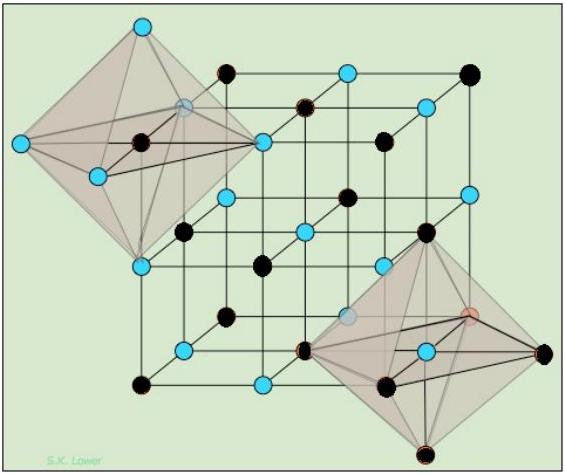
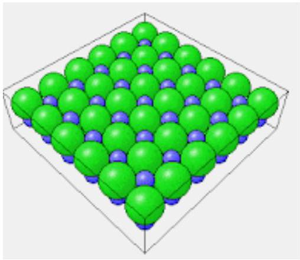

## Question 6

This question is about atomic structure and electric fields.
The sodium chloride crystal has a face centred cubic structure and we shall consider a unit cell (smallest repeating unit) which is in the octahedron shown shaded in Figure 11. For the purposes of this question we will consider the upper left octahedron, with the (blue/grey) circles at the corners to be the chlorine ions, and the (black) central ions to be sodium.

The ions in the crystal lattice are held in place by electrostatic forces, and the ions are considered to be point charges. The charge on a sodium ion is $+1 e$; the charge on a chlorine ion, $-1 e$. The distance $a$, between any two adjacent chlorine ions is 0.564 nm .

Figure 11:
credit: Figure attributed to S K Lower, https://doclecture.net/1-49591.html

a) What is the separation between nearest sodium and chlorine ions?
b) Calculate the electric potential energy of the unit cell, considering it to be the building block for the solid, so that you can take its overall charge to be zero and assign an appropriate charge to each chlorine ion. If, in our very simple model, we ignore the interaction between chlorine ions, estimate the energy released when 1 mole of NaCl is formed.
c) Now consider the octahedron shown in isolation. One sodium ion surrounded by six chlorine ions, the latter which we shall consider to be in fixed positions. If the sodium ion is displaced by a small distance $x$ towards one of the chlorine ions, it will experience a resultant force towards its equilibrium position. Using suitable approximations when $x \ll a$, determine:
    (i) An expression, in terms of the electronic charge $e$, the unit cell dimension $a$, the small displacement $x$, and the constants $\pi$ and $\epsilon_{0}$, for the resultant force acting on the sodium ion.
    (ii) Estimate the frequency of oscillation, assuming it approximates to simple harmonic motion, and the mass of the ion to be 23 u.

One surface of the sodium chloride crystal looks like Figure 12, and this surface can be investigated using electron diffraction.

d) A beam of electrons accelerated through a potential of 100 V is directed normally on to the surface. The electrons scatter back elastically from the surface layer of ions. By considering the electrons to behave as waves diffracted by the surface, determine

Figure 12:
credit: http://physicsforeach.blogspot.com/2012/09/oth

(i) an expression for the angle of interference maxima (relative to the normal) along the principle directions shown by the box edges in the diagram. Use the standard notation of: $a$ for the separation of two adjacent scatterers, $n$ for order of diffraction, $\theta$ for diffraction angle of the interference maxima, $m$ for the mass of the electron, $V$ for the potential, and $h$ for Planck's constant.
[Note: it makes no difference if the beam originates on the same side of the surface when it undergoes scattering.]
(ii) Calculate the angle of diffraction for the first and second orders.

Now consider the electron to be a particle with a momentum $p$.

(iii) For the first order diffracted beam, draw a diagram using momentum vectors to show the change in momentum of the electron during collision with the surface. Record the angles between the vectors on your diagram.
(iv) Calculate the direction (relative to the surface) and magnitude of the momentum change. (8)
e) The sodium atom must be ionised to form sodium chloride. The first ionisation energy of sodium is $496 \mathrm{~kJ} \mathrm{~mol}^{-1}$. By considering the outermost electron to lie on the surface of a sphere, within which the remaining charge of the atom is contained, estimate the radius $R$ of the atom. (2)
f) Now consider the sodium atom $(Z=11)$ to consist of a point like nucleus which contains all of the positive charge of the atom, and the electrons each of charge $-e$, evenly distributed within the atom, giving an average charge density of $\sigma$. The radius of the atom is $R$.
    (i) Determine an expression for the electric field strength within the atom as a function of distance $x$, from the centre of the atom.
    (ii) Subsequently find an expression for the electric potential $V$ within the atom, as a function of distance $x$ from the centre of the atom.
    (iii) Finally, by considering the atom to consist of concentric spheres of constant charge density, find an expression for the work done assembling the atom, and provide a numerical estimate of the energy required to turn one mole of sodium into a fully ionised gas (a plasma) of electrons and nuclei.
[Use your result from part (e) for the radius of the atom.] (5)
