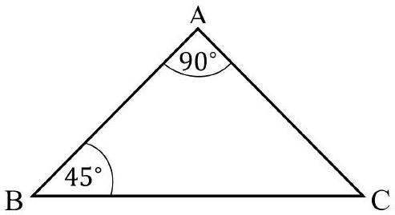
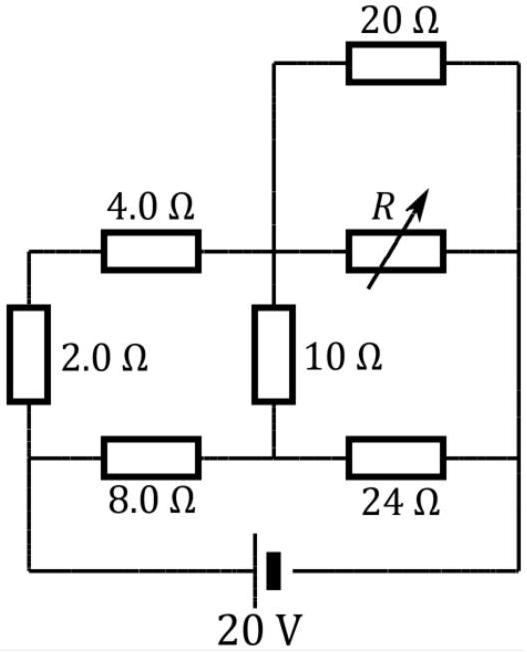
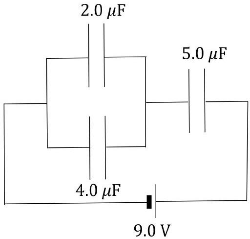
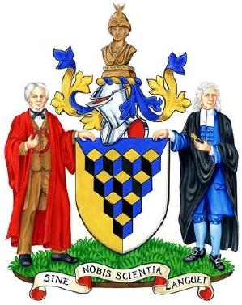
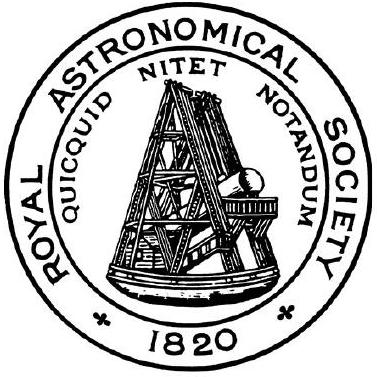

## Question 1

a) A railway truck travelling along a level track at $5.0 \mathrm{~m} \mathrm{~s}^{-1}$ collides with a truck of twice the mass moving in the same direction at $2.5 \mathrm{~m} \mathrm{~s}^{-1}$. The trucks couple together and continue moving. Calculate
    (i) the final speed of the combined trucks, and
    (ii) the percentage of the kinetic energy lost in the collision.
b) The fundamental frequency of a drum skin has been shown to be given by $f=\frac{0.47 h v}{a^{2} \sqrt{1-\rho^{2}}}$ where $h$ is the thickness of the skin, $v$ is the speed of sound in the skin, and $\rho$ is a constant of elasticity. Units are in SI units.
    (i) What are the units of $\rho$ ?
    (ii) Determine the units of quantity $a$.
c) A ball is thrown vertically upwards with a velocity of $40 \mathrm{~m} \mathrm{~s}^{-1}$. After 1.0 s , a second ball is thrown upwards with a velocity of $60 \mathrm{~m} \mathrm{~s}^{-1}$.
For this question, you may take $g=10 \mathrm{~m} \mathrm{~s}^{-2}$
    (i) Sketch, on the same axes, velocity-time graphs for each ball. Take the direction upwards as positive.
    (ii) After what time, and at what height do they meet?
    (iii) What would be the required time separation between the two balls being thrown if they were to meet at the moment the first ball reached its maximum height?
d) A railway carriage for transporting liquids is carrying a viscous liquid and it is only half full. The carriage is attached to an engine which pulls away with a constant acceleration, so that the fluid in the carriage forms a steady sloping surface. If the acceleration of the train is $0.84 \mathrm{~m} \mathrm{~s}^{-2}$, what is the angle of the liquid surface to the horizontal?
e) Two aeroplanes A and B travel with velocities $\overrightarrow{\boldsymbol{v}}_{\mathrm{A}}=50 \hat{\mathbf{i}}-125 \hat{\mathbf{j}}$ and $\overrightarrow{\boldsymbol{v}}_{\mathrm{B}}=-90 \hat{\mathbf{i}}+60 \hat{\mathbf{j}}$, where $\hat{\mathbf{i}}$ and $\hat{\mathbf{j}}$ are unit vectors to the east and north respectively, and the values are in units of $\mathrm{m} \mathrm{s}^{-1}$.
    (i) Find the relative velocity of plane $\mathbf{A}$ as seen from plane $\mathbf{B}$.
    (ii) When time $t=0 \mathrm{~s}$, plane A has position $\vec{r}_{\mathrm{A}}=-400 \hat{\mathbf{i}}+1200 \hat{\mathbf{j}}$ and plane B has position $\vec{r}_{\mathrm{B}}=800 \hat{\mathbf{i}}-600 \hat{\mathbf{j}}$. Find the time and distance of closest approach of the two aeroplanes.

f) Water flows at a steady rate of 1.0 litre $\mathrm{min}^{-1}$ through a pipe in which there is an electrical heater connected to a 230 V supply. The rise in temperature of the water after passing through the heater is $60^{\circ} \mathrm{C}$. Calculate the resistance of the heater.
Assume no heat loss to the surroundings.
$$
\begin{aligned}
& 1 \text { litre }=1000 \mathrm{~cm}^{3} \\
& \text { Density of water is } 1000 \mathrm{~kg} \mathrm{~m}^{-3}
\end{aligned}
$$
g) Dry steam at 100°C is passed into 0.250 kg of water at 0°C contained in a calorimeter whose thermal capacity is equivalent to 0.010 kg of water. When the temperature is 30 °C it is found that 0.0128 kg of steam have condensed. Calculate the specific latent heat of steam.
$$
\text { Specific latent heat of ice }=334 \mathrm{~kJ} \mathrm{~kg}^{-1} \text {. }
$$
h) The expansion of a metal rod varies linearly with temperature, in the form of
$$
\ell=\ell_{0}(1+\alpha \Delta T)
$$
where $\ell_{0}$ and $\ell$ are the initial and final lengths respectively, $\Delta T$ is the temperature change, and $\alpha$ is the coefficient of linear expansion.
An iron rod is 1.00 m at 0 °C. What is the length of a copper rod at 0 °C if the difference between its length and that of the iron rod is not to vary with temperature?
$$
\begin{aligned}
& \text { Coefficient of expansion of copper, } \alpha_{\mathrm{Cu}}=17.0 \times 10^{-6}{ }^{\circ} \mathrm{C}^{-1} \\
& \text { Coefficient of expansion of iron, } \alpha_{\mathrm{Fe}}=11.9 \times 10^{-6}{ }^{\circ} \mathrm{C}^{-1}
\end{aligned}
$$
i) An aeroplane files over an observer at speed $v$ and at a fixed height of 3000 m. After some time, the observer sees the plane at an angle of $60^{\circ}$ above the horizontal, which is decreasing at a rate of $0.09 \mathrm{rad} \mathrm{s}^{-1}$. Calculate
    (i) the distance from the observer to the plane
    (ii) the speed of the plane
    (iii) the speed at which the plane is receding along the observer's line of sight.
j) A smooth wedge of mass $M_{1}$ with the cross-section of an equilateral triangular is placed on a smooth horizontal table with its lower edge in contact with a smooth vertical wall. A smooth sphere of mass $M_{2}$ is placed between the wedge and the wall, so that the sphere falls without rotation.
    (i) By geometry, find a relation between the height fallen by the sphere and the horizontal distance moved by the wedge.
    (ii) Obtain an expression for $a$ in terms of $M_{1}, M_{2}$ and $g$.

k) An oscillating pendulum bob has a maximum angle of swing of $\theta$. In its lowest position, the tension in the string is $n$ times the weight of the bob. Obtain an expression for $\cos \theta$ in terms of $n$.
1) The standard railway gauge has tracks separated by 1435 mm. To travel around a curve the track is banked. Calculate the vertical displacement between the two tracks such that a train travelling at $200 \mathrm{~km} \mathrm{~h}^{-1}$ along a curve of radius 1500 m will experience a normal reaction force on the wheels only.
m) An isosceles glass prism is shown in Fig. 1. A ray of light in the plane of the paper is incident from air on the face AB.
    (i) Calculate the critical angle for light in the prism.
    (ii) Sketch the path of the ray incident on face AB such that the refracted ray strikes the face BC at the critical angle.
    (iii) Calculate the angle of incidence on face AB for this same condition.
Refractive index of glass, $n=1.5$

Figure 1: Isosceles glass prism with an apex angle of 90°.

n) An aluminium block 5.0 cm × 5.0 cm × 10 cm is attached to a newton-meter that records a weight of 6.6 N. A beaker of water sits on a mass balance and records a mass of 600 g. The aluminium block is then lowered into the water and completely submerged without touching the sides of the beaker. What is
    (i) the new reading on the newton-meter, and
    (ii) the new reading on the mass balance?
Density of water is $1000 \mathrm{~kg} \mathrm{~m}^{-3}$.
o) A solid square cross-section mild steel bar, of side 2.0 cm is to be bent on the arc of a circle. What is the smallest radius to which it can be bent, if the breaking stress of the steel is 840 MPa, and Young's Modulus is 210 GPa. Assume that the radius of curvature is much larger than the thickness of the bar.

p) In the photoelectric effect, an electrode is placed 0.10 m from a clean sodium surface, which has a work function of 2.28 eV . Light of wavelength 400 nm is shone on the surface and electrons are emitted.
    (i) What is the shortest time it takes the most energetic photoelectrons to reach the electrode after illumination is started?
    (ii) If a stopping potential of 0.50 V is applied between a plane electrode parallel to the photoemissive surface to produce a uniform electric field, what is now the shortest time it takes the most energetic photoelectrons to reach the electrode after illumination is started?
q) For the circuit shown in Fig. 2, what should be the value of the variable resistor $R$ in order to minimise the power converted in the $10 \Omega$ resistor?

Figure 2: A circuit of a cell and seven resistors.

r) In the arrangement of capacitors in Fig. 3, calculate the charge stored on the $4.0 \mu \mathrm{~F}$ capacitor.

Figure 3: A circuit with capacitors and a cell.

s) A capacitor is made of two parallel conducting plates of area $A$ and initial separation $d$. It is attached to a constant voltage supply, $V$. The energy stored in the capacitor is $E_{1}$. The separation of the plates is gradually reduced to $d / 3$. The supply is then disconnected and the separation of the plates is gradually restored to the value $d$, where the energy stored is now $E_{3}$. Calculate the difference in the energy stored in the capacitor between the final $\left(E_{3}\right)$ and initial ( $E_{1}$ ) states.

t) An isotope of polonium, ${ }_{84}^{210} \mathrm{Po}$ decays by alpha particle emission with a half-life of 138 days. A mass of 5 mg of this isotope is in the form of a thin film in a very thin-walled glass container such that the alpha particles can escape. By how much will the mass of the thin film of polonium be reduced after 100 days?

u) Beats are variations in sound intensity, produced by interference between two sources of sound very close in frequency. The beat frequency is simply the difference in the frequencies of the two sources. Three tuning forks in the audible range produce beats: B and C produce beats at 7 Hz, A and $\mathbf{C}$ produce beats at 8 Hz . The frequency of $\mathbf{B}$ is $5.9 \%$ higher than that of $\mathbf{A}$. Find the frequencies of the three tuning forks.

v) Resistance of a filament light bulb is given by $R=A+B P$ where $A$ and $B$ are constants, and $P$ is the power emitted by the bulb. When operating at 230 V the power emitted is 100 W . When switched on from cold, the filament has a resistance value 1/5 of its operating resistance, and consequently for the same mains voltage, the power is instantaneously five times greater than when at its normal operating power.
    (i) Determine the values of A and B (if you wish, you may leave the answers as products of integer values given).
    (ii) What would be the steady emitted power of the bulb if connected to a 210 V supply?

## END OF SECTION 1

UNIVERSITY OF OXFORD

UNIVERSITY OF CAMBRIDGE

OXFORD
UNIVERSITY PRESS

Worshipful Company of Scientific
Instrument Makers

ONEWORLD
PRINCETON UNIVERSITY PRESS

ONEWORLD
PRINCETON UNIVERSITY PRESS

