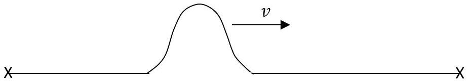
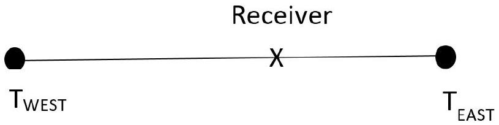
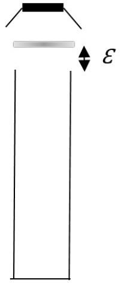

## Question 2

This question is about waves on wires and in tubes.

a)A uniform wire of length $\ell$ and mass per unit length, $\mu$, is stretched between two fixed points ×. A point close to one end is plucked and a pulse travels along the wire at speed $v$, as shown in Fig. 1, to reflect off the right hand fixed end.

Figure 1: Pulse travelling at speed $v$ along a wire under tension.

    (i) Sketch a diagram of the reflected pulse.
    (ii) After a second reflection from the left hand end, the pulse would be passing the initial point and travelling in the same direction. At that moment the wire could be plucked again to reinforce the pulse. What is the period of plucking, $t(\ell, v)$ which would accomplish this?
    (iii) Calculate the corresponding frequency of plucking the wire, $f_{1}$, in terms of $v$ and $\ell$.
    (iv) If a mechanical vibrator is attached to the wire to produce oscillations of frequency $f_{n}=n f_{1}$ (which are the harmonics or multiples of the $1^{\text {st }}$ harmonic, $f_{1}$ ) what resonant frequencies of the wire will be sustained, in terms of integer $n, v$ and $\ell$.
    (v) The wire is now plucked near one end whilst a finger is lightly touching the wire at a point 40\% of length from one end. Sketch the resultant amplitude of vibration along the wire, and determine the two lowest frequencies heard in terms of $f_{1}$.
    (vi) The speed of transverse waves along a stretched wire wave is given by $v=\sqrt{\frac{T}{\mu}}$, with $T$ the tension in the wire. What would be the tension required in order to sustain the fifth harmonic, $f_{5}$, of frequency 162 Hz in the wire if its length is 2.3 m and mass is 42 g.
b) In this example we hang the cable vertically and use its own weight to provide the tension. A massive, uniform cable of length $L$ and mass $M$ hangs with its upper end fixed to a support and the lower end free. The extension is negligible.
    (i) What is the tension at a distance $x$ below the support?
    (ii) The cable is shaken slightly at the bottom end. Using the information in part (a) (vi), calculate the ratio of the speeds of the pulse on the cable at points $1 / 4$ of its length from the top end and $1 / 4$ of its length from the bottom end.
    (iii) The cable is now plucked at the top end as in Fig. 2 and the pulse travels down the cable. Write an expression for the speed of a pulse travelling down the cable in terms of $x, L$ and $g$.

(iv) Now obtain an expression for the time taken, $t_{\text {top }}$ for a pulse to travel a distance $x$ down the cable from the support at the top end.
(v) At the same moment that the cable is plucked at the top end, a ball is dropped from rest from the same starting height. At what value of $x$ in terms of $L$ will the ball overtake the pulse traveling down?

Figure 2: Pulse travelling down a vertical hanging cable.

(8)
c) The timing of pulses can be used in GPS systems.

A stationary receiver is at a point on the line between two radio transmitters which lie on a West-East line, as in Fig. 3. Each transmitter contains a highly accurate clock and broadcasts a precise 1 MHz electromagnetic wave in pulses. After each pulse, a signal is sent with the exact time at which that signal was sent. The radio transmitters are 600 km apart. At the receiver, pulses are received from both transmitters. The pulse from the Western transmitter is received 1542 cycles of the 1 MHz wave before the pulse from the Eastern transmitter is received. The pulse from the Western transmitter was sent 0.000484 s before the pulse from the Eastern transmitter.
How far is the receiver from the Western transmitter? (2)

Figure 3: Two transmitters and a receiver lying along a W-E line

d) A resonant tube of length $\ell$ is closed at one end and has a small loudspeaker close to the open end as in Fig. 4. An a.c. signal of frequency $f$ is supplied to the speaker, and adjusted so the tube resonates at its lowest frequency, $f_{1}$. This longitudinal sound wave has a displacement node at the closed end and an antinode at the open end.
    (i) Sketch three graphs of the amplitude of the standing wave along the tube, for the lowest three harmonics that can be heard, as the speaker frequency $f$ is steadily increased.
    (ii) Now in dotted lines but on the same axes as already drawn in part (i), sketch three graphs of the corresponding pressure variation of the air with position along the tube.

Figure 4: Speaker above the open end of a closed tube.

e) The speed of sound in air is given by the equation $v_{\text {gas }}=\sqrt{\frac{\gamma P}{\rho}}$ where $\gamma$ is a numeric constant, $P$ is the pressure and $\rho$ is the density of the air.
    (i) In a 20 m tall vertical tube closed at one end, by how much is the pressure of air greater at the bottom of the tube relative to the top?
    (ii) Why is it that the speed of sound does not vary with the depth of the air in the tube?
    (iii) However, the speed does depend upon the absolute temperature of the air. Obtain an expression for the dependence on the speed of sound in terms of the constant $\gamma$, the gas constant $R$, the absolute temperature $T$ and the kg molar mass $M_{\mathrm{u}}$ in $\mathrm{kg} \mathrm{mol}^{-1}$.

(iv) In a tube closed at one end, the antinode at resonance is located a (small) fixed distance $\varepsilon$ beyond the open end of the tube. This length is known as the end correction and is illustrated in Fig. 5.

A tube closed at one end, of length 52.0 cm, and filled with air at $20.0^{\circ} \mathrm{C}$, resonates at its first harmonic at 156 Hz. A second, shorter tube alongside, which has the same end correction, $\varepsilon$, is filled with warm air at 35 °C and resonates at a slightly different frequency, producing beats with the first tube at 4.8 Hz. What is the length of the second tube?

At $20^{\circ} \mathrm{C}$ the speed of sound in air is $343 \mathrm{~m} \mathrm{~s}^{-1}$.
Atmospheric pressure is $1.01 \times 10^{5} \mathrm{~Pa}$.
Density of air at atmospheric pressure and 15°C is

Figure 5: The end correction, $\varepsilon$ for an antinode located above the open end of the tube.

$1.225 \mathrm{~kg} \mathrm{~m}^{-3}$.
