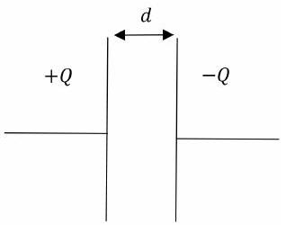
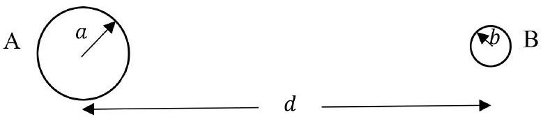
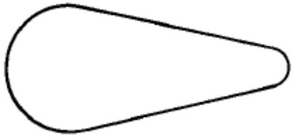
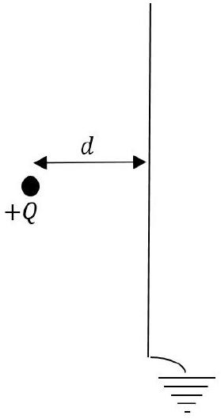

## Question 4

This question is about electric fields.

a) A capacitor $C$ consists of two parallel conducting plates, of large area $A$, separated by a distance $d$. A charge $+Q$ is applied to one plate and $-Q$ to the other, as shown in Fig. 11.

Figure 11: A parallel plate capacitor with charges $+Q$ and $-Q$ on the plates.

(i) Sketch three diagrams, showing the electric field due to one plate alone, the electric field due to the other plate alone, and the resultant electric field when both plates are in place parallel to each other. Neglect edge effects where the field may be non-uniform at the edges of the plates.

(ii) Both plates are now positively charged, each with $+Q$ instead. Sketch the three corresponding diagrams of the fields as in part (i).
(iii) The energy of a $+Q$ and $-Q$ charged capacitor can be written in terms of $Q$ and $C$. Given $C=\frac{\epsilon_{0} A}{d}$, and considering the work done in separating the charged plates by $d$, derive an expression for the force $F$ acting between the plates in terms of $Q, \epsilon_{0}$ and $A$.
(iv) Write down an expression for the field strength $E$ between the plates in terms of $\epsilon_{0}$ and $\sigma$, where $\sigma=\frac{Q}{A}$.
(v) If the area of the plates is doubled, by what factor is $Q$ changed to maintain the same force?
(vi) A thunder cloud forms over a large area of still water. What is the electrostatic surface charge density on the water if it rises under the cloud to a height 1.5 mm above its previous level? (8)
b) A point charge $Q$ produces a radial electric field, $E$ at distance $r$ from the charge. The same field strength is obtained at the surface of a sphere of radius $r$ if the charge $Q$ is spread uniformly over the surface, with an area charge density $\sigma=\frac{Q}{4 \pi r^{2}}$.
    (i) A conducting sphere of radius $r$ is charged to a potential $V$. Write down an expression for the charge $Q$ on the surface in terms of $V, r$ and $\epsilon_{0}$.

Two spheres A and B of radii $a$ and $b$ respectively are located with a distance $d$ between their centres, with $a, b \ll d$, as in Fig. 12. Each sphere is at the same potential $V$.

Figure 12: Two charged spheres at the same potential.

(ii) How are the electric field strengths at the surfaces of A and $\mathrm{B}, E_{\mathrm{A}}$ and $E_{\mathrm{B}}$ related to each other?
(iii) An ion of charge - $e$ is released from a point 3.0 mm from the surface of B. If B has a radius of 1.0 mm and is at a potentials of 2.0 kV , calculate the energy in electron-volts gained by the ion in moving 1.0 mm towards B.

A pear shaped conducting shell with hemispherical ends, as in Fig. 13 is of circular cross section perpendicular to its longitudinal axis. It is positively charged to a potential $+V$.

Figure 13: figure

(iv) Copy the diagram and sketch the pattern of electric field lines near the surface of the conductor.

As the potential is raised, the electric field strength at the surface will increase. The air becomes conducting when an electron is accelerated by the E field so that it gains enough energy between collisions to ionise the next atom with which it collides.

(v) If the ionisation energy is 2.5 eV and the mean free path between collisions is 7.0 × $10^{-6} \mathrm{~m}$, calculate the electric field strength which will cause the air to break down.
(vi) The radii of the two ends of the shell are 15.0 cm and 5.0 cm. What is the maximum potential of the shell such that it will not discharge through breakdown of the surrounding air?
(vii) Sketch the charge distribution over the surface of the shell.
c) A point charge $+Q$ is located a perpendicular distance $d$ from a large area, thin, earthed, conducting plate, as shown in Fig. 14.
    (i) Sketch the field lines linking the point charge and the conducting plane.
    (ii) Explain
        i. why there is a force acting on the plate,
        ii. in which direction is the force on the plate, and
        iii. why the force vector acting on the plate is along the direction $d$ and passes through the charge $Q$.
(iii) Consider the idea of removing the positive charge on the left and placing a negative charge on the right of the plate at distance $d$.

    i. Sketch the field lines between the earthed plate and the negative charge.
    ii. Now, by considering these field line patterns, with and without the plate present, calculate the attractive force between a $4.0 \mu \mathrm{C}$ charge located 20 cm from a large, conducting, earthed plate.

Figure 14: Point charge near a plane
