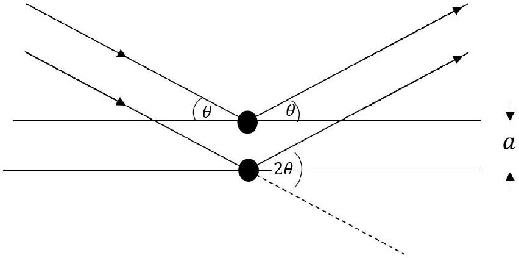
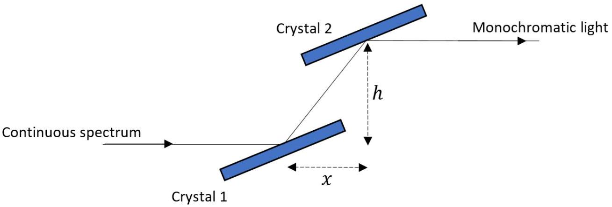
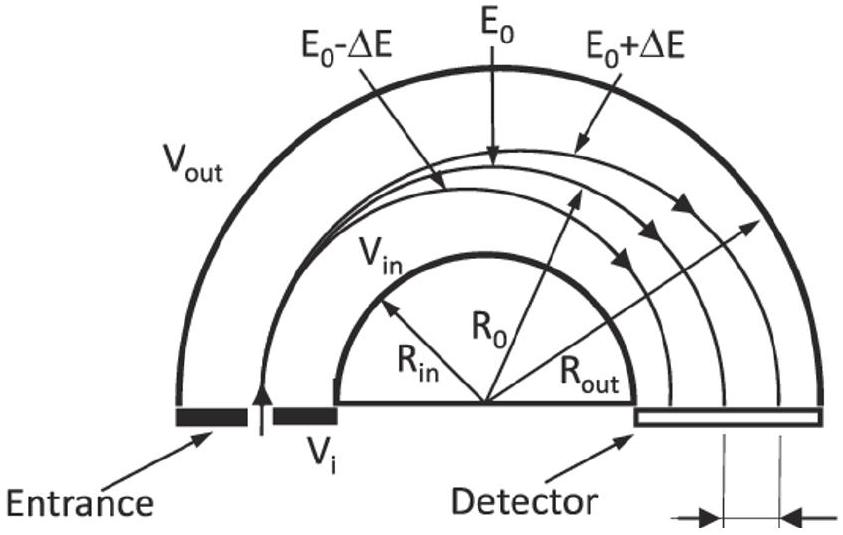
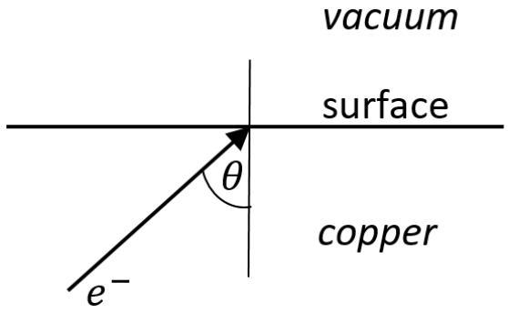
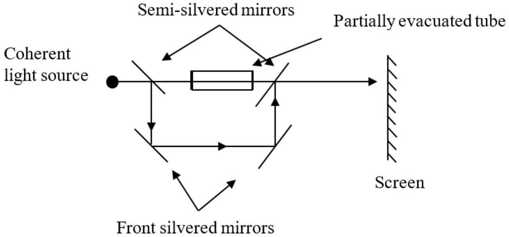
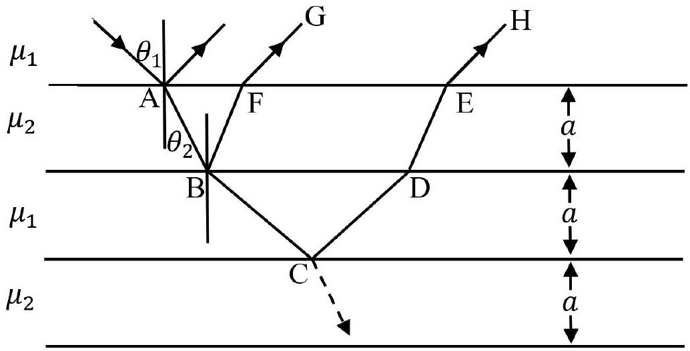

## Question 3

This question is about investigating materials with $X$ rays and electrons.
An accelerated charge radiates electromagnetic radiation. A synchrotron electron storage ring uses this idea to produce a continuous spectrum of electromagnetic radiation as the electrons are accelerated in a circular trajectory.

a)Particular wavelengths of light can be selected using a monochromator, some of which make use of diffraction and interference from crystals. The diagram shows two rays from the continuous spectrum striking two adjacent crystal planes separated by a distance $a$. The crystal planes act as partially reflecting mirrors. For certain angles $\theta$, measured to the reflecting plane, the emerging rays are monochromatic.

Figure 4: Reflection from two atomic surfaces in a crystal.

    (i) What is the path difference between the two rays shown, in terms of $a$ ?
    (ii) Determine the wavelength in terms of $\theta$ and $a$.
    (iii) If $a=0.31 \mathrm{~nm}$, calculate the first order wavelength of light strongly scattered at an angle of $\theta=15^{\circ}$, and
    (iv) the direction and magnitude of the change in momentum of the photons of this wavelength. You may use a diagram. (5)
b)In practice two crystals are used such that the light enters and leaves the monochromator in the same direction. The height, $h$ between the incoming and outgoing beams is fixed. Using a suitable approximation to first order, obtain a formula for $x$ in terms of the wavelength $\lambda$, the crystal lattice spacing $a$, and the height $h$. (3)

Figure 5

c) Monochromatic light of part (b) is incident on a sample of copper so that electrons are emitted via the photoelectric effect. The energy of the emitted electrons are investigated using a hemispherical electron energy analyser, shown in Fig. 6.
$E_{0}$, referred to as the pass energy, is the energy of the electron travelling from the analyser entrance to the exit slit of the electron detector along the equipotential path defined by, $R_{0}=\frac{R_{\text {out }}+R_{\text {in }}}{2}$, in which $R_{\text {in }}$ and $R_{\text {out }}$ are the inner and outer hemisphere radii, respectively.

These charged spheres produce a radial electric field between them. Only electrons of the particular energy $E_{0}$, describe a perfectly semi circular path and are detected. The inner sphere is at a potential $V_{\text {in }}$ and the outer one is at a potential $V_{\text {out }}$ so as to make the electric field radial.

Figure 6: Hemispherical electron energy analyser.
Figure published in Progress in Materials Science 2020 X-ray photoelectron spectroscopy: Towards reliable binding energy referencing G. Greczynski, L. Hultman

(i) Draw a sketch of the electric field lines between the hemispheres.
(ii) Write down the potential $V_{\text {in }}$ of the inner hemisphere in terms of the charge $Q$ on the hemisphere and its radius $R_{\text {in }}$.
(iii) In the simplest form possible, determine an expression for the pass energy, $E_{0}$ in terms of the radii of the hemispheres $R_{\text {in }}$ and $R_{\text {out }}$, the difference in the potentials (i.e. $\Delta V=V_{\text {in }}-V_{\text {out }}$ ), and the electronic charge $e$.
(iv) If the mean radius of the hemispheres is 50 mm with a separation of 10 mm, what potential difference between the plates gives a pass energy of 5.0 eV?
d) In a solid such as copper, the electrons exist in very closely spaced energy levels, which can be investigated. A 5.0 eV free electron is produced, for example, when an electron is in an energy level 4.0 eV below the top level in the solid and is released without collision in photoelectric emission. The workfunction of copper is 4.6 eV.
    (i) What was the photon energy used?

(ii) what wavelength is this and which part of the electromagnetic spectrum does it correspond to?
(iii) When an electron travels from the solid into the vacuum, it changes speed, similar to the behaviour of light crossing a boundary. Whilst inside the material the electron was travelling in the direction shown in Fig. 7, at $\theta=50^{\circ}$ to the surface normal.
    i. Calculate a value for the (relative) refractive index $\mu>1$, corresponding to the electron going from the vacuum into the copper.
    ii. For the the electron leaving the copper at $\theta=50^{\circ}$, at what angle does it emerge into the vacuum?

Figure 7: An electron crossing a surface from the vacuum.

e) Light of wavelength $\lambda=640 \mathrm{~nm}$ passes through an evacuated tube of length $\ell=8.0 \mathrm{~cm}$ with thin glass ends. The beam interferes with a second coherent beam of light on a screen, causing destructive interference, as shown in Fig. 8. Air has a refractive index given by $\mu_{\text {air }}=1+0.00029 \frac{P}{P_{0}}$ where $P_{0}=1.0 \times 10^{5} \mathrm{~Pa}$. What minimum pressure of air in the tube would cause the interference pattern to become constructive interference at the screen?

Figure 8: Interference between two beams from a coherent source of light. One beam passes through a partially evacuated tube.

f) The refractive index of a material for electrons depends upon the wavelength of the electron. So if we instead consider X rays reflecting off adjacent layers of a crystal, we

Figure 9: X ray interference between layers of atoms.

can take into account the effect of refraction within the material.
An example is illustrated in Fig. 9 in which adjacent layers of atoms are laid down on a substrate. X rays are incident at angle $\theta_{1}$ and refracted in the second layer at angle $\theta_{r}$. If there are multiple layers and reflections, then these will dominate intensity of the reflection at the first surface from the vacuum. So we we can look at the path difference between the emerging rays G and H. In this very simplified model, the layers have been given the same thickness $a$.

(i) Determine the path length BCD.
(ii) What is the optical path difference between rays G and H?

[25 marks]
