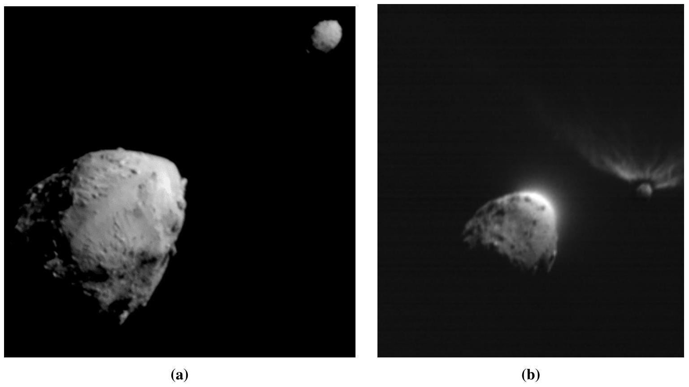

## Question 4

This question is about the physics of the DART mission to deflect an asteroid.
The Double Asteroid Redirection Test (DART) was a mission by NASA to measure the effectiveness of the deflection of an asteroid through a high-speed impact. Such a strategy would be a cheap way of achieving planetary defence against such asteroids should one of comparable size threaten the Earth. The DART probe successfully impacted into Dimorphos, an asteroid moon of the asteroid Didymos, on $26^{\text {th }}$ September 2022 (see Fig. 10). The target was chosen as it would only affect the orbit of the moon and so there was no danger of it being pushed into an Earth-crossing orbit, and Dimorphos is comparable to the 140 m minimum size to be considered a potentially hazardous asteroid, so is like the real threats we might face.

Figure 10: Observations before and after impact.
Fig. (a): The view of the asteroid Didymos (bottom left) and its moon Dimorphos (top right) taken by DART as it was heading towards the moon for impact. Credit: NASA/Johns Hopkins APL Fig. (b): The view of the pair taken with the probe LICIACube just after its closest approach, from a vantage point a little behind the DART impactor. There is clearly a considerable amount of material ejected from the surface of Dimorphos, as expected from a successful impact. This amplifies the effect of the impact on the orbit of Dimorphos, giving a larger change in orbital velocity than by just the probe alone. Credit: ASI/NASA

a) DART was fitted with the most up-to-date ion drive available (NEXT-C) to ensure it could accelerate up to the required impact velocity with only a fraction of the mass of fuel that would be needed for conventional rockets. It does this by applying a very small thrust for a very long time. The fuel used was singly ionised xenon-131 ions. The accelerating potential was 1800 V.
    (i) What was the ejection speed of the xenon? Assume the xenon ions started from rest.
    (ii) The current of ions was 3.52 A. What is the thrust generated?
    (iii) The probe hit Dimorphos 306 days after launch. If the ion drive had been run continuously for that time (and there was enough xenon to do so), what would

have been the speed at impact?
Assume linear acceleration of the probe in deep space starting from rest, and take the average mass of the probe to be 600 kg during the acceleration phase. $\square$

Dimorphos was discovered through dips in the brightness of Didymos as it passes in front and behind the asteroid (known as transits).

b) Radar observations of Didymos measured its diameter to be 780 m (assuming a spherical shape) and the centre-to-centre distance to Dimorphos to be 1.20 km (assuming a circular orbit). The relative depth of the dips in brightness meant that the diameter of Dimorphos was derived to be 164 m (again assuming a spherical shape), and the period of the orbital motion was 11 h 55 min .
    (i) By considering the forces acting on each of the objects in their circular orbits, calculate the total mass of the binary system.
    (ii) Assuming both asteroid and moon have the same density, calculate the mass of Didymos and Dimorphos.

c) The DART probe had a mass of 570 kg at impact and was travelling at a speed of $6.14 \mathrm{~km} \mathrm{~s}^{-1}$ (relative to the rest frame of Dimorphos).
    (i) By conserving momentum and assuming a head-on inelastic collision, determine the change in Dimorphos' orbital speed, $\Delta v$. Give your answer in $\mathrm{mm} \mathrm{s}^{-1}$.
    (ii) The impact will have made the orbit elliptical, although by considering the total energy of the orbit you can calculate the radius of an equivalent circular one.
        i. obtain an expression for the total energy of a satellite, $m_{\mathrm{s}}$, in orbit about a central mass, $m_{\mathrm{c}}$, in terms of $G, m_{\mathrm{c}}, m_{\mathrm{s}}$ and the radius of orbit $r$. Using this approach, calculate
        ii. the expected decrease in orbital radius, $\Delta r$, and hence
        iii. the expected decrease in orbital period, $\Delta T$, giving your answer in minutes.

d) Less than a month after the impact, it was announced that the observed orbital period shortening was 32 minutes. This is larger than the one in part (c) due to the momentum transfer enhancement factor, $\beta$, which quantifies how much the ejecta from the surface and deformation of Dimorphos has amplified the effect. To calculate $\beta$ accurately is quite complicated and will need months of observations, but a very rough estimate can be made using the approximation $\beta \propto \Delta v$.
Treating the value in part (c) as the $\beta=1$ case, find the observed value of $\Delta v$ and hence a ballpark estimate for the value of $\beta$. $\square$
[25 marks]
