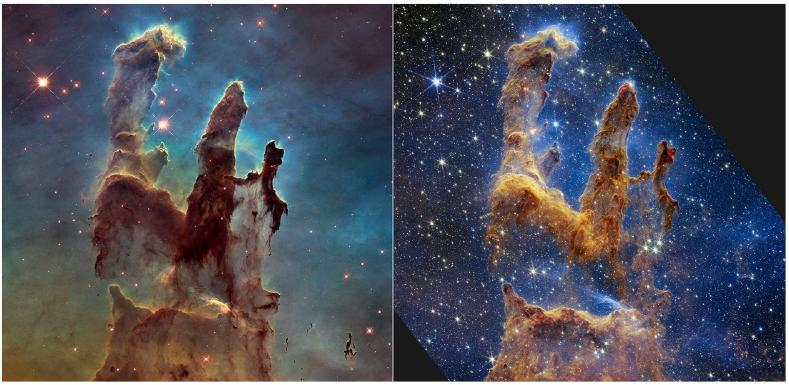

## Question 5

This question is about the physics involved in star formation.

The James Webb Space Telescope (JWST) has only been publicly releasing images since July 2022 and has already shown it is a more than worthy successor to the Hubble Space Telescope (HST). In Fig. 11 is a recent side by side comparison is of the 'Pillars of Creation' in the Eagle Nebula - a famous area undergoing considerable star formation.

Figure 11: The 'Pillars of Creation' - a famous star-forming region in the Eagle Nebula - as viewed with the Hubble Space Telescope (left) and the James Webb Space Telescope (right). Since the JWST operates at infrared wavelengths it can see through the dust and reveal so many of the new stars that have been born. Credit: NASA, ESA, CSA, STScI; Joseph DePasquale (STScI), Anton M. Koekemoer (STScI), Alyssa Pagan (STScI).

Some of the new stars being born will be large and hot, so will have strong stellar winds and considerable ionising radiation that will carve out holes around them, meaning that over time the dust columns as we see them will disappear. The ionised bubble is known as a Strömgren Sphere and is created by ionising photons (those with energies greater than 13.6 eV) ionising any hydrogen atoms in the vicinity. At the edge there is a balance between new ionisations and electrons recombining with hydrogen nuclei.
The formula for the radius of the sphere is:

$$
r_{\mathrm{S}}=\left(\frac{3 N}{4 \pi \alpha}\right)^{\frac{1}{3}} n_{\mathrm{H}}^{-\frac{2}{3}}
$$

where $N$ is the number of ionising photons per second, $\alpha$ quantifies the probability that a proton and electron recombine into a hydrogen atom, and $n_{\mathrm{H}}$ is the number density of hydrogen nuclei in the sphere (assumed to be the same as the number density of electrons).

Some Solar data:
Mass of the Sun, $M_{\text {Sun }}=1.99 \times 10^{30} \mathrm{~kg}$
Radius of the Sun, $R_{\text {Sun }}=6.96 \times 10^{8} \mathrm{~m}$
Luminosity of the Sun (power output), $L_{\text {Sun }}=3.85 \times 10^{26} \mathrm{~W}$
Effective surface temperature of the Sun, $T_{\text {Sun }}=5780 \mathrm{~K}$
Peak wavelength in solar spectrum, $\lambda_{\text {Sun }}=500 \mathrm{~nm}$
Distance from Sun to Earth $=1.50 \times 10^{11} \mathrm{~m}$

a) Infrared measurements by JWST suggest that in this region some O and B class stars will be formed. An example of such a star has a mass of $23 M_{\text {Sun }}$, radius of $10.0 R_{\text {Sun }}$, luminosity of $1.47 \times 10^{5} L_{\text {Sun }}$, and effective surface temperature of 35800 K .

(i) Given that the peak wavelength in a blackbody spectrum (i.e. the wavelength $\lambda_{\max }$ at which the power emitted is a maximum) is inversely proportional to the effective surface temperature, $T$, so $T \lambda_{\text {max }}=$ constant, verify by calculation that photons emitted at the star's peak wavelength will be ionising.
(ii) In the Pillars of Creation, $n_{\mathrm{H}} \approx 10^{9} \mathrm{~m}^{-3}$ and ionisation will lead to an equilibrium temperature inside the sphere of 8000 K for which $\alpha=3.1 \times 10^{-19} \mathrm{~m}^{3} \mathrm{~s}^{-1}$. Assuming that the star emits monochromatically at just the peak wavelength, estimate $N$ and hence estimate $r_{\mathrm{S}}$. Give your answer in light years (ly).
(iii) The height of the pillar on the left is 5 ly. How many such large stars will be needed to photoevaporate the pillar (given long enough), such that it is no longer visible? Assume they are evenly spread out throughout the pillar.

As well as the ionising effects on its surroundings, a new, bright star will exert radiation pressure, and this can trigger further collapses of regions of the nebula into other stars. Assuming the region outside the Strömgren Sphere is purely neutral hydrogen, the mass that will be collapsed by an external pressure $p_{0}$ is given as:

$$
M_{\text {collapse }}=\frac{1.18 k_{\mathrm{B}}^{2} T_{\text {neb }}^{2}}{p_{0}^{\frac{1}{2}} G^{\frac{3}{2}} m_{\mathrm{H}}^{2}}
$$

This is known at the Bonner-Ebert mass, where $k_{\mathrm{B}}$ is the Boltzmann constant, $T_{\text {neb }}$ is the temperature of the neutral hydrogen in the nebula, and $m_{\mathrm{H}}$ is the mass of a hydrogen atom. The radiation pressure is given as:

$$
p_{\text {rad }}=\frac{L}{4 \pi r^{2} c}
$$

where $L$ is the luminosity of the star (the power output), $r$ is the distance from the star, and $c$ is the speed of light.

b) Taking the temperature of the nebula to be $T_{\text {neb }}=50 \mathrm{~K}$, and taking $p_{0}=p_{\text {rad }}$, calculate the cloud mass that will begin to collapse just outside the Strömgren Sphere and form a new star (cluster). Give your answer in solar masses. (2)

Radiation pressure can also be important in some stars in keeping them in equilibrium against the gravitational forces trying to compress them. The gravitational pressure at the centre of a star is given by:

$$
p_{\text {Grav }}=\int_{0}^{R_{\text {star }}} \frac{G M(r) \rho(r)}{r^{2}} d r
$$

where $M(r)$ is the mass enclosed within radius $r$, and $\rho(r)$ is the density. Since in real stars both $M$ and $\rho$ are complicated functions of $r$, this integral is not straightforward to do and generally can only be done numerically. In equilibrium, this will be balanced by contributions from the gas pressure and blackbody radiation pressure:

$$
p_{\text {tot }}=p_{\text {gas }}+p_{\text {rad }}=\frac{\rho_{c} k_{\mathrm{B}} T_{c}}{\bar{m}}+\frac{4 \sigma}{3 c} T_{c}^{4}
$$

where $\rho_{c}$ and $T_{c}$ are the central density and central temperature, respectively, $\sigma$ is the Stefan-Boltzmann constant, and $\bar{m}$ is the average mass of the particles. Generally, in the core of the star is a mix of fully ionised hydrogen and helium, so

$$
\frac{\bar{m}}{m_{\mathrm{H}}}=\frac{2}{1+3 X+0.5 Y}
$$

where $X$ and $Y$ are the mass fractions of hydrogen and helium, respectively.

c) At the centre of the Sun, lots of its initial hydrogen has already been turned into helium, so $X=0.35, Y=0.65, \rho_{c}=1.53 \times 10^{5} \mathrm{~kg} \mathrm{~m}^{-3}$ and $T_{c}=1.57 \times 10^{7} \mathrm{~K}$.
    (i) Estimate the pressure at the centre of the Sun, $p_{\text {tot }}$.
    (ii) Calculate $p_{\text {rad }}$ as a percentage of $p_{\text {tot }}$. Comment on your answer.
    (iii) Consider a solar mass, Earth-sized white dwarf and assume it has a constant density equal to its average density. Carry out the integration and estimate $p_{\text {Grav }}$. How many times larger is it than the solar $p_{\text {tot }}$ ?
$$
R_{\text {Earth }}=6370 \mathrm{~km}
$$

The photons generated by the nuclear fusion in the core of the Sun are gamma ray photons, however by the time they reach the surface of the Sun they are mostly visible light. This is because the photons spend a very long time being absorbed and then re-emitted by particles in the plasma, and initially this is via Compton scattering, which lowers the energy of the photon with each emission, and then later via Thomson scattering, which does not affect the photon energy but does mean it continues to bounce around in the star.

Throughout all the scattering, the photons follow a "random walk", meaning that after $N$ steps of average step size $\ell$ (known as the mean free path), the final displacement, $d$, is

$$
d=\ell \sqrt{N}
$$

d) The energy density of blackbody photons is $\frac{E}{V}=\frac{4 \sigma}{c} T^{4}$ and the mean temperature of the Sun is $4.73 \times 10^{6} \mathrm{~K}$.
    (i) By considering the total energy stored as EM radiation in the Sun and the current luminosity, estimate the time it takes for a photon to diffuse from the core to the surface. Give your answer in years.
    (ii) Hence find the mean free path, $\ell$, and the number of interactions, $N$.

Unlike photons, neutrinos produced in the fusion reactions hardly interact at all with the dense, opaque plasma in the core. Consequently, they can tell us about the energy production happening now, which can be compared to the observed luminosity and alert us to any changes over the photon diffusion timescale. In 2018, the Borexino experiment detected, for the first time, neutrinos from the proton-proton I branch from the Sun. This branch is responsible for 92\% of the Sun's energy output, and each neutrino corresponds to 13.1 MeV of energy provided to the star by fusion reactions. The measured neutrino flux at the position of the Earth was $(6.1 \pm 0.5) \times 10^{10}$ neutrinos $\mathrm{cm}^{-2} \mathrm{~s}^{-1}$.

e) Use the photon output luminosity to predict the neutrino flux at Earth and compare it to the measured value. Comment on the implications of your answer.
