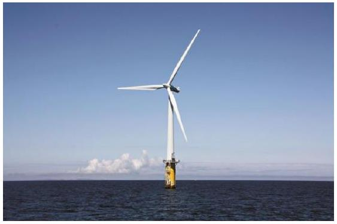
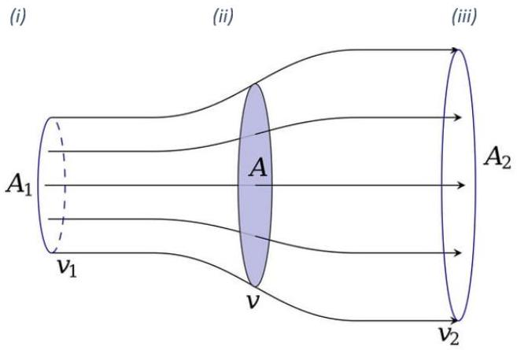
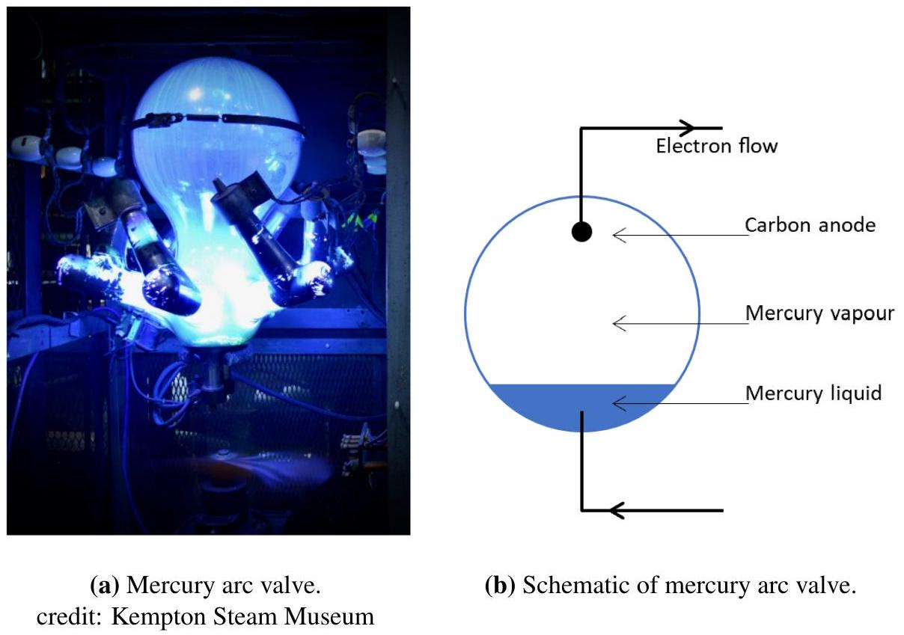
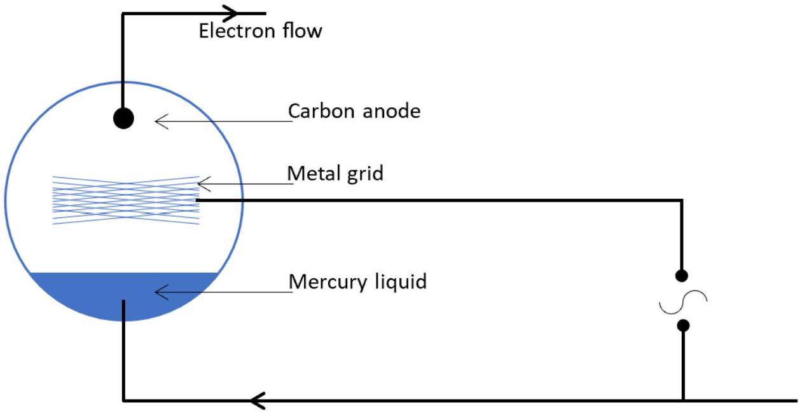

## Question 2

This question is about wind turbines.

a) Assuming a wind direction perpendicular to the plane of the turbine blades, determine the power if all of the kinetic energy of the wind is transferred to the blades, in terms of the density of the air $\rho$, the length of the turbine blades $r$, and the wind speed $v$.

Figure 1: An offshore wind turbine.

b) In reality, not all of the power of the wind is extracted. The wind speed is slower behind the turbine, and the wind can be imagined to disperse over a larger area as shown in Figure 2, where A shows the area swept out by the turbine. This question will attempt a more realistic model of the energy transfers in a wind turbine. Assume the density of the air remains constant.
    (i) Write down expressions for the rate of flow of air mass in region (i),
    (ii) Write down expressions for the rate of flow of air mass in region (ii)
    (iii) Write down expressions for the rate of flow of air mass in region (iii).

Figure 2: Flow of air through turbine.

(iv) By considering the air before entry and after entry to the turbine, determine the power output of the turbine in terms of $\rho, A, v, v_{1}$ and $v_{2}$.
(v) If we now assume that $v$ equals the mean of $v_{1}$ and $v_{2}$, write down an expression for the power output of the turbine in terms of $\rho, A, v_{1}$ and $v_{2}$ only.
(vi) Determine the value of $v_{1} / v_{2}$ which gives a maximum in the output of the turbine.
(vii) Determine the maximum power output of the turbine in terms of $\rho, A$ and the prevailing wind speed $v_{1}$.
(viii) The newest off-shore wind turbines in the North Sea have a blade length of 107 m, and the average wind speed in $10 \mathrm{~m} \mathrm{~s}^{-1}$. Calculate the maximum possible power output from this turbine.

c) The electrical power from the wind farm is transferred to the shore using High Voltage Direct Current (HVDC) at 320 kV with respect to earth. The cable used to transfer the power will typically consist of a 2.2 cm radius copper core, surrounded by cross-linked polyethylene (XLPE) insulation of radius 4.0 cm which itself is surrounded by a protective metal screen. The greatest length in a North Sea project will be 265 km.
The resistivity of copper is $1.68 \times 10^{-8} \Omega \mathrm{~m}$ and of XLPE is $1.97 \times 10^{14} \Omega \mathrm{~m}$
    (i) Calculate the resistance of the copper core and the power dissipated as heat, and percentage loss in the copper, if the cable transfers 800 MW of power.
    (ii) Calculate the resistance of the XLPE insulation between the copper core and the metal screen, and hence calculate the leakage current, power and percentage loss due to the leakage current, when operating at 320 kV.
    (iii) The thermal conductivity of XLPE $=0.28 \mathrm{WmK}^{-1}$. Assuming the temperature drop across all thermal barriers except the XPLE is negligible, calculate the operating temperature of the copper core at 800 MW given the ambient sea temperature is $7.0^{\circ} \mathrm{C}$.
d) High current rectification (ac to dc conversion), and inversion (dc to ac conversion) was until relatively recently achieved using a device called a mercury arc valve (see Figure 4a). In its simplest schematic form in Figure 4b:

Figure 4

The principle of operation is that the mercury vapour at low pressure (7.0 mPa and 40 °C) becomes ionised and the ions collide with the mercury liquid which liberates electrons. These then become available to carry the current to the carbon anode, and also via collision with atoms of mercury vapour produce mercury ions to replace those reabsorbed into the liquid phase. There is no appreciable electron emission from the carbon anode and so the current flows in one direction only in the manner of a diode.

(i) Estimate the forward bias potential of this "diode".
(ii) Inserting a grid between the anode and the mercury cathode allows the electron current to be modulated and thus an ac current produced from a dc supply.

Figure 5: Mercury Arc Valve Circuit

The anode current is given by $I=a+b V_{g}+c V_{g}^{2}$, and $V_{g}=A+B \cos (\omega t)$, that is a constant bias and an oscillatory signal.
The anode current contains a second harmonic component. Determine its amplitude.

(iii) The mean value of the anode current contains a term proportional to $B^{2}$. Obtain the coefficient of this term.
(iv) If $I_{0}$ is the value of $I$ when $B=0$ and, when the signal is applied, $I$ oscillates between $I_{\text {max }}$ and $I_{\text {min }}$, express the ratio of the amplitudes of the second harmonic and fundamental ( $1^{\text {st }}$ harmonic) in terms of the quantity $\chi$, which is defined as $\chi=\frac{I_{\text {max }}-I_{0}}{I_{0}-I_{\text {min }}}$.

Hint: a useful identity is $\quad \cos ^{2} \theta-\sin ^{2} \theta=\cos 2 \theta$.
[25 marks]
